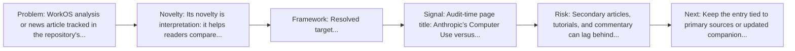
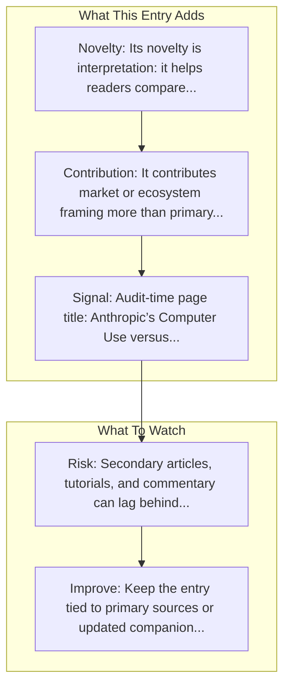

# Anthropic's Computer Use vs OpenAI's CUA

Entry report generated on 2026-03-28 (Asia/Tokyo). This report is based on the repository entry, audit-time metadata, and cross-checks against adjacent repo context.

## Snapshot

| Field | Detail |
| --- | --- |
| Repo entry | Anthropic's Computer Use vs OpenAI's CUA |
| Actual target | [Article](https://workos.com/blog/anthropics-computer-use-versus-openais-computer-using-agent-cua) |
| Group | Resources & Guides |
| Category | Industry Analysis & News / Comparison Articles |
| Source location | `resources/README.md:119` |
| Primary link type | `article` |
| Audit status | `ok` |
| Title | Anthropic's Computer Use vs OpenAI's CUA |
| Source | WorkOS |

## Quick Read

| Lens | Read |
| --- | --- |
| Role in repo | article |
| Novelty | Its novelty is interpretation: it helps readers compare, frame, or contextualize the surrounding products, models, and tools. |
| Operating frame | Resolved target: https://workos.com/blog/anthropics-computer-use-versus-openais-computer-using-agent-cua. |
| Main caution | Secondary articles, tutorials, and commentary can lag behind primary source changes or smooth over important caveats. |

## Visual Frame

## Analysis Map

## Executive Summary

WorkOS analysis or news article tracked in the repository's industry-reading section. Anthropic’s Computer Use gives Claude direct control over your desktop, letting it interact with native apps and the web like a human. OpenAI’s Computer Using Agent runs GPT-4o in a secure virtual browser, where it follows high-level instructions to navigate web UIs and complete tasks.

## Novelty and Distinguishing Angle

- Its novelty is interpretation: it helps readers compare, frame, or contextualize the surrounding products, models, and tools.
- Audit-time page framing: Anthropic’s Computer Use versus OpenAI’s Computer Using Agent (CUA) — WorkOS.

## Core Contributions or Offerings

- It contributes market or ecosystem framing more than primary technical detail.
- Listed source: WorkOS.

## Operating Framework

- Resolved target: https://workos.com/blog/anthropics-computer-use-versus-openais-computer-using-agent-cua.
- Treat it as a secondary interpretation layer, not as the sole technical source of truth.
- Source context: WorkOS.

## Evidence and Adoption Signals

- Audit-time page title: Anthropic’s Computer Use versus OpenAI’s Computer Using Agent (CUA) — WorkOS.
- Audit-time page description: Anthropic’s Computer Use gives Claude direct control over your desktop, letting it interact with native apps and the web like a human. OpenAI’s Computer Using Agent runs GPT-4o in a secure virtual browser, where it follows high-level instructions to navigate web UIs and complete tasks..
- Resource provenance: WorkOS.

## Limitations and Gaps

- Secondary articles, tutorials, and commentary can lag behind primary source changes or smooth over important caveats.

## Improvement Paths

- Keep the entry tied to primary sources or updated companion material so readers can distinguish signal from hype.
- Add clearer context on where the resource is strong, where it is partial, and what it omits.
- Cross-link it more explicitly to the products, frameworks, or papers it is most useful for understanding.

## Why It Matters

- It gives the repository explanatory and operational context beyond raw project lists.
- Resource entries matter because they shape how readers interpret the surrounding products, models, and frameworks.

## Connections In This Repo

- [Introducing computer use](key-blog-posts-and-announcements-anthropic-introducing-computer-use.md) - neighboring ecosystem entry in the same local cluster.
- [Computer Use Tool Guide](tutorials-and-guides-getting-started-computer-use-tool-guide.md) - neighboring ecosystem entry in the same local cluster.
- [Computer Use Guide](tutorials-and-guides-getting-started-computer-use-guide.md) - neighboring ecosystem entry in the same local cluster.
- [OpenAI CUA Sample App](../frameworks-and-tools/integration-examples-openai-cua-sample-app.md) - neighboring ecosystem entry in the same local cluster.

## Source Basis

- Primary basis: repo-local notes, link-audit page metadata.
- Audit access note: link-audit status was `ok` for the primary URL.
