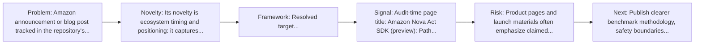
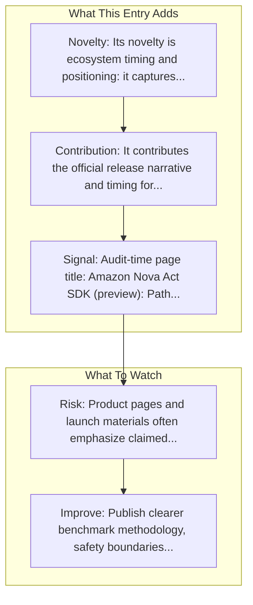

# Amazon Nova Act SDK

Entry report generated on 2026-03-28 (Asia/Tokyo). This report is based on the repository entry, audit-time metadata, and cross-checks against adjacent repo context.

## Snapshot

| Field | Detail |
| --- | --- |
| Repo entry | Amazon Nova Act SDK |
| Actual target | [Blog](https://aws.amazon.com/blogs/machine-learning/amazon-nova-act-sdk-preview-path-to-production-for-browser-automation-agents/) |
| Group | Resources & Guides |
| Category | Key Blog Posts & Announcements / Amazon |
| Source location | `resources/README.md:96` |
| Primary link type | `announcement` |
| Audit status | `ok` |
| Title | Amazon Nova Act SDK |
| Date | 2025 |

## Quick Read

| Lens | Read |
| --- | --- |
| Role in repo | announcement |
| Novelty | Its novelty is ecosystem timing and positioning: it captures how a vendor chose to frame computer use as a product capability. |
| Operating frame | Resolved target... |
| Main caution | Product pages and launch materials often emphasize claimed capability more than independent evaluation or failure analysis. |

## Visual Frame

## Analysis Map

## Executive Summary

Amazon announcement or blog post tracked in the repository's resource list. In this post, we’ll walk through what makes Nova Act SDK unique, how it works, and how teams across industries are already using it to automate browser-based workflows at scale.

## Novelty and Distinguishing Angle

- Its novelty is ecosystem timing and positioning: it captures how a vendor chose to frame computer use as a product capability.
- Audit-time page framing: Amazon Nova Act SDK (preview): Path to production for browser automation agents | Artificial Intelligence.

## Core Contributions or Offerings

- It contributes the official release narrative and timing for a capability that later appears in docs, repos, or comparison articles.
- Tracked date in repo: 2025.

## Operating Framework

- Resolved target: https://aws.amazon.com/blogs/machine-learning/amazon-nova-act-sdk-preview-path-to-production-for-browser-automation-agents/.
- Read it as a launch artifact first; pair it with docs, repos, or system cards for operational detail.
- Repo-tracked date: 2025.

## Evidence and Adoption Signals

- Audit-time page title: Amazon Nova Act SDK (preview): Path to production for browser automation agents | Artificial Intelligence.
- Audit-time page description: In this post, we’ll walk through what makes Nova Act SDK unique, how it works, and how teams across industries are already using it to automate browser-based workflows at scale..
- Resource provenance: unspecified source, 2025.

## Limitations and Gaps

- Product pages and launch materials often emphasize claimed capability more than independent evaluation or failure analysis.

## Improvement Paths

- Publish clearer benchmark methodology, safety boundaries, and real deployment limits alongside capability claims.
- Keep changelogs and API or availability notes current so the repo can track product evolution without guesswork.
- Add more concrete examples of failure handling, fallback behavior, and human takeover boundaries.

## Why It Matters

- It gives the repository explanatory and operational context beyond raw project lists.
- Resource entries matter because they shape how readers interpret the surrounding products, models, and frameworks.

## Connections In This Repo

- [Amazon AWS - Nova Act](../products-and-services/major-tech-companies-amazon-aws-nova-act.md) - neighboring ecosystem entry in the same local cluster.
- [AgentCore Browser](key-blog-posts-and-announcements-amazon-agentcore-browser.md) - neighboring ecosystem entry in the same local cluster.
- [Adept AI - ACT-1](../products-and-services/startups-adept-ai-act-1.md) - neighboring ecosystem entry in the same local cluster.
- [Amazon Bedrock AgentCore Browser](../products-and-services/browser-infrastructure-services-amazon-bedrock-agentcore-browser.md) - neighboring ecosystem entry in the same local cluster.

## Source Basis

- Primary basis: repo-local notes, link-audit page metadata.
- Audit access note: link-audit status was `ok` for the primary URL.
