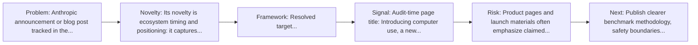
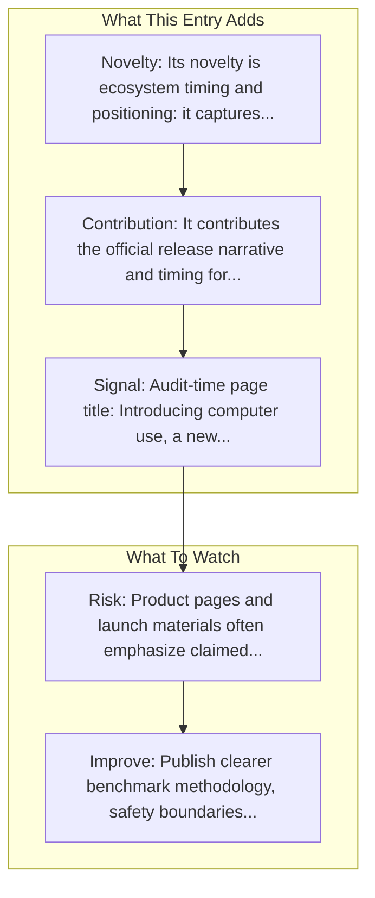

# Introducing computer use

Entry report generated on 2026-03-28 (Asia/Tokyo). This report is based on the repository entry, audit-time metadata, and cross-checks against adjacent repo context.

## Snapshot

| Field | Detail |
| --- | --- |
| Repo entry | Introducing computer use |
| Actual target | [Blog](https://www.anthropic.com/news/3-5-models-and-computer-use) |
| Group | Resources & Guides |
| Category | Key Blog Posts & Announcements / Anthropic |
| Source location | `resources/README.md:76` |
| Primary link type | `announcement` |
| Audit status | `ok` |
| Title | Introducing computer use |
| Date | Oct 2024 |

## Quick Read

| Lens | Read |
| --- | --- |
| Role in repo | announcement |
| Novelty | Its novelty is ecosystem timing and positioning: it captures how a vendor chose to frame computer use as a product capability. |
| Operating frame | Resolved target: https://www.anthropic.com/news/3-5-models-and-computer-use. |
| Main caution | Product pages and launch materials often emphasize claimed capability more than independent evaluation or failure analysis. |

## Visual Frame

## Analysis Map

## Executive Summary

Anthropic announcement or blog post tracked in the repository's resource list. A refreshed, more powerful Claude 3.5 Sonnet, Claude 3.5 Haiku, and a new experimental AI capability: computer use.

## Novelty and Distinguishing Angle

- Its novelty is ecosystem timing and positioning: it captures how a vendor chose to frame computer use as a product capability.
- Audit-time page framing: Introducing computer use, a new Claude 3.5 Sonnet, and Claude 3.5 Haiku \ Anthropic.

## Core Contributions or Offerings

- It contributes the official release narrative and timing for a capability that later appears in docs, repos, or comparison articles.
- Tracked date in repo: Oct 2024.

## Operating Framework

- Resolved target: https://www.anthropic.com/news/3-5-models-and-computer-use.
- Read it as a launch artifact first; pair it with docs, repos, or system cards for operational detail.
- Repo-tracked date: Oct 2024.

## Evidence and Adoption Signals

- Audit-time page title: Introducing computer use, a new Claude 3.5 Sonnet, and Claude 3.5 Haiku \ Anthropic.
- Audit-time page description: A refreshed, more powerful Claude 3.5 Sonnet, Claude 3.5 Haiku, and a new experimental AI capability: computer use..
- Resource provenance: unspecified source, Oct 2024.

## Limitations and Gaps

- Product pages and launch materials often emphasize claimed capability more than independent evaluation or failure analysis.

## Improvement Paths

- Publish clearer benchmark methodology, safety boundaries, and real deployment limits alongside capability claims.
- Keep changelogs and API or availability notes current so the repo can track product evolution without guesswork.
- Add more concrete examples of failure handling, fallback behavior, and human takeover boundaries.

## Why It Matters

- It gives the repository explanatory and operational context beyond raw project lists.
- Resource entries matter because they shape how readers interpret the surrounding products, models, and frameworks.

## Connections In This Repo

- [Anthropic's Computer Use vs OpenAI's CUA](industry-analysis-and-news-comparison-articles-anthropic-s-computer-use-vs-openai-s-cua.md) - neighboring ecosystem entry in the same local cluster.
- [Computer Use Tool Guide](tutorials-and-guides-getting-started-computer-use-tool-guide.md) - neighboring ecosystem entry in the same local cluster.
- [Claude can now use computers](key-blog-posts-and-announcements-anthropic-claude-can-now-use-computers.md) - neighboring ecosystem entry in the same local cluster.
- [ACU - AI for Computer Use](curated-paper-lists-acu-ai-for-computer-use.md) - neighboring ecosystem entry in the same local cluster.

## Source Basis

- Primary basis: repo-local notes, link-audit page metadata.
- Audit access note: link-audit status was `ok` for the primary URL.
