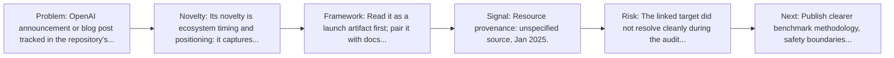
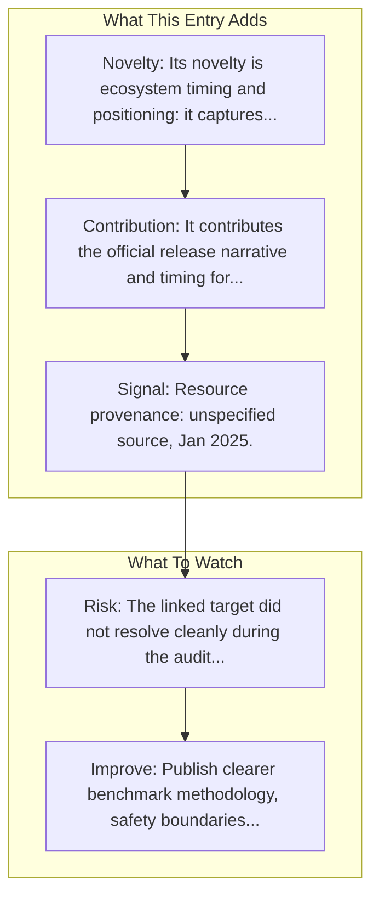

# Introducing Operator

Entry report generated on 2026-03-28 (Asia/Tokyo). This report is based on the repository entry, audit-time metadata, and cross-checks against adjacent repo context.

## Snapshot

| Field | Detail |
| --- | --- |
| Repo entry | Introducing Operator |
| Actual target | [Blog](https://openai.com/index/introducing-operator/) |
| Group | Resources & Guides |
| Category | Key Blog Posts & Announcements / OpenAI |
| Source location | `resources/README.md:83` |
| Primary link type | `announcement` |
| Audit status | `error` |
| Title | Introducing Operator |
| Date | Jan 2025 |

## Quick Read

| Lens | Read |
| --- | --- |
| Role in repo | announcement |
| Novelty | Its novelty is ecosystem timing and positioning: it captures how a vendor chose to frame computer use as a product capability. |
| Operating frame | Read it as a launch artifact first; pair it with docs, repos, or system cards for operational detail. |
| Main caution | The linked target did not resolve cleanly during the audit, so this report leans heavily on repo-local notes and adjacent metadata. |

## Visual Frame

## Analysis Map

## Executive Summary

OpenAI announcement or blog post tracked in the repository's resource list.

## Novelty and Distinguishing Angle

- Its novelty is ecosystem timing and positioning: it captures how a vendor chose to frame computer use as a product capability.

## Core Contributions or Offerings

- It contributes the official release narrative and timing for a capability that later appears in docs, repos, or comparison articles.
- Tracked date in repo: Jan 2025.

## Operating Framework

- Read it as a launch artifact first; pair it with docs, repos, or system cards for operational detail.
- Repo-tracked date: Jan 2025.

## Evidence and Adoption Signals

- Resource provenance: unspecified source, Jan 2025.

## Limitations and Gaps

- The linked target did not resolve cleanly during the audit, so this report leans heavily on repo-local notes and adjacent metadata.
- Product pages and launch materials often emphasize claimed capability more than independent evaluation or failure analysis.

## Improvement Paths

- Publish clearer benchmark methodology, safety boundaries, and real deployment limits alongside capability claims.
- Keep changelogs and API or availability notes current so the repo can track product evolution without guesswork.
- Add more concrete examples of failure handling, fallback behavior, and human takeover boundaries.

## Why It Matters

- It gives the repository explanatory and operational context beyond raw project lists.
- Resource entries matter because they shape how readers interpret the surrounding products, models, and frameworks.

## Connections In This Repo

- [Operator System Card](key-blog-posts-and-announcements-openai-operator-system-card.md) - neighboring ecosystem entry in the same local cluster.
- [Computer-Using Agent](key-blog-posts-and-announcements-openai-computer-using-agent.md) - neighboring ecosystem entry in the same local cluster.
- [New tools for building agents](key-blog-posts-and-announcements-openai-new-tools-for-building-agents.md) - neighboring ecosystem entry in the same local cluster.
- [Anthropic's Computer Use vs OpenAI's CUA](industry-analysis-and-news-comparison-articles-anthropic-s-computer-use-vs-openai-s-cua.md) - neighboring ecosystem entry in the same local cluster.

## Source Basis

- Primary basis: repo-local notes, link-audit page metadata.
- Audit access note: the linked target failed to resolve during the audit, so this report is more inferential than the ones backed by clean page metadata.
