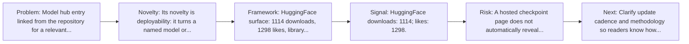
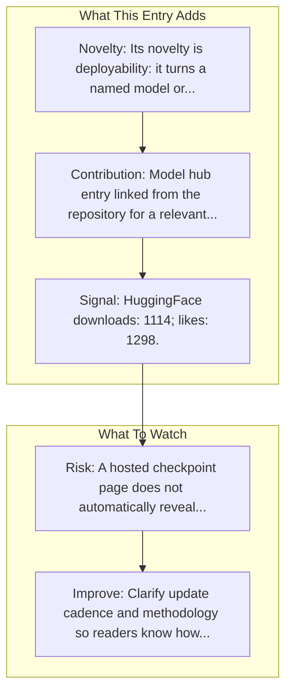

# OmniParser-v2.0

Entry report generated on 2026-03-28 (Asia/Tokyo). This report is based on the repository entry, audit-time metadata, and cross-checks against adjacent repo context.

## Snapshot

| Field | Detail |
| --- | --- |
| Repo entry | OmniParser-v2.0 |
| Actual target | [HuggingFace](https://huggingface.co/microsoft/OmniParser-v2.0) |
| Group | Resources & Guides |
| Category | Model Hubs / HuggingFace Models |
| Source location | `resources/README.md:171` |
| Primary link type | `model-hub` |
| Audit status | `ok` |
| Model | OmniParser-v2.0 |

## Quick Read

| Lens | Read |
| --- | --- |
| Role in repo | model-hub |
| Novelty | Its novelty is deployability: it turns a named model or agent component into something readers can fetch, run, or benchmark directly. |
| Operating frame | HuggingFace surface: 1114 downloads, 1298 likes, library transformers. |
| Main caution | A hosted checkpoint page does not automatically reveal evaluation rigor, deployment limits, or failure modes. |

## Visual Frame

## Analysis Map

## Executive Summary

Model hub entry linked from the repository for a relevant computer-use model or component. We’re on a journey to advance and democratize artificial intelligence through open source and open science.

## Novelty and Distinguishing Angle

- Its novelty is deployability: it turns a named model or agent component into something readers can fetch, run, or benchmark directly.
- Model-hub uptake is visible in cached metadata: 1114 downloads and 1298 likes.

## Core Contributions or Offerings

- Model hub entry linked from the repository for a relevant computer-use model or component.

## Operating Framework

- HuggingFace surface: 1114 downloads, 1298 likes, library transformers.
- Use it as the runnable checkpoint surface for inference, demos, or downstream benchmarking.

## Evidence and Adoption Signals

- HuggingFace downloads: 1114; likes: 1298.
- Last modified on HuggingFace: 2025-03-28T16:17:39.000Z.
- Model tags: transformers, safetensors, endpoint-template, custom_code, arxiv:2408.00203, license:mit.
- Audit-time page title: microsoft/OmniParser-v2.0 · Hugging Face.
- Audit-time page description: We’re on a journey to advance and democratize artificial intelligence through open source and open science..

## Limitations and Gaps

- A hosted checkpoint page does not automatically reveal evaluation rigor, deployment limits, or failure modes.

## Improvement Paths

- Clarify update cadence and methodology so readers know how fresh and comparable the surfaced information really is.
- Cross-link more directly to primary papers, repos, or docs so the index page is not the end of the evidence chain.
- State scope boundaries more explicitly so readers know what this entry covers and what it leaves out.

## Why It Matters

- It gives the repository explanatory and operational context beyond raw project lists.
- Resource entries matter because they shape how readers interpret the surrounding products, models, and frameworks.

## Connections In This Repo

- [OmniParser: Pure Vision Based GUI Agent](../../papers/models-and-architectures/omniparser-pure-vision-based-gui-agent.md) - paper-side context for the same capability cluster.
- [UI-TARS-1.5-7B](model-hubs-huggingface-models-ui-tars-1-5-7b.md) - neighboring ecosystem entry in the same local cluster.
- [AutoGLM-Phone-9B](model-hubs-huggingface-models-autoglm-phone-9b.md) - neighboring ecosystem entry in the same local cluster.
- [Qwen2.5-VL-72B-Instruct](model-hubs-huggingface-models-qwen2-5-vl-72b-instruct.md) - neighboring ecosystem entry in the same local cluster.

## Source Basis

- Primary basis: repo-local notes, link-audit page metadata, HuggingFace model metadata.
- Audit access note: link-audit status was `ok` for the primary URL.
