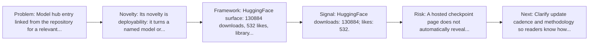
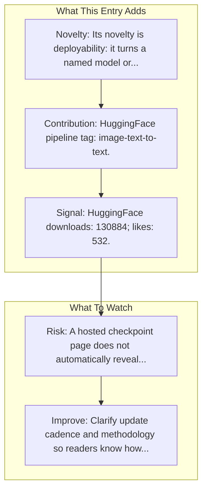

# UI-TARS-1.5-7B

Entry report generated on 2026-03-28 (Asia/Tokyo). This report is based on the repository entry, audit-time metadata, and cross-checks against adjacent repo context.

## Snapshot

| Field | Detail |
| --- | --- |
| Repo entry | UI-TARS-1.5-7B |
| Actual target | [HuggingFace](https://huggingface.co/ByteDance-Seed/UI-TARS-1.5-7B) |
| Group | Resources & Guides |
| Category | Model Hubs / HuggingFace Models |
| Source location | `resources/README.md:168` |
| Primary link type | `model-hub` |
| Audit status | `ok` |
| Model | UI-TARS-1.5-7B |

## Quick Read

| Lens | Read |
| --- | --- |
| Role in repo | model-hub |
| Novelty | Its novelty is deployability: it turns a named model or agent component into something readers can fetch, run, or benchmark directly. |
| Operating frame | HuggingFace surface: 130884 downloads, 532 likes, library transformers. |
| Main caution | A hosted checkpoint page does not automatically reveal evaluation rigor, deployment limits, or failure modes. |

## Visual Frame

## Analysis Map

## Executive Summary

Model hub entry linked from the repository for a relevant computer-use model or component. We’re on a journey to advance and democratize artificial intelligence through open source and open science.

## Novelty and Distinguishing Angle

- Its novelty is deployability: it turns a named model or agent component into something readers can fetch, run, or benchmark directly.
- Model-hub uptake is visible in cached metadata: 130884 downloads and 532 likes.

## Core Contributions or Offerings

- HuggingFace pipeline tag: image-text-to-text.

## Operating Framework

- HuggingFace surface: 130884 downloads, 532 likes, library transformers.
- Use it as the runnable checkpoint surface for inference, demos, or downstream benchmarking.

## Evidence and Adoption Signals

- HuggingFace downloads: 130884; likes: 532.
- Last modified on HuggingFace: 2025-04-18T01:35:38.000Z.
- Pipeline tag: image-text-to-text.
- Model tags: transformers, safetensors, qwen2_5_vl, image-text-to-text, multimodal, gui.
- Audit-time page title: ByteDance-Seed/UI-TARS-1.5-7B · Hugging Face.
- Audit-time page description: We’re on a journey to advance and democratize artificial intelligence through open source and open science..

## Limitations and Gaps

- A hosted checkpoint page does not automatically reveal evaluation rigor, deployment limits, or failure modes.

## Improvement Paths

- Clarify update cadence and methodology so readers know how fresh and comparable the surfaced information really is.
- Cross-link more directly to primary papers, repos, or docs so the index page is not the end of the evidence chain.
- State scope boundaries more explicitly so readers know what this entry covers and what it leaves out.

## Why It Matters

- It gives the repository explanatory and operational context beyond raw project lists.
- Resource entries matter because they shape how readers interpret the surrounding products, models, and frameworks.

## Connections In This Repo

- [Qwen2.5-VL-72B-Instruct](model-hubs-huggingface-models-qwen2-5-vl-72b-instruct.md) - neighboring ecosystem entry in the same local cluster.
- [Ferret-UI: Grounded Mobile UI Understanding](../../papers/models-and-architectures/ferret-ui-grounded-mobile-ui-understanding.md) - paper-side context for the same capability cluster.
- [Qwen2.5-VL Technical Report](../../papers/models-and-architectures/qwen2-5-vl-technical-report.md) - paper-side context for the same capability cluster.
- [UI-TARS Research Page](key-blog-posts-and-announcements-bytedance-ui-tars-research-page.md) - neighboring ecosystem entry in the same local cluster.

## Source Basis

- Primary basis: repo-local notes, link-audit page metadata, HuggingFace model metadata.
- Audit access note: link-audit status was `ok` for the primary URL.
