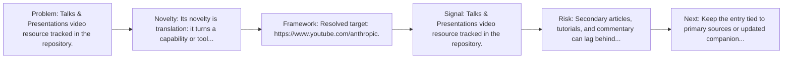
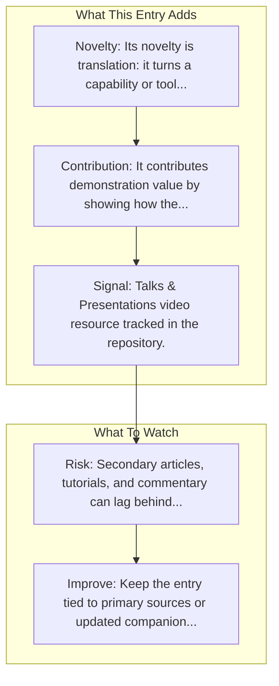

# Computer Use Demo

Entry report generated on 2026-03-28 (Asia/Tokyo). This report is based on the repository entry, audit-time metadata, and cross-checks against adjacent repo context.

## Snapshot

| Field | Detail |
| --- | --- |
| Repo entry | Computer Use Demo |
| Actual target | [YouTube](https://www.youtube.com/anthropic) |
| Group | Resources & Guides |
| Category | Video Resources / Talks & Presentations |
| Source location | `resources/README.md:217` |
| Primary link type | `video` |
| Audit status | `ok` |
| Title | Computer Use Demo |
| Event | Anthropic |

## Quick Read

| Lens | Read |
| --- | --- |
| Role in repo | video |
| Novelty | Its novelty is translation: it turns a capability or tool into a more learnable workflow for practitioners. |
| Operating frame | Resolved target: https://www.youtube.com/anthropic. |
| Main caution | Secondary articles, tutorials, and commentary can lag behind primary source changes or smooth over important caveats. |

## Visual Frame

## Analysis Map

## Executive Summary

Talks & Presentations video resource tracked in the repository.

## Novelty and Distinguishing Angle

- Its novelty is translation: it turns a capability or tool into a more learnable workflow for practitioners.

## Core Contributions or Offerings

- It contributes demonstration value by showing how the capability is presented in motion rather than only in prose.

## Operating Framework

- Resolved target: https://www.youtube.com/anthropic.

## Evidence and Adoption Signals

- Talks & Presentations video resource tracked in the repository.

## Limitations and Gaps

- Secondary articles, tutorials, and commentary can lag behind primary source changes or smooth over important caveats.

## Improvement Paths

- Keep the entry tied to primary sources or updated companion material so readers can distinguish signal from hype.
- Add clearer context on where the resource is strong, where it is partial, and what it omits.
- Cross-link it more explicitly to the products, frameworks, or papers it is most useful for understanding.

## Why It Matters

- It gives the repository explanatory and operational context beyond raw project lists.
- Resource entries matter because they shape how readers interpret the surrounding products, models, and frameworks.

## Connections In This Repo

- [Claude Computer Use Demo](../frameworks-and-tools/integration-examples-claude-computer-use-demo.md) - neighboring ecosystem entry in the same local cluster.
- [ACU - AI for Computer Use](curated-paper-lists-acu-ai-for-computer-use.md) - neighboring ecosystem entry in the same local cluster.
- [Introducing computer use](key-blog-posts-and-announcements-anthropic-introducing-computer-use.md) - neighboring ecosystem entry in the same local cluster.
- [Gemini 2.5 Computer Use](key-blog-posts-and-announcements-google-gemini-2-5-computer-use.md) - neighboring ecosystem entry in the same local cluster.

## Source Basis

- Primary basis: repo-local notes, link-audit page metadata.
- Audit access note: link-audit status was `ok` for the primary URL.
