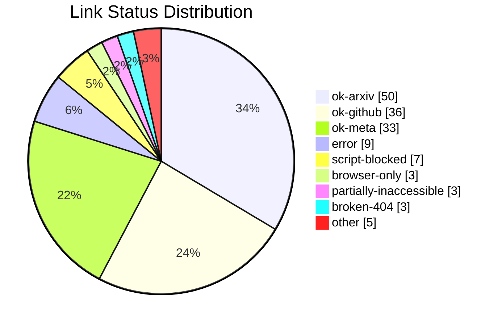
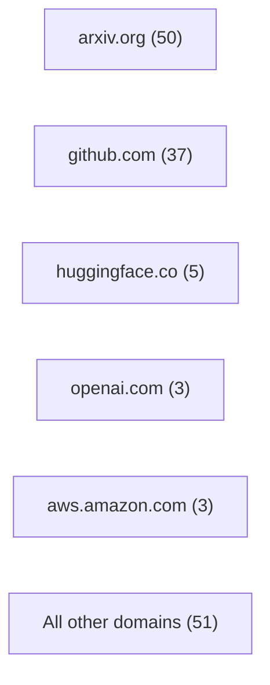

# External Link Inventory

Checked on 2026-03-27 (Asia/Tokyo). This inventory covers **149 unique URLs** across **290 total link occurrences** in the repository markdown files.

## Visual Snapshot

## Coverage Notes

- `ok-arxiv`: resolved through the arXiv API with title and abstract.
- `ok-github`: resolved through the GitHub API with current repo metadata.
- `ok-hf`: resolved through the Hugging Face API.
- `ok-meta`: resolved through direct page metadata fetch.
- `browser-only`: live in a normal browser or search results, but blocked by Cloudflare or similar anti-bot protections during scripted fetch.
- `script-blocked`, `partially-inaccessible`, `rate-limited`, `gated`, `broken-404`, `redirect`: limitations observed during the audit.

## Snapshot

- Top domains: `arxiv.org` (50), `github.com` (37), `huggingface.co` (5), `openai.com` (3), `aws.amazon.com` (3), `awesome.re` (2), `microsoft.github.io` (2), `www.browserless.io` (2), `docs.aws.amazon.com` (2), `www.anthropic.com` (2), `www.youtube.com` (2), `www.techrxiv.org` (1)
- Status summary: `ok-arxiv` 50, `ok-github` 36, `ok-meta` 33, `error` 9, `script-blocked` 7, `browser-only` 3, `partially-inaccessible` 3, `broken-404` 3, `ok-hf` 2, `redirect` 1, `gated` 1, `rate-limited` 1

## Survey Papers

| Link | Seen In | Status | Notes |
| --- | --- | --- | --- |
| [A Survey on the Safety and Security Threats of Computer-Using Agents: JARVIS or Ultron?](https://arxiv.org/abs/2505.10924) | README.md papers/safety/README.md papers/surveys/README.md | `ok-arxiv` | A Survey on the Safety and Security Threats of Computer-Using Agents: JARVIS or Ultron?. Recently, AI-driven interactions with computing devices have advanced from basic prototype tools to sophisticated, LLM-based systems that emulate human-like operations in graphical user interfaces. We are now witnessing ... |
| [AI Agents: Evolution, Architecture, and Real-World Applications](https://arxiv.org/abs/2503.12687) | README.md papers/surveys/README.md | `ok-arxiv` | AI Agents: Evolution, Architecture, and Real-World Applications. This paper examines the evolution, architecture, and practical applications of AI agents from their early, rule-based incarnations to modern sophisticated systems that integrate large language models with dedicated modul... |
| [GUI Agents with Foundation Models: A Comprehensive Survey](https://arxiv.org/abs/2411.04890) | README.md papers/surveys/README.md | `ok-arxiv` | GUI Agents with Foundation Models: A Comprehensive Survey. Recent advances in foundation models, particularly Large Language Models (LLMs) and Multimodal Large Language Models (MLLMs), have facilitated the development of intelligent agents capable of performing complex tasks. By... |
| [GUI Agents: A Survey](https://arxiv.org/abs/2412.13501) | README.md papers/surveys/README.md | `ok-arxiv` | GUI Agents: A Survey. Graphical User Interface (GUI) agents, powered by Large Foundation Models, have emerged as a transformative approach to automating human-computer interaction. These agents autonomously interact with digital systems or so... |
| [Large Language Model-Brained GUI Agents: A Survey](https://arxiv.org/abs/2411.18279) | README.md papers/surveys/README.md | `ok-arxiv` | Large Language Model-Brained GUI Agents: A Survey. GUIs have long been central to human-computer interaction, providing an intuitive and visually-driven way to access and interact with digital systems. The advent of LLMs, particularly multimodal models, has ushered in a ... |
| [LLM-Powered GUI Agents in Phone Automation: Surveying Progress and Prospects](https://arxiv.org/abs/2504.19838) | README.md papers/surveys/README.md | `ok-arxiv` | LLM-Powered GUI Agents in Phone Automation: Surveying Progress and Prospects. With the rapid rise of large language models (LLMs), phone automation has undergone transformative changes. This paper systematically reviews LLM-driven phone GUI agents, highlighting their evolution from script-based au... |
| [OSU-NLP-Group/GUI-Agents-Paper-List](https://github.com/OSU-NLP-Group/GUI-Agents-Paper-List) | README.md papers/surveys/README.md resources/README.md | `ok-github` | GitHub repo. Building a comprehensive and handy list of papers for GUI agents Stars: 657. Language: Python. |
| [showlab/Awesome-GUI-Agent](https://github.com/showlab/Awesome-GUI-Agent) | README.md papers/surveys/README.md resources/README.md | `ok-github` | GitHub repo. 💻 A curated list of papers and resources for multi-modal Graphical User Interface (GUI) agents. Stars: 1149. Language: n/a. |
| [trycua/acu](https://github.com/trycua/acu) | README.md papers/surveys/README.md resources/README.md | `ok-github` | GitHub repo. A curated list of resources about AI agents for Computer Use, including research papers, projects, frameworks, and tools. Stars: 1639. Language: n/a. |
| [www.techrxiv.org/doi/pdf/10.36227/techrxiv.176591818.87526814](https://www.techrxiv.org/doi/pdf/10.36227/techrxiv.176591818.87526814) | README.md papers/surveys/README.md | `script-blocked` | TechRxiv PDF denies direct scripted fetches (403). |

## Models and Architectures

| Link | Seen In | Status | Notes |
| --- | --- | --- | --- |
| [Aguvis: Unified Pure Vision Agents for Autonomous GUI Interaction](https://arxiv.org/abs/2412.04454) | README.md papers/models/README.md | `ok-arxiv` | Aguvis: Unified Pure Vision Agents for Autonomous GUI Interaction. Automating GUI tasks remains challenging due to reliance on textual representations, platform-specific action spaces, and limited reasoning capabilities. We introduce Aguvis, a unified vision-based framework for autonomo... |
| [AppAgent: Multimodal Agents as Smartphone Users](https://arxiv.org/abs/2312.13771) | README.md papers/models/README.md | `ok-arxiv` | AppAgent: Multimodal Agents as Smartphone Users. Recent advancements in large language models (LLMs) have led to the creation of intelligent agents capable of performing complex tasks. This paper introduces a novel LLM-based multimodal agent framework designed to opera... |
| [AutoGLM: Autonomous Foundation Agents for GUIs](https://arxiv.org/abs/2411.00820) | README.md papers/benchmarks/README.md papers/models/README.md | `ok-arxiv` | AutoGLM: Autonomous Foundation Agents for GUIs. We present AutoGLM, a new series in the ChatGLM family, designed to serve as foundation agents for autonomous control of digital devices through Graphical User Interfaces (GUIs). While foundation models excel at acquirin... |
| [bytedance/UI-TARS](https://github.com/bytedance/UI-TARS) | frameworks/README.md papers/models/README.md | `ok-github` | GitHub repo. Pioneering Automated GUI Interaction with Native Agents Stars: 9992. Language: Python. |
| [CogAgent: A Visual Language Model for GUI Agents](https://arxiv.org/abs/2312.08914) | README.md papers/models/README.md | `ok-arxiv` | CogAgent: A Visual Language Model for GUI Agents. People are spending an enormous amount of time on digital devices through graphical user interfaces (GUIs), e.g., computer or smartphone screens. Large language models (LLMs) such as ChatGPT can assist people in tasks li... |
| [Ferret-UI: Grounded Mobile UI Understanding with Multimodal LLMs](https://arxiv.org/abs/2404.05719) | README.md papers/models/README.md | `ok-arxiv` | Ferret-UI: Grounded Mobile UI Understanding with Multimodal LLMs. Recent advancements in multimodal large language models (MLLMs) have been noteworthy, yet, these general-domain MLLMs often fall short in their ability to comprehend and interact effectively with user interface (UI) scre... |
| [github.com/THUDM/AutoGLM](https://github.com/THUDM/AutoGLM) | README.md frameworks/README.md papers/models/README.md | `broken-404` | GitHub repo URL currently returns HTTP 404; the paper link still resolves. |
| [GUI-Actor: Coordinate-Free Visual Grounding for GUI Agents](https://microsoft.github.io/GUI-Actor/) | README.md papers/models/README.md | `ok-meta` | GUI-Actor: Coordinate-Free Visual Grounding for GUI Agents |
| [huggingface.co/THUDM/AutoGLM-Phone-9B](https://huggingface.co/THUDM/AutoGLM-Phone-9B) | frameworks/README.md papers/models/README.md resources/README.md | `gated` | Hugging Face model page is gated / unauthorized for anonymous scripted access. |
| [microsoft/OmniParser](https://github.com/microsoft/OmniParser) | README.md frameworks/README.md papers/models/README.md | `ok-github` | GitHub repo. A simple screen parsing tool towards pure vision based GUI agent Stars: 24583. Language: Jupyter Notebook. |
| [Mobile-Agent-v3: Fundamental Agents for GUI Automation](https://arxiv.org/abs/2508.15144) | README.md papers/models/README.md | `ok-arxiv` | Mobile-Agent-v3: Fundamental Agents for GUI Automation. This paper introduces GUI-Owl, a foundational GUI agent model that achieves state-of-the-art performance among open-source end-to-end models on ten GUI benchmarks across desktop and mobile environments, covering groundin... |
| [niuzaisheng/ScreenAgent](https://github.com/niuzaisheng/ScreenAgent) | papers/models/README.md | `ok-github` | GitHub repo. ScreenAgent: A Computer Control Agent Driven by Visual Language Large Model (IJCAI-24) Stars: 584. Language: Python. |
| [njucckevin/SeeClick](https://github.com/njucckevin/SeeClick) | README.md frameworks/README.md papers/models/README.md | `ok-github` | GitHub repo. The model, data and code for the visual GUI Agent SeeClick Stars: 475. Language: HTML. |
| [OmniParser for Pure Vision Based GUI Agent](https://arxiv.org/abs/2408.00203) | README.md papers/models/README.md | `ok-arxiv` | OmniParser for Pure Vision Based GUI Agent. The recent success of large vision language models shows great potential in driving the agent system operating on user interfaces. However, we argue that the power multimodal models like GPT-4V as a general agent on mult... |
| [OpenBMB/AgentCPM-GUI](https://github.com/OpenBMB/AgentCPM-GUI) | README.md frameworks/README.md papers/models/README.md | `ok-github` | GitHub repo. AgentCPM-GUI: An on-device GUI agent for operating Android apps, enhancing reasoning ability with reinforcement fine-tuning for efficient task execution. Stars: 1341. Language: Python. |
| [PDF](https://openaccess.thecvf.com/content/CVPR2025/papers/Lin_ShowUI_One_Vision-Language-Action_Model_for_GUI_Visual_Agent_CVPR_2025_paper.pdf) | README.md papers/models/README.md | `ok-meta` | PDF. PDF content fetched |
| [Qwen/Qwen2.5-VL-72B-Instruct · Hugging Face](https://huggingface.co/Qwen/Qwen2.5-VL-72B-Instruct) | papers/models/README.md resources/README.md | `error` | <urlopen error _ssl.c:1112: The handshake operation timed out> |
| [Qwen2.5-VL Technical Report](https://arxiv.org/abs/2502.13923) | README.md papers/models/README.md | `ok-arxiv` | Qwen2.5-VL Technical Report. We introduce Qwen2.5-VL, the latest flagship model of Qwen vision-language series, which demonstrates significant advancements in both foundational capabilities and innovative functionalities. Qwen2.5-VL achieves a major... |
| [R-VLM: Region-Aware Vision Language Model for Precise GUI Grounding](https://arxiv.org/abs/2507.05673) | README.md papers/models/README.md | `ok-arxiv` | R-VLM: Region-Aware Vision Language Model for Precise GUI Grounding. Visual agent models for automating human activities on Graphical User Interfaces (GUIs) have emerged as a promising research direction, driven by advances in large Vision Language Models (VLMs). A critical challenge in G... |
| [ScreenAgent: A Vision Language Model-driven Computer Control Agent](https://arxiv.org/abs/2402.07945) | README.md papers/models/README.md | `ok-arxiv` | ScreenAgent: A Vision Language Model-driven Computer Control Agent. Existing Large Language Models (LLM) can invoke a variety of tools and APIs to complete complex tasks. The computer, as the most powerful and universal tool, could potentially be controlled directly by a trained LLM agen... |
| [SeeClick: Harnessing GUI Grounding for Advanced Visual GUI Agents](https://arxiv.org/abs/2401.10935) | README.md papers/benchmarks/README.md papers/models/README.md | `ok-arxiv` | SeeClick: Harnessing GUI Grounding for Advanced Visual GUI Agents. Graphical User Interface (GUI) agents are designed to automate complex tasks on digital devices, such as smartphones and desktops. Most existing GUI agents interact with the environment through extracted structured data,... |
| [TencentQQGYLab/AppAgent](https://github.com/TencentQQGYLab/AppAgent) | README.md frameworks/README.md papers/models/README.md | `ok-github` | GitHub repo. AppAgent: Multimodal Agents as Smartphone Users, an LLM-based multimodal agent framework designed to operate smartphone apps. Stars: 6621. Language: Python. |
| [UI-TARS-2 Technical Report: Advancing GUI Agent with Multi-Turn Reinforcement Learning](https://arxiv.org/abs/2509.02544) | README.md papers/models/README.md | `ok-arxiv` | UI-TARS-2 Technical Report: Advancing GUI Agent with Multi-Turn Reinforcement Learning. The development of autonomous agents for graphical user interfaces (GUIs) presents major challenges in artificial intelligence. While recent advances in native agent models have shown promise by unifying perception, reas... |
| [UI-TARS: Pioneering Automated GUI Interaction with Native Agents](https://arxiv.org/abs/2501.12326) | README.md papers/models/README.md | `ok-arxiv` | UI-TARS: Pioneering Automated GUI Interaction with Native Agents. This paper introduces UI-TARS, a native GUI agent model that solely perceives the screenshots as input and performs human-like interactions (e.g., keyboard and mouse operations). Unlike prevailing agent frameworks that d... |
| [X-PLUG/MobileAgent](https://github.com/X-PLUG/MobileAgent) | README.md frameworks/README.md papers/models/README.md | `ok-github` | GitHub repo. Mobile-Agent: The Powerful GUI Agent Family Stars: 8320. Language: Python. |

## Benchmarks and Datasets

| Link | Seen In | Status | Notes |
| --- | --- | --- | --- |
| [A3: Android Agent Arena for Mobile GUI Agents with Essential-State Procedural Evaluation](https://arxiv.org/abs/2501.01149) | README.md papers/benchmarks/README.md | `ok-arxiv` | A3: Android Agent Arena for Mobile GUI Agents with Essential-State Procedural Evaluation. The advancement of Large Language Models (LLMs) and Multimodal Large Language Models (MLLMs) has catalyzed the development of mobile graphic user interface (GUI) AI agents, which is designed to autonomously perform tasks... |
| [AgentTrek: Agent Trajectory Synthesis via Guiding Replay with Web Tutorials](https://agenttrek.github.io/) | papers/benchmarks/README.md papers/methods/README.md | `ok-meta` | AgentTrek: Agent Trajectory Synthesis via Guiding Replay with Web Tutorials |
| [AMEX: Android Multi-annotation Expo Dataset for Mobile GUI Agents](https://arxiv.org/abs/2407.17490) | README.md papers/benchmarks/README.md | `ok-arxiv` | AMEX: Android Multi-annotation Expo Dataset for Mobile GUI Agents. AI agents have drawn increasing attention mostly on their ability to perceive environments, understand tasks, and autonomously achieve goals. To advance research on AI agents in mobile scenarios, we introduce the Android... |
| [An Illusion of Progress? Assessing the Current State of Web Agents](https://arxiv.org/abs/2504.01382) | README.md papers/benchmarks/README.md | `ok-arxiv` | An Illusion of Progress? Assessing the Current State of Web Agents. As digitalization and cloud technologies evolve, the web is becoming increasingly important in the modern society. Autonomous web agents based on large language models (LLMs) hold a great potential in work automation. It... |
| [Android in the Wild: A Large-Scale Dataset for Android Device Control](https://arxiv.org/abs/2307.10088) | README.md papers/benchmarks/README.md | `ok-arxiv` | Android in the Wild: A Large-Scale Dataset for Android Device Control. There is a growing interest in device-control systems that can interpret human natural language instructions and execute them on a digital device by directly controlling its user interface. We present a dataset for devic... |
| [AndroidWorld: A Dynamic Benchmarking Environment for Autonomous Agents](https://arxiv.org/abs/2405.14573) | README.md papers/benchmarks/README.md | `ok-arxiv` | AndroidWorld: A Dynamic Benchmarking Environment for Autonomous Agents. Autonomous agents that execute human tasks by controlling computers can enhance human productivity and application accessibility. However, progress in this field will be driven by realistic and reproducible benchmarks. W... |
| [huggingface/screensuite](https://github.com/huggingface/screensuite) | README.md papers/benchmarks/README.md | `ok-github` | GitHub repo. ScreenSuite - The most comprehensive benchmarking suite for GUI Agents! Stars: 143. Language: Python. |
| [macOSWorld: A Multilingual Interactive Benchmark for GUI Agents](https://arxiv.org/abs/2506.04135) | README.md papers/benchmarks/README.md | `ok-arxiv` | macOSWorld: A Multilingual Interactive Benchmark for GUI Agents. Graphical User Interface (GUI) agents show promising capabilities for automating computer-use tasks and facilitating accessibility, but existing interactive benchmarks are mostly English-only, covering web-use or Windows... |
| [microsoft/WindowsAgentArena](https://github.com/microsoft/WindowsAgentArena) | papers/benchmarks/README.md | `ok-github` | GitHub repo. Windows Agent Arena (WAA) 🪟 is a scalable OS platform for testing and benchmarking of multi-modal AI agents. Stars: 845. Language: Python. |
| [Mind2Web](https://osu-nlp-group.github.io/Mind2Web/) | papers/benchmarks/README.md resources/README.md | `ok-meta` | Mind2Web. Mind2Web Towards a Generalist Agent for the Web. |
| [Mind2Web: Towards a Generalist Agent for the Web](https://arxiv.org/abs/2306.06070) | README.md papers/benchmarks/README.md | `ok-arxiv` | Mind2Web: Towards a Generalist Agent for the Web. We introduce Mind2Web, the first dataset for developing and evaluating generalist agents for the web that can follow language instructions to complete complex tasks on any website. Existing datasets for web agents either... |
| [MobileAgentBench: An Efficient and User-Friendly Benchmark for Mobile LLM Agents](https://arxiv.org/abs/2406.08184) | README.md papers/benchmarks/README.md | `ok-arxiv` | MobileAgentBench: An Efficient and User-Friendly Benchmark for Mobile LLM Agents. Large language model (LLM)-based mobile agents are increasingly popular due to their capability to interact directly with mobile phone Graphic User Interfaces (GUIs) and their potential to autonomously manage daily tasks... |
| [OmniACT: A Dataset and Benchmark for Enabling Multimodal Generalist Autonomous Agents for Desktop and Web](https://arxiv.org/abs/2402.17553) | README.md papers/benchmarks/README.md | `ok-arxiv` | OmniACT: A Dataset and Benchmark for Enabling Multimodal Generalist Autonomous Agents for Desktop and Web. For decades, human-computer interaction has fundamentally been manual. Even today, almost all productive work done on the computer necessitates human input at every step. Autonomous virtual agents represent an exciting s... |
| [OS-Genesis: Automating GUI Agent Trajectory Construction via Reverse Task Synthesis](https://qiushisun.github.io/OS-Genesis-Home/) | papers/benchmarks/README.md papers/methods/README.md | `ok-meta` | OS-Genesis: Automating GUI Agent Trajectory Construction via Reverse Task Synthesis. OS-Genesis is an interaction-driven pipeline for synthesizing diverse and high-quality GUI agent trajectory data without human supervision. |
| [OSU-NLP-Group/Mind2Web](https://github.com/OSU-NLP-Group/Mind2Web) | papers/benchmarks/README.md | `ok-github` | GitHub repo. [NeurIPS'23 Spotlight] "Mind2Web: Towards a Generalist Agent for the Web" -- the first LLM-based web agent and benchmark for generalist web agents Stars: 966. Language: Jupyter Notebook. |
| [OSWorld: Benchmarking Multimodal Agents for Open-Ended Tasks in Real Computer Environments](https://arxiv.org/abs/2404.07972) | README.md papers/benchmarks/README.md | `ok-arxiv` | OSWorld: Benchmarking Multimodal Agents for Open-Ended Tasks in Real Computer Environments. Autonomous agents that accomplish complex computer tasks with minimal human interventions have the potential to transform human-computer interaction, significantly enhancing accessibility and productivity. However, exist... |
| [OSWorld: Benchmarking Multimodal Agents for Open-Ended Tasks in Real Computer Environments](https://os-world.github.io/) | papers/benchmarks/README.md resources/README.md | `ok-meta` | OSWorld: Benchmarking Multimodal Agents for Open-Ended Tasks in Real Computer Environments |
| [VisualWebArena: Evaluating Multimodal Agents on Realistic Visual Web Tasks](https://arxiv.org/abs/2401.13649) | README.md papers/benchmarks/README.md | `ok-arxiv` | VisualWebArena: Evaluating Multimodal Agents on Realistic Visual Web Tasks. Autonomous agents capable of planning, reasoning, and executing actions on the web offer a promising avenue for automating computer tasks. However, the majority of existing benchmarks primarily focus on text-based agents... |
| [WebArena-x](https://webarena.dev/) | papers/benchmarks/README.md resources/README.md | `ok-meta` | WebArena-x. WebArena: A suite of benchmarks for building autonomous web agents. |
| [WebArena: A Realistic Web Environment for Building Autonomous Agents](https://arxiv.org/abs/2307.13854) | README.md papers/benchmarks/README.md | `ok-arxiv` | WebArena: A Realistic Web Environment for Building Autonomous Agents. With advances in generative AI, there is now potential for autonomous agents to manage daily tasks via natural language commands. However, current agents are primarily created and tested in simplified synthetic environme... |
| [WebCanvas: Benchmarking Web Agents in Online Environments](https://arxiv.org/abs/2406.12373) | README.md papers/benchmarks/README.md | `ok-arxiv` | WebCanvas: Benchmarking Web Agents in Online Environments. For web agents to be practically useful, they must adapt to the continuously evolving web environment characterized by frequent updates to user interfaces and content. However, most existing benchmarks only capture the s... |
| [WebVoyager: Building an End-to-End Web Agent with Large Multimodal Models](https://arxiv.org/abs/2401.13919) | README.md papers/benchmarks/README.md | `ok-arxiv` | WebVoyager: Building an End-to-End Web Agent with Large Multimodal Models. The rapid advancement of large language models (LLMs) has led to a new era marked by the development of autonomous applications in real-world scenarios, which drives innovation in creating advanced web agents. Existing w... |
| [Windows Agent Arena: Evaluating Multi-Modal OS Agents at Scale](https://arxiv.org/abs/2409.08264) | README.md papers/benchmarks/README.md | `ok-arxiv` | Windows Agent Arena: Evaluating Multi-Modal OS Agents at Scale. Large language models (LLMs) show remarkable potential to act as computer agents, enhancing human productivity and software accessibility in multi-modal tasks that require planning and reasoning. However, measuring agent... |
| [Windows Agent Arena: Evaluating Multi-modal OS Agents at Scale](https://microsoft.github.io/WindowsAgentArena/) | papers/benchmarks/README.md resources/README.md | `ok-meta` | Windows Agent Arena: Evaluating Multi-modal OS Agents at Scale. Windows Agent Arena (WAA) is a scalable Windows AI agent platform for testing and benchmarking multi-modal, desktop AI agents. WAA provides researchers and developers with a reproducible and realistic Windows OS environm... |
| [xlang-ai/OSWorld](https://github.com/xlang-ai/OSWorld) | papers/benchmarks/README.md | `ok-github` | GitHub repo. [NeurIPS 2024] OSWorld: Benchmarking Multimodal Agents for Open-Ended Tasks in Real Computer Environments Stars: 2714. Language: Python. |

## Methods and Techniques

| Link | Seen In | Status | Notes |
| --- | --- | --- | --- |
| [AgentTrek: Agent Trajectory Synthesis via Guiding Replay with Web Tutorials](https://arxiv.org/abs/2412.09605) | README.md papers/methods/README.md | `ok-arxiv` | AgentTrek: Agent Trajectory Synthesis via Guiding Replay with Web Tutorials. Graphical User Interface (GUI) agents can automate complex tasks across digital environments, but their development is hindered by the scarcity of high-quality trajectory data for training. Existing approaches rely on ex... |
| [Chain-of-Agents: End-to-End Agent Foundation Models via Multi-Agent Distillation and Agentic RL](https://arxiv.org/abs/2508.13167) | README.md papers/methods/README.md | `ok-arxiv` | Chain-of-Agents: End-to-End Agent Foundation Models via Multi-Agent Distillation and Agentic RL. Recent advances in large language models (LLMs) and multi-agent systems have demonstrated remarkable capabilities in complex problem-solving tasks such as deep research, vibe coding, and mathematical reasoning. However, ... |
| [ComputerRL: Scaling End-to-End Online Reinforcement Learning for Computer Use Agents](https://arxiv.org/abs/2508.14040) | README.md papers/methods/README.md | `ok-arxiv` | ComputerRL: Scaling End-to-End Online Reinforcement Learning for Computer Use Agents. We introduce ComputerRL, a framework for autonomous desktop intelligence that enables agents to operate complex digital workspaces skillfully. ComputerRL features the API-GUI paradigm, which unifies programmatic API call... |
| [DigiRL: Training In-The-Wild Device-Control Agents with Autonomous Reinforcement Learning](https://arxiv.org/abs/2406.11896) | README.md papers/methods/README.md | `ok-arxiv` | DigiRL: Training In-The-Wild Device-Control Agents with Autonomous Reinforcement Learning. Training corpuses for vision language models (VLMs) typically lack sufficient amounts of decision-centric data. This renders off-the-shelf VLMs sub-optimal for decision-making tasks such as in-the-wild device control thr... |
| [Efficient Agent Training for Computer Use](https://arxiv.org/abs/2505.13909) | README.md papers/methods/README.md | `ok-arxiv` | Efficient Agent Training for Computer Use. Scaling up high-quality trajectory data has long been a critical bottleneck for developing human-like computer use agents. We introduce PC Agent-E, an efficient agent training framework that significantly reduces relianc... |
| [GPT-4V(ision) is a Generalist Web Agent, if Grounded](https://arxiv.org/abs/2401.01614) | README.md papers/methods/README.md | `ok-arxiv` | GPT-4V(ision) is a Generalist Web Agent, if Grounded. The recent development on large multimodal models (LMMs), especially GPT-4V(ision) and Gemini, has been quickly expanding the capability boundaries of multimodal models beyond traditional tasks like image captioning and ... |
| [Magentic-One: A Generalist Multi-Agent System for Solving Complex Tasks](https://arxiv.org/abs/2411.04468) | README.md papers/methods/README.md | `ok-arxiv` | Magentic-One: A Generalist Multi-Agent System for Solving Complex Tasks. Modern AI agents, driven by advances in large foundation models, promise to enhance our productivity and transform our lives by augmenting our knowledge and capabilities. To achieve this vision, AI agents must effectivel... |
| [microsoft/UFO](https://github.com/microsoft/UFO) | frameworks/README.md papers/methods/README.md | `ok-github` | GitHub repo. UFO³: Weaving the Digital Agent Galaxy Stars: 8258. Language: Python. |
| [Multipartite entanglement](https://arxiv.org/abs/2409.04566) | README.md papers/methods/README.md | `ok-arxiv` | Multipartite entanglement. In this contribution we present a concise introduction to quantum entanglement in multipartite systems. After a brief comparison between bipartite systems and the simplest non-trivial multipartite scenario involving thre... |
| [OS-Genesis: Automating GUI Agent Trajectory Construction via Reverse Task Synthesis](https://arxiv.org/abs/2412.19723) | README.md papers/methods/README.md | `ok-arxiv` | OS-Genesis: Automating GUI Agent Trajectory Construction via Reverse Task Synthesis. Graphical User Interface (GUI) agents powered by Vision-Language Models (VLMs) have demonstrated human-like computer control capability. Despite their utility in advancing digital automation, a critical bottleneck persis... |
| [penghao-wu.github.io/GUI_Reflection](https://penghao-wu.github.io/GUI_Reflection) | README.md papers/methods/README.md | `error` | <urlopen error _ssl.c:1112: The handshake operation timed out> |
| [UFO: A UI-Focused Agent for Windows OS Interaction](https://arxiv.org/abs/2402.07939) | README.md papers/methods/README.md | `ok-arxiv` | UFO: A UI-Focused Agent for Windows OS Interaction. We introduce UFO, an innovative UI-Focused agent to fulfill user requests tailored to applications on Windows OS, harnessing the capabilities of GPT-Vision. UFO employs a dual-agent framework to meticulously observe and ... |
| [WebRL: Training LLM Web Agents via Self-Evolving Online Curriculum Reinforcement Learning](https://arxiv.org/abs/2411.02337) | README.md papers/methods/README.md | `ok-arxiv` | WebRL: Training LLM Web Agents via Self-Evolving Online Curriculum Reinforcement Learning. Large language models (LLMs) have shown remarkable potential as autonomous agents, particularly in web-based tasks. However, existing LLM web agents heavily rely on expensive proprietary LLM APIs, while open LLMs lack th... |

## Safety and Security

| Link | Seen In | Status | Notes |
| --- | --- | --- | --- |
| [AgentHarm: A Benchmark for Measuring Harmfulness of LLM Agents](https://arxiv.org/abs/2410.09024) | README.md papers/safety/README.md | `ok-arxiv` | AgentHarm: A Benchmark for Measuring Harmfulness of LLM Agents. The robustness of LLMs to jailbreak attacks, where users design prompts to circumvent safety measures and misuse model capabilities, has been studied primarily for LLMs acting as simple chatbots. Meanwhile, LLM agents --... |
| [Attacking Vision-Language Computer Agents via Pop-ups](https://arxiv.org/abs/2411.02391) | README.md papers/safety/README.md | `ok-arxiv` | Attacking Vision-Language Computer Agents via Pop-ups. Autonomous agents powered by large vision and language models (VLM) have demonstrated significant potential in completing daily computer tasks, such as browsing the web to book travel and operating desktop software, whic... |
| [dl.acm.org/doi/10.1145/3716628](https://dl.acm.org/doi/10.1145/3716628) | README.md papers/safety/README.md | `script-blocked` | ACM DOI page denies direct scripted fetches (403) without a full browser session. |
| [FrameCorr: Adaptive, Autoencoder-based Neural Compression for Video Reconstruction in Resource and Timing Constrained Network Settings](https://arxiv.org/abs/2409.02453) | README.md papers/safety/README.md | `ok-arxiv` | FrameCorr: Adaptive, Autoencoder-based Neural Compression for Video Reconstruction in Resource and Timing Constrained Network Settings. Despite the growing adoption of video processing via Internet of Things (IoT) devices due to their cost-effectiveness, transmitting captured data to nearby servers poses challenges due to varying timing constraints and s... |
| [RedTeamCUA: Realistic Adversarial Testing of Computer-Use Agents in Hybrid Web-OS Environments](https://arxiv.org/abs/2505.21936) | README.md papers/safety/README.md | `ok-arxiv` | RedTeamCUA: Realistic Adversarial Testing of Computer-Use Agents in Hybrid Web-OS Environments. Computer-use agents (CUAs) promise to automate complex tasks across operating systems (OS) and the web, but remain vulnerable to indirect prompt injection. Current evaluations of this threat either lack support realistic... |
| [WebGuard: Building a Generalizable Guardrail for Web Agents](https://arxiv.org/abs/2507.14293) | README.md papers/safety/README.md | `ok-arxiv` | WebGuard: Building a Generalizable Guardrail for Web Agents. The rapid development of autonomous web agents powered by Large Language Models (LLMs), while greatly elevating efficiency, exposes the frontier risk of taking unintended or harmful actions. This situation underscores an... |
| [www.nature.com/articles/s41467-026-69010-1](https://www.nature.com/articles/s41467-026-69010-1) | README.md papers/safety/README.md | `error` | <urlopen error _ssl.c:1112: The handshake operation timed out> |

## Products and Official Docs

| Link | Seen In | Status | Notes |
| --- | --- | --- | --- |
| [AGI, Inc.](https://www.multion.ai/) | README.md products/README.md | `ok-meta` | AGI, Inc.. Designing everyday AGI. |
| [AI Personal Assistant &#124; HyperWrite AI Agent](https://www.hyperwriteai.com/personal-assistant) | README.md products/README.md | `ok-meta` | AI Personal Assistant &#124; HyperWrite AI Agent. The HyperWrite AI Personal Assistant is an AI Agent that can help you complete any task online. It's like self-driving mode, for your browser. Use your assistant for research, content creation, task automation, and more.... |
| [aws/nova-act](https://github.com/aws/nova-act) | products/README.md | `ok-github` | GitHub repo. Amazon Nova Act is an AWS service for building and deploying highly reliable AI agents that automate UI-based workflows at scale. Stars: 898. Language: Python. |
| [Browserbase: A web browser for AI agents & applications](https://www.browserbase.com/) | README.md products/README.md | `ok-meta` | Browserbase: A web browser for AI agents & applications. Cloud browser infrastructure for AI agents and automation. Run Playwright, Puppeteer, and Selenium at scale with stealth mode, session persistence, and debugging tools. |
| [Browserless - Browser Automation and Bypass Bot Detectors](https://www.browserless.io/) | README.md products/README.md | `ok-meta` | Browserless - Browser Automation and Bypass Bot Detectors. Bypass any bot detection for your scraping or automations. Sign up for free today, to use our API, proxies and captcha solving. |
| [Build reliable agents to automate production UI workflows at scale – Amazon Nova Act – AWS](https://aws.amazon.com/nova/act/) | README.md products/README.md | `ok-meta` | Build reliable agents to automate production UI workflows at scale – Amazon Nova Act – AWS. Nova Act is a new AWS service to build and manage fleets of agents to automate production UI workflows with high reliability, fast time-to-value, and ease of implementation at scale. |
| [Building Autonomous Browser Agents with Playwright & Claude Opus 4.5](https://www.browserless.io/blog/building-autonomous-browser-agents-with-playwright-claude-opus-4-5) | resources/README.md | `ok-meta` | Building Autonomous Browser Agents with Playwright & Claude Opus 4.5. A guide to building autonomous browser agents with Claude Opus 4.5 and Playwright, and running them reliably at scale using Browserless-managed browsers. |
| [Computer use &#124; OpenAI API](https://developers.openai.com/api/docs/guides/tools-computer-use) | products/README.md resources/README.md | `ok-meta` | Computer use &#124; OpenAI API. Use the Responses API computer tool to click, type, scroll, and inspect screenshots. |
| [Computer use tool - Claude API Docs](https://platform.claude.com/docs/en/agents-and-tools/tool-use/computer-use-tool) | README.md products/README.md resources/README.md | `ok-meta` | Computer use tool - Claude API Docs. Claude API Documentation |
| [deepmind.google/models/project-mariner/](https://deepmind.google/models/project-mariner/) | README.md products/README.md resources/README.md | `error` | <urlopen error _ssl.c:1112: The handshake operation timed out> |
| [docs.aws.amazon.com/bedrock-agentcore/](https://docs.aws.amazon.com/bedrock-agentcore/) | README.md products/README.md | `ok-meta` |  |
| [Introducing the Gemini 2.5 Computer Use model](https://blog.google/technology/google-deepmind/gemini-computer-use-model/) | README.md products/README.md resources/README.md | `ok-meta` | Introducing the Gemini 2.5 Computer Use model. Today we are releasing the Gemini 2.5 Computer Use model via the API, which outperforms leading alternatives at browser and mobile tasks. |
| [manus.bot](https://manus.bot) | README.md products/README.md | `partially-inaccessible` | Official Manus site had TLS/protocol issues under scripted fetch. |
| [openai.com/index/computer-using-agent/](https://openai.com/index/computer-using-agent/) | README.md products/README.md resources/README.md | `browser-only` | OpenAI CUA announcement page; live in browser/search but blocked by Cloudflare to simple script fetches. |
| [openai.com/index/introducing-operator/](https://openai.com/index/introducing-operator/) | README.md products/README.md resources/README.md | `browser-only` | OpenAI Operator announcement page; live in browser/search but blocked by Cloudflare to simple script fetches. |
| [openai/openai-cua-sample-app](https://github.com/openai/openai-cua-sample-app) | frameworks/README.md products/README.md | `ok-github` | GitHub repo. Learn how to use CUA (our Computer Using Agent) via the API on multiple computer environments. Stars: 1661. Language: TypeScript. |
| [PDF](https://cdn.openai.com/operator_system_card.pdf) | README.md products/README.md resources/README.md | `ok-meta` | PDF. PDF content fetched |
| [twin.so/](https://twin.so/) | README.md products/README.md | `partially-inaccessible` | Twin site timed out under scripted fetch. |
| [Using AgentCore Browser with Nova Act - Amazon Bedrock AgentCore Using AgentCore Browser w](https://docs.aws.amazon.com/bedrock-agentcore/latest/devguide/browser-quickstart-nova-act.html) | products/README.md | `ok-meta` | Using AgentCore Browser with Nova Act - Amazon Bedrock AgentCore Using AgentCore Browser with Nova Act - Amazon Bedrock AgentCore. You can build a browser agent using Nova Act to automate web interactions: |
| [Welcome to MultiOn](https://docs.multion.ai/) | products/README.md | `ok-meta` | Welcome to MultiOn. Official documentation for MultiOn - the Motor Cortex layer for AI |
| [www.adept.ai/blog/act-1/](https://www.adept.ai/blog/act-1/) | README.md products/README.md | `error` | HTTP Error 403: Forbidden |
| [www.apple.com/apple-intelligence/](https://www.apple.com/apple-intelligence/) | README.md products/README.md | `error` | <urlopen error _ssl.c:1112: The handshake operation timed out> |
| [www.hcompany.ai/](https://www.hcompany.ai/) | README.md products/README.md | `redirect` | Redirects to https://hcompany.ai/. |
| [www.rabbit.tech/rabbit-r1](https://www.rabbit.tech/rabbit-r1) | README.md products/README.md | `partially-inaccessible` | Rabbit R1 product page timed out under scripted fetch. |

## Frameworks and Repositories

| Link | Seen In | Status | Notes |
| --- | --- | --- | --- |
| [anthropics/claude-quickstarts](https://github.com/anthropics/anthropic-quickstarts) | frameworks/README.md | `ok-github` | GitHub repo. A collection of projects designed to help developers quickly get started with building deployable applications using the Claude API Stars: 15667. Language: Python. |
| [asweigart/pyautogui](https://github.com/asweigart/pyautogui) | README.md frameworks/README.md | `ok-github` | GitHub repo. A cross-platform GUI automation Python module for human beings. Used to programmatically control the mouse & keyboard. Stars: 12400. Language: Python. |
| [browser-use/browser-use](https://github.com/browser-use/browser-use) | README.md frameworks/README.md | `ok-github` | GitHub repo. 🌐 Make websites accessible for AI agents. Automate tasks online with ease. Stars: 84728. Language: Python. |
| [browserbase/stagehand](https://github.com/browserbase/stagehand) | README.md frameworks/README.md | `ok-github` | GitHub repo. The AI Browser Automation Framework Stars: 21721. Language: TypeScript. |
| [ByteDance-Seed/UI-TARS-1.5-7B](https://huggingface.co/ByteDance-Seed/UI-TARS-1.5-7B) | frameworks/README.md resources/README.md | `ok-hf` | Hugging Face model hub entry. Pipeline: image-text-to-text. Downloads: 130884. Likes: 532. Gated: False. |
| [bytedance/UI-TARS-desktop](https://github.com/bytedance/UI-TARS-desktop) | README.md frameworks/README.md | `ok-github` | GitHub repo. The Open-Source Multimodal AI Agent Stack: Connecting Cutting-Edge AI Models and Agent Infra Stars: 29127. Language: TypeScript. |
| [crewAIInc/crewAI](https://github.com/joaomdmoura/crewAI) | README.md frameworks/README.md | `ok-github` | GitHub repo. Framework for orchestrating role-playing, autonomous AI agents. By fostering collaborative intelligence, CrewAI empowers agents to work together seamlessly, tackling complex tasks. Stars: 47360. Language: Python. |
| [dockur/windows](https://github.com/dockur/windows) | README.md frameworks/README.md | `ok-github` | GitHub repo. Windows inside a Docker container. Stars: 50743. Language: Shell. |
| [e2b-dev/desktop](https://github.com/e2b-dev/desktop) | README.md frameworks/README.md | `ok-github` | GitHub repo. E2B Desktop Sandbox for LLMs. E2B Sandbox with desktop graphical environment that you can connect to any LLM for secure computer use. Stars: 1327. Language: Python. |
| [langchain-ai/langgraph](https://github.com/langchain-ai/langgraph) | README.md frameworks/README.md | `ok-github` | GitHub repo. Build resilient language agents as graphs. Stars: 27681. Language: Python. |
| [lavague-ai/LaVague](https://github.com/lavague-ai/lavague) | README.md frameworks/README.md | `ok-github` | GitHub repo. Large Action Model framework to develop AI Web Agents Stars: 6318. Language: Python. |
| [microsoft/autogen](https://github.com/microsoft/autogen) | README.md frameworks/README.md | `ok-github` | GitHub repo. A programming framework for agentic AI Stars: 56301. Language: Python. |
| [nut-tree/nut.js](https://github.com/nut-tree/nut.js) | README.md frameworks/README.md | `ok-github` | GitHub repo. Native UI testing / controlling with node Stars: 2792. Language: TypeScript. |
| [OpenAdaptAI/OpenAdapt](https://github.com/OpenAdaptAI/OpenAdapt) | README.md frameworks/README.md | `ok-github` | GitHub repo. Open Source Generative Process Automation (i.e. Generative RPA). AI-First Process Automation with Large ([Language (LLMs) / Action (LAMs) / Multimodal (LMMs)] / Visual Language (VLMs)) Models Stars: 1533. Language: Python. |
| [openinterpreter/open-interpreter](https://github.com/OpenInterpreter/open-interpreter) | README.md frameworks/README.md | `ok-github` | GitHub repo. A natural language interface for computers Stars: 62878. Language: Python. |
| [Skyvern-AI/skyvern](https://github.com/Skyvern-AI/skyvern) | README.md frameworks/README.md | `ok-github` | GitHub repo. Automate browser based workflows with AI Stars: 20975. Language: Python. |
| [vercel-labs/agent-browser](https://github.com/vercel-labs/agent-browser) | frameworks/README.md | `ok-github` | GitHub repo. Browser automation CLI for AI agents Stars: 25187. Language: Rust. |

## Model Hubs

| Link | Seen In | Status | Notes |
| --- | --- | --- | --- |
| [microsoft/OmniParser-v2.0](https://huggingface.co/microsoft/OmniParser-v2.0) | resources/README.md | `ok-hf` | Hugging Face model hub entry. Pipeline: n/a. Downloads: 1114. Likes: 1298. Gated: False. |

## Curated Lists and Collections

| Link | Seen In | Status | Notes |
| --- | --- | --- | --- |
| [aialt/awesome-mobile-agents](https://github.com/aialt/awesome-mobile-agents) | README.md resources/README.md | `ok-github` | GitHub repo. ✨✨Latest Papers and Datasets on Mobile and PC GUI Agent Stars: 154. Language: n/a. |
| [masamasa59/ai-agent-papers](https://github.com/masamasa59/ai-agent-papers) | README.md resources/README.md | `ok-github` | GitHub repo. A collection of AI Agents papers (Updated biweekly) Stars: 1217. Language: n/a. |
| [ZJU-REAL/Awesome-GUI-Agents](https://github.com/ZJU-REAL/Awesome-GUI-Agents) | README.md resources/README.md | `ok-github` | GitHub repo. A curated collection of resources, tools, and frameworks for developing GUI Agents. Stars: 382. Language: n/a. |

## Benchmarks, Hubs, and Discovery

| Link | Seen In | Status | Notes |
| --- | --- | --- | --- |
| [Daily Papers - Hugging Face](https://huggingface.co/papers) | resources/README.md | `ok-meta` | Daily Papers - Hugging Face. Your daily dose of AI research from AK |
| [www.alphaxiv.org/benchmarks](https://www.alphaxiv.org/benchmarks) | resources/README.md | `broken-404` | alphaXiv benchmark URL currently returns HTTP 404. |

## Articles, Tutorials, and Commentary

| Link | Seen In | Status | Notes |
| --- | --- | --- | --- |
| [aibusiness.com/nlp/ai-agents-why-the-rabbit-r1-may-be-a-game-changer](https://aibusiness.com/nlp/ai-agents-why-the-rabbit-r1-may-be-a-game-changer) | resources/README.md | `script-blocked` | AI Business article returns 403 to simple scripted fetches. |
| [Amazon Nova Act SDK (preview): Path to production for browser automation agents &#124; Artific](https://aws.amazon.com/blogs/machine-learning/amazon-nova-act-sdk-preview-path-to-production-for-browser-automation-agents/) | resources/README.md | `ok-meta` | Amazon Nova Act SDK (preview): Path to production for browser automation agents &#124; Artificial Intelligence. In this post, we’ll walk through what makes Nova Act SDK unique, how it works, and how teams across industries are already using it to automate browser-based workflows at scale. |
| [Anthropic’s Computer Use versus OpenAI’s Computer Using Agent (CUA) — WorkOS](https://workos.com/blog/anthropics-computer-use-versus-openais-computer-using-agent-cua) | resources/README.md | `ok-meta` | Anthropic’s Computer Use versus OpenAI’s Computer Using Agent (CUA) — WorkOS. Anthropic’s Computer Use gives Claude direct control over your desktop, letting it interact with native apps and the web like a human. OpenAI’s Computer Using Agent runs GPT-4o in a secure virtual browser, where it follo... |
| [awesome.re/badge.svg](https://awesome.re/badge.svg) | README.md | `ok-meta` |  |
| [aws.amazon.com/blogs/machine-learning/introducing-amazon-bedrock-agentcore-browser-tool/](https://aws.amazon.com/blogs/machine-learning/introducing-amazon-bedrock-agentcore-browser-tool/) | resources/README.md | `error` | <urlopen error _ssl.c:1112: The handshake operation timed out> |
| [Bytedance Seed - Research](https://seed.bytedance.com/en/ui-tars) | resources/README.md | `ok-meta` | Bytedance Seed - Research. UI-TARS: An open-source multimodal agent built upon a powerful vision-language model |
| [carlrannaberg.medium.com/state-of-ai-agents-in-2025-5f11444a5c78](https://carlrannaberg.medium.com/state-of-ai-agents-in-2025-5f11444a5c78) | resources/README.md | `script-blocked` | Medium article returns 403 to simple scripted fetches. |
| [debuggercafe.com/qwen2-5-vl/](https://debuggercafe.com/qwen2-5-vl/) | resources/README.md | `error` | <urlopen error _ssl.c:1112: The handshake operation timed out> |
| [fast.io/resources/ai-agent-framework-comparison/](https://fast.io/resources/ai-agent-framework-comparison/) | resources/README.md | `error` | <urlopen error _ssl.c:1112: The handshake operation timed out> |
| [GitHub - sindresorhus/awesome: 😎 Awesome lists about all kinds of interesting topics · Git](https://awesome.re) | README.md | `ok-meta` | GitHub - sindresorhus/awesome: 😎 Awesome lists about all kinds of interesting topics · GitHub. 😎 Awesome lists about all kinds of interesting topics - sindresorhus/awesome |
| [Introducing computer use, a new Claude 3.5 Sonnet, and Claude 3.5 Haiku \ Anthropic](https://www.anthropic.com/news/3-5-models-and-computer-use) | README.md resources/README.md | `ok-meta` | Introducing computer use, a new Claude 3.5 Sonnet, and Claude 3.5 Haiku \ Anthropic. A refreshed, more powerful Claude 3.5 Sonnet, Claude 3.5 Haiku, and a new experimental AI capability: computer use. |
| [Manus vs MultiOn vs HyperWrite – A Complete Guide for Marketing Leaders in 2026](https://genesysgrowth.com/blog/manus-vs-multion-vs-hyperwrite) | resources/README.md | `ok-meta` | Manus vs MultiOn vs HyperWrite – A Complete Guide for Marketing Leaders in 2026. AI advantage comes from workflow fit and transparency, not adoption — Manus leads research, MultiOn automates web tasks, HyperWrite refines content. |
| [medium.com/@mansi.more943/building-ai-browser-agents-with-multion-5c00c6df731e](https://medium.com/@mansi.more943/building-ai-browser-agents-with-multion-5c00c6df731e) | resources/README.md | `script-blocked` | Medium tutorial returns 403 to simple scripted fetches. |
| [OmniParser: Vision Based GUI Agent](https://learnopencv.com/omniparser-vision-based-gui-agent/) | resources/README.md | `ok-meta` | OmniParser: Vision Based GUI Agent. OmniParser is a UI screen parsing pipeline combining a YOLO for icon detection and a fine-tuned Florence 2 model for icon recognition and description. |
| [openai.com/index/new-tools-for-building-agents/](https://openai.com/index/new-tools-for-building-agents/) | resources/README.md | `browser-only` | OpenAI tools-for-agents announcement page; browser discoverable, scripted fetch blocked by Cloudflare. |
| [Top 10 Browser Automation Agents for Web Task Automation 2024 &#124; Articles &#124; o-mega](https://o-mega.ai/articles/the-top-10-browser-automation-agents) | resources/README.md | `ok-meta` | Top 10 Browser Automation Agents for Web Task Automation 2024 &#124; Articles &#124; o-mega. Discover the best browser automation agents that can handle repetitive web tasks, form filling, and clicks to boost your productivity. |
| [venturebeat.com/ai/what-you-need-to-know-about-manus-the-new-ai-agentic-system-from-china-hailed-as-a-second-deepseek-moment](https://venturebeat.com/ai/what-you-need-to-know-about-manus-the-new-ai-agentic-system-from-china-hailed-as-a-second-deepseek-moment) | resources/README.md | `rate-limited` | VentureBeat article rate-limited scripted access (429). |
| [www.anthropic.com/news/claude-computer-use-ga](https://www.anthropic.com/news/claude-computer-use-ga) | resources/README.md | `broken-404` | Anthropic news URL currently returns HTTP 404. |
| [www.datacamp.com/tutorial/project-mariner](https://www.datacamp.com/tutorial/project-mariner) | resources/README.md | `script-blocked` | DataCamp tutorial returns 403 to simple scripted fetches. |
| [www.gatesnotes.com/AI-agents](https://www.gatesnotes.com/AI-agents) | README.md resources/README.md | `script-blocked` | GatesNotes article returns 403 to simple scripted fetches. |

## Videos and Channels

| Link | Seen In | Status | Notes |
| --- | --- | --- | --- |
| [www.youtube.com/anthropic](https://www.youtube.com/anthropic) | resources/README.md | `ok-meta` |  |
| [www.youtube.com/openai](https://www.youtube.com/openai) | resources/README.md | `ok-meta` |  |
