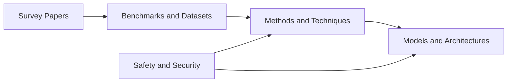
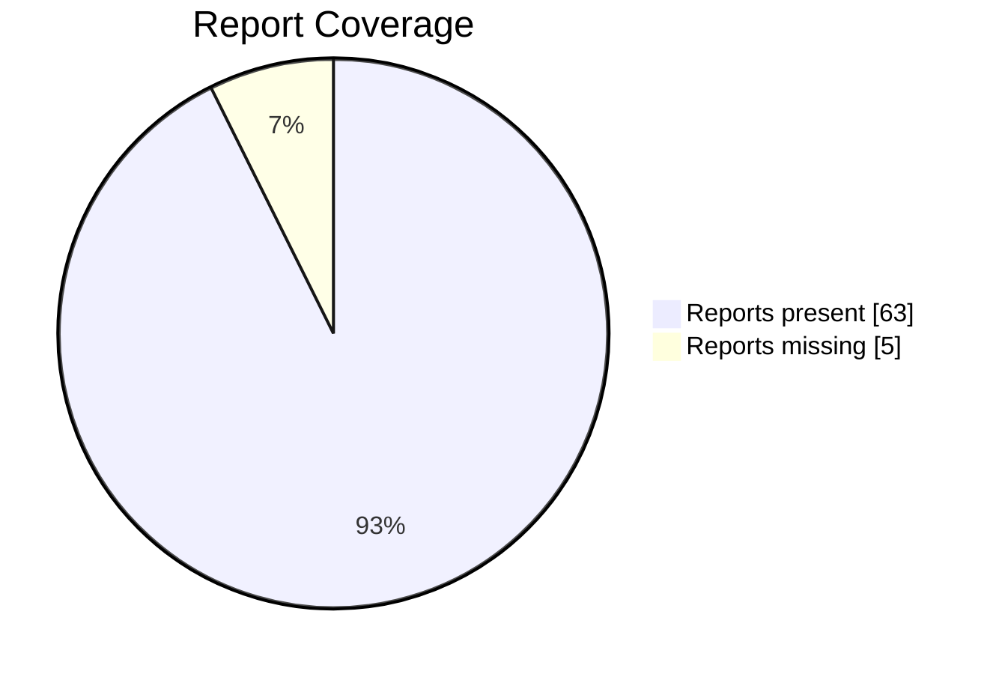

# Paper Reports Index

This index is generated from the repository's `papers/*/README.md` files. The `Report Included` column is a coverage checkbox: entries with a generated report are marked `[x]`, and future entries without reports stay blank until a report is added.

Coverage: `63/68` entries currently have a paper report.

## Survey Papers

| Entry | Report Included | Report | Primary URL | Audit status | Notes |
| --- | --- | --- | --- | --- | --- |
| Large Language Model-Brained GUI Agents: A Survey | [x] | [Open](survey-papers/large-language-model-brained-gui-agents-a-survey.md) | [Source](https://arxiv.org/abs/2411.18279) | `limited-access` | - |
| GUI Agents: A Survey | [x] | [Open](survey-papers/gui-agents-a-survey.md) | [Source](https://arxiv.org/abs/2412.13501) | `ok` | - |
| GUI Agents with Foundation Models: A Comprehensive Survey | [x] | [Open](survey-papers/gui-agents-with-foundation-models-a-comprehensive-survey.md) | [Source](https://arxiv.org/abs/2411.04890) | `limited-access` | - |
| LLM-Powered GUI Agents in Phone Automation | [x] | [Open](survey-papers/llm-powered-gui-agents-in-phone-automation.md) | [Source](https://arxiv.org/abs/2504.19838) | `ok` | - |
| JARVIS or Ultron? Safety and Security Threats of Computer-Using Agents | [x] | [Open](survey-papers/jarvis-or-ultron-safety-and-security-threats-of-computer-using-agents.md) | [Source](https://arxiv.org/abs/2505.10924) | `ok` | - |
| A Survey on Benchmarks of LLM-based GUI Agents | [x] | [Open](survey-papers/a-survey-on-benchmarks-of-llm-based-gui-agents.md) | [Source](https://www.techrxiv.org/doi/pdf/10.36227/techrxiv.176591818.87526814) | `script-blocked` | - |
| AI Agents: Evolution, Architecture, and Real-World Applications | [x] | [Open](survey-papers/ai-agents-evolution-architecture-and-real-world-applications.md) | [Source](https://arxiv.org/abs/2503.12687) | `ok` | - |

## Models and Architectures

| Entry | Report Included | Report | Primary URL | Audit status | Notes |
| --- | --- | --- | --- | --- | --- |
| UI-TARS: Pioneering Automated GUI Interaction with Native Agents | [x] | [Open](models-and-architectures/ui-tars-pioneering-automated-gui-interaction-with-native-agents.md) | [Source](https://arxiv.org/abs/2501.12326) | `ok` | - |
| UI-TARS-2: Advancing GUI Agent with Multi-Turn RL | [x] | [Open](models-and-architectures/ui-tars-2-advancing-gui-agent-with-multi-turn-rl.md) | [Source](https://arxiv.org/abs/2509.02544) | `ok` | - |
| CogAgent: A Visual Language Model for GUI Agents | [x] | [Open](models-and-architectures/cogagent-a-visual-language-model-for-gui-agents.md) | [Source](https://arxiv.org/abs/2312.08914) | `ok` | - |
| ShowUI: Vision-Language-Action Model for GUI Visual Agent | [x] | [Open](models-and-architectures/showui-vision-language-action-model-for-gui-visual-agent.md) | [Source](https://openaccess.thecvf.com/content/CVPR2025/papers/Lin_ShowUI_One_Vision-Language-Action_Model_for_GUI_Visual_Agent_CVPR_2025_paper.pdf) | `pdf-light-read` | - |
| ScreenAgent: A VLM-driven Computer Control Agent | [x] | [Open](models-and-architectures/screenagent-a-vlm-driven-computer-control-agent.md) | [Source](https://arxiv.org/abs/2402.07945) | `ok` | - |
| OmniParser: Pure Vision Based GUI Agent | [x] | [Open](models-and-architectures/omniparser-pure-vision-based-gui-agent.md) | [Source](https://arxiv.org/abs/2408.00203) | `ok` | - |
| SeeClick: Harnessing GUI Grounding for Advanced Visual GUI Agents | [x] | [Open](models-and-architectures/seeclick-harnessing-gui-grounding-for-advanced-visual-gui-agents.md) | [Source](https://arxiv.org/abs/2401.10935) | `ok` | - |
| AppAgent: Multimodal Agents as Smartphone Users | [x] | [Open](models-and-architectures/appagent-multimodal-agents-as-smartphone-users.md) | [Source](https://arxiv.org/abs/2312.13771) | `ok` | - |
| Mobile-Agent-v3: Fundamental Agents for GUI Automation | [x] | [Open](models-and-architectures/mobile-agent-v3-fundamental-agents-for-gui-automation.md) | [Source](https://arxiv.org/abs/2508.15144) | `ok` | - |
| AutoGLM: Autonomous Foundation Agents for GUIs | [x] | [Open](models-and-architectures/autoglm-autonomous-foundation-agents-for-guis.md) | [Source](https://arxiv.org/abs/2411.00820) | `ok` | - |
| AgentCPM-GUI: On-device Mobile Agent | [x] | [Open](models-and-architectures/agentcpm-gui-on-device-mobile-agent.md) | [Source](https://github.com/OpenBMB/AgentCPM-GUI) | `code-only` | Primary source is `code`. |
| Ferret-UI: Grounded Mobile UI Understanding | [x] | [Open](models-and-architectures/ferret-ui-grounded-mobile-ui-understanding.md) | [Source](https://arxiv.org/abs/2404.05719) | `ok` | - |
| Qwen2.5-VL Technical Report | [x] | [Open](models-and-architectures/qwen2-5-vl-technical-report.md) | [Source](https://arxiv.org/abs/2502.13923) | `limited-access` | - |
| AGUVIS: Unified Pure Vision Agents for GUI Interaction | [x] | [Open](models-and-architectures/aguvis-unified-pure-vision-agents-for-gui-interaction.md) | [Source](https://arxiv.org/abs/2412.04454) | `ok` | - |
| R-VLM: Region-Aware VLM for Precise GUI Grounding | [x] | [Open](models-and-architectures/r-vlm-region-aware-vlm-for-precise-gui-grounding.md) | [Source](https://arxiv.org/abs/2507.05673) | `limited-access` | - |
| GUI-Actor: Coordinate-Free Visual Grounding | [x] | [Open](models-and-architectures/gui-actor-coordinate-free-visual-grounding.md) | [Source](https://microsoft.github.io/GUI-Actor/) | `project-page` | - |

## Benchmarks and Datasets

| Entry | Report Included | Report | Primary URL | Audit status | Notes |
| --- | --- | --- | --- | --- | --- |
| OSWorld: Multimodal Agents for Open-Ended Tasks in Real Computer Environments | [x] | [Open](benchmarks-and-datasets/osworld-multimodal-agents-for-open-ended-tasks-in-real-computer-environments.md) | [Source](https://arxiv.org/abs/2404.07972) | `ok` | - |
| Windows Agent Arena (WAA) | [x] | [Open](benchmarks-and-datasets/windows-agent-arena-waa.md) | [Source](https://arxiv.org/abs/2409.08264) | `ok` | - |
| macOSWorld | [x] | [Open](benchmarks-and-datasets/macosworld.md) | [Source](https://arxiv.org/abs/2506.04135) | `limited-access` | - |
| WebArena: Realistic Web Environment for Building Autonomous Agents | [x] | [Open](benchmarks-and-datasets/webarena-realistic-web-environment-for-building-autonomous-agents.md) | [Source](https://arxiv.org/abs/2307.13854) | `limited-access` | - |
| Mind2Web: Towards a Generalist Agent for the Web | [x] | [Open](benchmarks-and-datasets/mind2web-towards-a-generalist-agent-for-the-web.md) | [Source](https://arxiv.org/abs/2306.06070) | `ok` | - |
| Online-Mind2Web | [x] | [Open](benchmarks-and-datasets/online-mind2web.md) | [Source](https://arxiv.org/abs/2504.01382) | `ok` | - |
| VisualWebArena: Multimodal Web Tasks | [x] | [Open](benchmarks-and-datasets/visualwebarena-multimodal-web-tasks.md) | [Source](https://arxiv.org/abs/2401.13649) | `ok` | - |
| WebVoyager: End-to-End Web Agent with LMMs | [x] | [Open](benchmarks-and-datasets/webvoyager-end-to-end-web-agent-with-lmms.md) | [Source](https://arxiv.org/abs/2401.13919) | `limited-access` | - |
| WebCanvas: Online Web Agent Benchmarking | [x] | [Open](benchmarks-and-datasets/webcanvas-online-web-agent-benchmarking.md) | [Source](https://arxiv.org/abs/2406.12373) | `limited-access` | - |
| AndroidWorld: Dynamic Benchmarking Environment | [x] | [Open](benchmarks-and-datasets/androidworld-dynamic-benchmarking-environment.md) | [Source](https://arxiv.org/abs/2405.14573) | `limited-access` | - |
| Android in the Wild (AitW) | [x] | [Open](benchmarks-and-datasets/android-in-the-wild-aitw.md) | [Source](https://arxiv.org/abs/2307.10088) | `ok` | - |
| AMEX: Android Multi-annotation EXpo | [x] | [Open](benchmarks-and-datasets/amex-android-multi-annotation-expo.md) | [Source](https://arxiv.org/abs/2407.17490) | `ok` | - |
| A3: Android Agent Arena | [x] | [Open](benchmarks-and-datasets/a3-android-agent-arena.md) | [Source](https://arxiv.org/abs/2501.01149) | `ok` | - |
| MobileAgentBench | [x] | [Open](benchmarks-and-datasets/mobileagentbench.md) | [Source](https://arxiv.org/abs/2406.08184) | `limited-access` | - |
| GUI Odyssey: Cross-app Mobile Navigation | [x] | [Open](benchmarks-and-datasets/gui-odyssey-cross-app-mobile-navigation.md) | [Source](https://arxiv.org/abs/2411.00820) | `ok` | Confirmed link mismatch. |
| ScreenSpot / ScreenSpot-Pro | [x] | [Open](benchmarks-and-datasets/screenspot-screenspot-pro.md) | [Source](https://arxiv.org/abs/2401.10935) | `ok` | - |
| OmniACT | [x] | [Open](benchmarks-and-datasets/omniact.md) | [Source](https://arxiv.org/abs/2402.17553) | `limited-access` | - |
| ScreenSuite (HuggingFace) | [x] | [Open](benchmarks-and-datasets/screensuite-huggingface.md) | [Source](https://github.com/huggingface/screensuite) | `code-only` | Primary source is `code`. |
| Spider2-V: Data Science Workflows |  |  |  |  | - |
| VideoGUI: Instructional Video Automation |  |  |  |  | - |
| GUICourse: Vision-Language to Agents |  |  |  |  | - |
| AgentTrek Trajectories | [x] | [Open](benchmarks-and-datasets/agenttrek-trajectories.md) | [Source](https://agenttrek.github.io/) | `project-page` | - |
| OS-Genesis Trajectories | [x] | [Open](benchmarks-and-datasets/os-genesis-trajectories.md) | [Source](https://qiushisun.github.io/OS-Genesis-Home/) | `project-page` | - |

## Methods and Techniques

| Entry | Report Included | Report | Primary URL | Audit status | Notes |
| --- | --- | --- | --- | --- | --- |
| ComputerRL: End-to-End Online RL for Computer Use Agents | [x] | [Open](methods-and-techniques/computerrl-end-to-end-online-rl-for-computer-use-agents.md) | [Source](https://arxiv.org/abs/2508.14040) | `ok` | - |
| WebRL: Self-Evolving Online Curriculum RL for Web Agents | [x] | [Open](methods-and-techniques/webrl-self-evolving-online-curriculum-rl-for-web-agents.md) | [Source](https://arxiv.org/abs/2411.02337) | `ok` | - |
| DigiRL: Training In-The-Wild Device-Control | [x] | [Open](methods-and-techniques/digirl-training-in-the-wild-device-control.md) | [Source](https://arxiv.org/abs/2406.11896) | `ok` | - |
| AgentTrek: Agent Trajectory Synthesis via Web Tutorials | [x] | [Open](methods-and-techniques/agenttrek-agent-trajectory-synthesis-via-web-tutorials.md) | [Source](https://arxiv.org/abs/2412.09605) | `ok` | - |
| OS-Genesis: Automating GUI Agent Trajectory Construction | [x] | [Open](methods-and-techniques/os-genesis-automating-gui-agent-trajectory-construction.md) | [Source](https://arxiv.org/abs/2412.19723) | `ok` | - |
| PC Agent-E: Efficient Agent Training for Computer Use | [x] | [Open](methods-and-techniques/pc-agent-e-efficient-agent-training-for-computer-use.md) | [Source](https://arxiv.org/abs/2505.13909) | `ok` | - |
| SeeAct: GPT-4V Web Agent via Visual Grounding | [x] | [Open](methods-and-techniques/seeact-gpt-4v-web-agent-via-visual-grounding.md) | [Source](https://arxiv.org/abs/2401.01614) | `ok` | - |
| Ponder & Press: Advancing VLM Grounding | [x] | [Open](methods-and-techniques/ponder-press-advancing-vlm-grounding.md) | [Source](https://arxiv.org/abs/2409.04566) | `ok` | Confirmed link mismatch. |
| GUI-Reflection: Self-Reflection for GUI Agents | [x] | [Open](methods-and-techniques/gui-reflection-self-reflection-for-gui-agents.md) | [Source](https://penghao-wu.github.io/GUI_Reflection) | `project-page` | Primary source is `website`. |
| Chain-of-Agents: Multi-Agent Collaboration | [x] | [Open](methods-and-techniques/chain-of-agents-multi-agent-collaboration.md) | [Source](https://arxiv.org/abs/2508.13167) | `ok` | - |
| Magentic-One: Multi-Agent with Human-in-Loop | [x] | [Open](methods-and-techniques/magentic-one-multi-agent-with-human-in-loop.md) | [Source](https://arxiv.org/abs/2411.04468) | `ok` | - |
| UFO: Windows OS UI Agent via GPT-4V | [x] | [Open](methods-and-techniques/ufo-windows-os-ui-agent-via-gpt-4v.md) | [Source](https://arxiv.org/abs/2402.07939) | `ok` | - |
| OS-Copilot: Towards Generalist Computer Agents |  |  |  |  | - |

## Safety and Security

| Entry | Report Included | Report | Primary URL | Audit status | Notes |
| --- | --- | --- | --- | --- | --- |
| AgentHarm: LLM Agent Safety Benchmark | [x] | [Open](safety-and-security/agentharm-llm-agent-safety-benchmark.md) | [Source](https://arxiv.org/abs/2410.09024) | `ok` | - |
| WebGuard: Safety Dataset for Web Agents | [x] | [Open](safety-and-security/webguard-safety-dataset-for-web-agents.md) | [Source](https://arxiv.org/abs/2507.14293) | `ok` | - |
| JARVIS or Ultron? Safety and Security Threats of CUAs | [x] | [Open](safety-and-security/jarvis-or-ultron-safety-and-security-threats-of-cuas.md) | [Source](https://arxiv.org/abs/2505.10924) | `ok` | - |
| RedTeamCUA: Security Testing for Computer Use Agents | [x] | [Open](safety-and-security/redteamcua-security-testing-for-computer-use-agents.md) | [Source](https://arxiv.org/abs/2505.21936) | `limited-access` | - |
| Attacking Vision-Language Computer Agents via Pop-ups | [x] | [Open](safety-and-security/attacking-vision-language-computer-agents-via-pop-ups.md) | [Source](https://arxiv.org/abs/2411.02391) | `ok` | - |
| EIA: Environmental Injection Attack | [x] | [Open](safety-and-security/eia-environmental-injection-attack.md) | [Source](https://arxiv.org/abs/2409.02453) | `limited-access` | Confirmed link mismatch. |
| Large Reasoning Models are Autonomous Jailbreak Agents | [x] | [Open](safety-and-security/large-reasoning-models-are-autonomous-jailbreak-agents.md) | [Source](https://www.nature.com/articles/s41467-026-69010-1) | `limited-access` | - |
| Infectious Jailbreaks in Multi-Agent Systems |  |  |  |  | - |
| AI Agents Under Threat: Key Security Challenges and Future Pathways | [x] | [Open](safety-and-security/ai-agents-under-threat-key-security-challenges-and-future-pathways.md) | [Source](https://dl.acm.org/doi/10.1145/3716628) | `script-blocked` | - |
