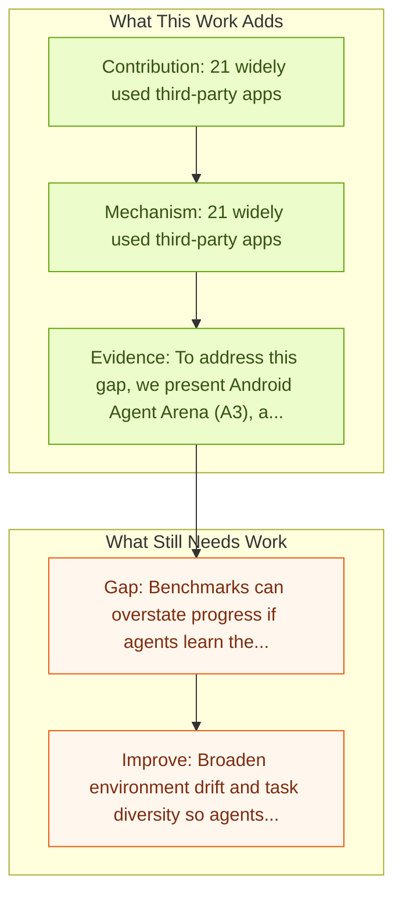

# A3: Android Agent Arena

Entry report generated on 2026-03-28 (Asia/Tokyo). This report is based on the repository entry, linked source metadata, and audit-time cross-checks.

## Snapshot

| Field | Detail |
| --- | --- |
| Repo entry | A3: Android Agent Arena |
| Actual target | [A3: Android Agent Arena for Mobile GUI Agents with Essential-State Procedural Evaluation](https://arxiv.org/abs/2501.01149) |
| Section | Benchmarks and Datasets |
| Source location | `papers/benchmarks/README.md:172` |
| Primary link type | `link` |
| Audit status | `ok` |
| Date / venue | January 2025 |
| Authors | Yuxiang Chai, Shunye Tang, Han Xiao, Weifeng Lin, Hanhao Li, Jiayu Zhang, Liang Liu, Pengxiang Zhao, Guangyi Liu, Guozhi Wang, Shuai Ren, Rongduo Han, Haining Zhang, Siyuan Huang, Hongsheng Li |
| Focus tags | `benchmark` `android` `evaluation` `practical` |
| Center of gravity | mobile |

## Quick Read

| Lens | Read |
| --- | --- |
| Problem pressure | The paper targets a concrete bottleneck in computer-use agents. |
| Most novel move | The main novelty sits in the evaluation surface itself, especially its emphasis on android, practical, features. |
| Strongest evidence | To address this gap, we present Android Agent Arena (A3), a novel "essential-state" based procedural evaluation system for mobile GUI... |
| Main caveat | Benchmarks can overstate progress if agents learn the evaluator rather than the underlying task skill, especially around mobile... |

## Visual Frame

```mermaid
flowchart LR
  Problem["Problem: The advancement of Large Language Models (LLMs) and..."] --> Novelty["Novelty: The main novelty sits in the evaluation surface itself..."]
  Novelty --> Framework["Framework: 21 widely used third-party apps"]
  Framework --> Evidence["Evidence: To address this gap, we present Android Agent Arena (A3), a..."]
  Evidence --> Gap["Gap: Benchmarks can overstate progress if agents learn the..."]
  Gap --> Next["Next: Broaden environment drift and task diversity so agents..."]
  classDef insight fill:#dbeafe,stroke:#2563eb,color:#0f172a;
  classDef risk fill:#fee2e2,stroke:#dc2626,color:#7f1d1d;
  classDef next fill:#dcfce7,stroke:#16a34a,color:#14532d;
  class Problem,Novelty,Framework insight;
  class Evidence insight;
  class Gap risk;
  class Next next;
```

## Analysis Map

## Executive Summary

The advancement of Large Language Models (LLMs) and Multimodal Large Language Models (MLLMs) has catalyzed the development of mobile graphic user interface (GUI) AI agents, which is designed to autonomously perform tasks on mobile devices. However, a significant gap persists in mobile GUI agent evaluation, where existing benchmarks predominantly rely on either static frame assessments such as AndroidControl or offline static apps such as AndroidWorld and thus fail to capture agent performance in dynamic, real-world online mobile apps. To address this gap, we present Android Agent Arena (A3), a novel "essential-state" based procedural evaluation system for mobile GUI agents.

## Code and Supporting Artifacts

- Code repository: no dedicated code link is currently tracked in the repo entry.

## Novelty

- The main novelty sits in the evaluation surface itself, especially its emphasis on android, practical, features.
- It also stands out for 201 representative user tasks.
- It also stands out for automated LLM-based evaluation.

## Core Contributions

- 21 widely used third-party apps
- 201 representative user tasks
- Automated LLM-based evaluation
- The advancement of Large Language Models (LLMs) and Multimodal Large Language Models (MLLMs) has catalyzed the development of mobile graphic user interface (GUI) AI agents, which is designed to autonomously perform tasks on mobile devices.

## Framework and Operating Logic

- 21 widely used third-party apps
- 201 representative user tasks
- Automated LLM-based evaluation

## Evidence and Claimed Results

- To address this gap, we present Android Agent Arena (A3), a novel "essential-state" based procedural evaluation system for mobile GUI agents.
- A3 introduces a benchmark of 100 tasks derived from 20 widely-used, dynamic online apps across 20 categories from the Google Play Store, ensuring evaluation comprehension.
- A3 also presents a novel "essential-state" based procedural evaluation method that leverages MLLMs as reward models to progressively verify task completion and process achievement.
- Furthermore, A3 includes a toolkit to streamline Android device interaction, reset online environment and apps and facilitate data collection from both human and agent demonstrations.

## Gaps and Limitations

- Benchmarks can overstate progress if agents learn the evaluator rather than the underlying task skill, especially around mobile interfaces, app transitions, and version drift.
- Even a strong benchmark can miss interruptions, login drift, or real user messiness if the environment is too clean.

## How To Improve

- Broaden environment drift and task diversity so agents cannot overfit a narrow evaluator or a fixed slice of mobile interfaces, app transitions, and version drift.
- Add richer partial-credit and failure-taxonomy reporting, not only binary success.
- Pair benchmark scores with human-grounded difficulty and usability checks so the suite better reflects real workflows.

## Why It Matters

- This entry matters because benchmarks decide what the rest of the repo gets rewarded for improving.
- It is part of the evaluative scaffolding that lets model and method papers claim progress in a comparable way.

## Connections In This Repo

- [AndroidWorld: Dynamic Benchmarking Environment](androidworld-dynamic-benchmarking-environment.md) - shared focus on mobile GUI control and cross-app interaction constraints.
- [AppAgent: Multimodal Agents as Smartphone Users](../models-and-architectures/appagent-multimodal-agents-as-smartphone-users.md) - shared focus on mobile GUI control and cross-app interaction constraints.
- [Step-GUI Technical Report](../models-and-architectures/step-gui-technical-report.md) - shared focus on mobile GUI control and cross-app interaction constraints.
- [WebVoyager: End-to-End Web Agent with LMMs](webvoyager-end-to-end-web-agent-with-lmms.md) - shared evaluative role in defining what progress means.

## Source Basis

- Primary basis: abstract-level paper metadata plus the repo-local notes in the source Markdown file.
- Audit access note: Metadata resolved cleanly during the audit.
