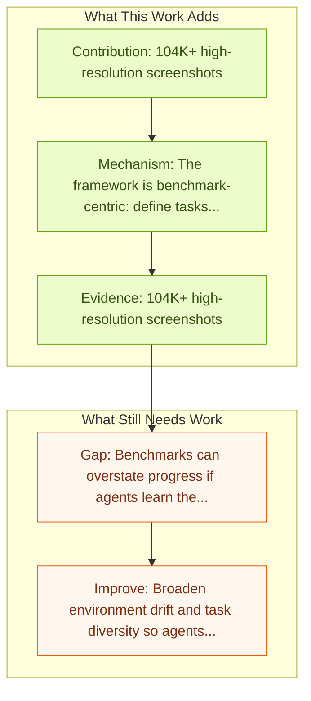

# AMEX: Android Multi-annotation EXpo

Entry report generated on 2026-03-28 (Asia/Tokyo). This report is based on the repository entry, linked source metadata, and audit-time cross-checks.

## Snapshot

| Field | Detail |
| --- | --- |
| Repo entry | AMEX: Android Multi-annotation EXpo |
| Actual target | [AMEX: Android Multi-annotation Expo Dataset for Mobile GUI Agents](https://arxiv.org/abs/2407.17490) |
| Section | Benchmarks and Datasets |
| Source location | `papers/benchmarks/README.md:157` |
| Primary link type | `link` |
| Audit status | `ok` |
| Date / venue | July 2024 |
| Authors | Yuxiang Chai, Siyuan Huang, Yazhe Niu, Han Xiao, Liang Liu, Dingyu Zhang, Shuai Ren, Hongsheng Li |
| Focus tags | `dataset` `android` `annotations` `comprehensive` |
| Center of gravity | mobile, grounding |

## Quick Read

| Lens | Read |
| --- | --- |
| Problem pressure | The paper targets a concrete bottleneck in computer-use agents. |
| Most novel move | The main novelty sits in the evaluation surface itself, especially its emphasis on android, annotations. |
| Strongest evidence | 104K+ high-resolution screenshots |
| Main caveat | Benchmarks can overstate progress if agents learn the evaluator rather than the underlying task skill, especially around mobile... |

## Visual Frame

```mermaid
flowchart LR
  Problem["Problem: AI agents have drawn increasing attention mostly on their..."] --> Novelty["Novelty: The main novelty sits in the evaluation surface itself..."]
  Novelty --> Framework["Framework: The framework is benchmark-centric: define tasks..."]
  Framework --> Evidence["Evidence: 104K+ high-resolution screenshots"]
  Evidence --> Gap["Gap: Benchmarks can overstate progress if agents learn the..."]
  Gap --> Next["Next: Broaden environment drift and task diversity so agents..."]
  classDef insight fill:#dbeafe,stroke:#2563eb,color:#0f172a;
  classDef risk fill:#fee2e2,stroke:#dc2626,color:#7f1d1d;
  classDef next fill:#dcfce7,stroke:#16a34a,color:#14532d;
  class Problem,Novelty,Framework insight;
  class Evidence insight;
  class Gap risk;
  class Next next;
```

## Analysis Map

## Executive Summary

AI agents have drawn increasing attention mostly on their ability to perceive environments, understand tasks, and autonomously achieve goals. To advance research on AI agents in mobile scenarios, we introduce the Android Multi-annotation EXpo (AMEX), a comprehensive, large-scale dataset designed for generalist mobile GUI-control agents which are capable of completing tasks by directly interacting with the graphical user interface (GUI) on mobile devices. AMEX comprises over 104K high-resolution screenshots from popular mobile applications, which are annotated at multiple levels. The benchmark or dataset is the main contribution rather than a new agent policy.

## Code and Supporting Artifacts

- Code repository: no dedicated code link is currently tracked in the repo entry.

## Novelty

- The main novelty sits in the evaluation surface itself, especially its emphasis on android, annotations.
- AI agents have drawn increasing attention mostly on their ability to perceive environments, understand tasks, and autonomously achieve goals.
- To advance research on AI agents in mobile scenarios, we introduce the Android Multi-annotation EXpo (AMEX), a comprehensive, large-scale dataset designed for generalist mobile GUI-control agents which are capable of completing tasks by directly interacting with the graphical user interface (GUI) on mobile devices.

## Core Contributions

- 104K+ high-resolution screenshots
- 110 popular mobile applications
- Multi-level annotations:
- GUI element grounding
- Functionality descriptions

## Framework and Operating Logic

- The framework is benchmark-centric: define tasks, environments, and success criteria so later agent work can be evaluated on common ground.
- AI agents have drawn increasing attention mostly on their ability to perceive environments, understand tasks, and autonomously achieve goals.
- To advance research on AI agents in mobile scenarios, we introduce the Android Multi-annotation EXpo (AMEX), a comprehensive, large-scale dataset designed for generalist mobile GUI-control agents which are capable of completing tasks by directly interacting with the graphical user interface (GUI) on mobile devices.

## Evidence and Claimed Results

- 104K+ high-resolution screenshots
- 110 popular mobile applications
- Multi-level annotations:
- GUI element grounding
- Functionality descriptions

## Gaps and Limitations

- Benchmarks can overstate progress if agents learn the evaluator rather than the underlying task skill, especially around mobile interfaces, app transitions, and version drift.
- Even a strong benchmark can miss interruptions, login drift, or real user messiness if the environment is too clean.

## How To Improve

- Broaden environment drift and task diversity so agents cannot overfit a narrow evaluator or a fixed slice of mobile interfaces, app transitions, and version drift.
- Add richer partial-credit and failure-taxonomy reporting, not only binary success.
- Pair benchmark scores with human-grounded difficulty and usability checks so the suite better reflects real workflows.

## Why It Matters

- This entry matters because benchmarks decide what the rest of the repo gets rewarded for improving.
- It is part of the evaluative scaffolding that lets model and method papers claim progress in a comparable way.

## Connections In This Repo

- [Android in the Wild (AitW)](android-in-the-wild-aitw.md) - shared focus on mobile GUI control and cross-app interaction constraints.
- [AppAgent: Multimodal Agents as Smartphone Users](../models-and-architectures/appagent-multimodal-agents-as-smartphone-users.md) - shared focus on mobile GUI control and cross-app interaction constraints.
- [Step-GUI Technical Report](../models-and-architectures/step-gui-technical-report.md) - shared focus on mobile GUI control and cross-app interaction constraints.
- [DigiRL: Training In-The-Wild Device-Control](../methods-and-techniques/digirl-training-in-the-wild-device-control.md) - shared focus on mobile GUI control and cross-app interaction constraints.

## Source Basis

- Primary basis: abstract-level paper metadata plus the repo-local notes in the source Markdown file.
- Audit access note: Metadata resolved cleanly during the audit.
