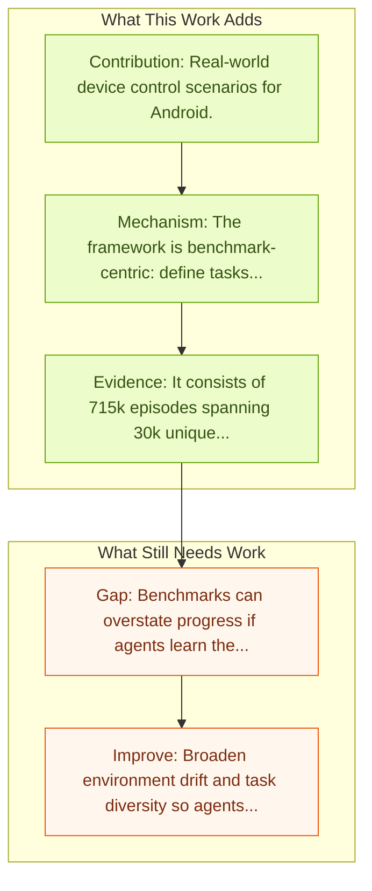

# Android in the Wild (AitW)

Entry report generated on 2026-03-28 (Asia/Tokyo). This report is based on the repository entry, linked source metadata, and audit-time cross-checks.

## Snapshot

| Field | Detail |
| --- | --- |
| Repo entry | Android in the Wild (AitW) |
| Actual target | [Android in the Wild: A Large-Scale Dataset for Android Device Control](https://arxiv.org/abs/2307.10088) |
| Section | Benchmarks and Datasets |
| Source location | `papers/benchmarks/README.md:147` |
| Primary link type | `link` |
| Audit status | `ok` |
| Date / venue | July 2023 |
| Authors | Christopher Rawles, Alice Li, Daniel Rodriguez, Oriana Riva, Timothy Lillicrap |
| Focus tags | `dataset`, `android`, `real-world` |
| Center of gravity | `mobile`, `grounding` |

## Quick Read

| Lens | Read |
| --- | --- |
| Problem pressure | Real-world device control scenarios for Android. |
| Most novel move | The main novelty sits in the evaluation surface itself, especially its emphasis on android, real-world. |
| Strongest evidence | It consists of 715k episodes spanning 30k unique instructions, four versions of Android (v10-13),and eight device types (Pixel 2 XL to... |
| Main caveat | Benchmarks can overstate progress if agents learn the evaluator rather than the underlying task skill, especially around mobile... |

## Visual Frame

```mermaid
flowchart LR
  Problem["Problem: Real-world device control scenarios for Android."] --> Novelty["Novelty: The main novelty sits in the evaluation surface itself..."]
  Novelty --> Framework["Framework: The framework is benchmark-centric: define tasks..."]
  Framework --> Evidence["Evidence: It consists of 715k episodes spanning 30k unique..."]
  Evidence --> Gap["Gap: Benchmarks can overstate progress if agents learn the..."]
  Gap --> Next["Next: Broaden environment drift and task diversity so agents..."]
  classDef insight fill:#dbeafe,stroke:#2563eb,color:#0f172a;
  classDef risk fill:#fee2e2,stroke:#dc2626,color:#7f1d1d;
  classDef next fill:#dcfce7,stroke:#16a34a,color:#14532d;
  class Problem,Novelty,Framework insight;
  class Evidence insight;
  class Gap risk;
  class Next next;
```

## Analysis Map

## Executive Summary

Real-world device control scenarios for Android. There is a growing interest in device-control systems that can interpret human natural language instructions and execute them on a digital device by directly controlling its user interface. The authors present a dataset for device-control research, Android in the Wild (AITW), which is orders of magnitude larger than current datasets. The dataset contains human demonstrations of device interactions, including the screens and actions, and corresponding natural language instructions. The benchmark or dataset is the main contribution rather than a new agent policy.

## Novelty

- The main novelty sits in the evaluation surface itself, especially its emphasis on android, real-world.
- There is a growing interest in device-control systems that can interpret human natural language instructions and execute them on a digital device by directly controlling its user interface.
- The authors present a dataset for device-control research, Android in the Wild (AITW), which is orders of magnitude larger than current datasets.

## Core Contributions

- Real-world device control scenarios for Android.
- There is a growing interest in device-control systems that can interpret human natural language instructions and execute them on a digital device by directly controlling its user interface.
- The authors present a dataset for device-control research, Android in the Wild (AITW), which is orders of magnitude larger than current datasets.
- The dataset contains human demonstrations of device interactions, including the screens and actions, and corresponding natural language instructions.
- Defines a reusable benchmark surface that later model and method papers can optimize against.

## Framework and Operating Logic

- The framework is benchmark-centric: define tasks, environments, and success criteria so later agent work can be evaluated on common ground.
- There is a growing interest in device-control systems that can interpret human natural language instructions and execute them on a digital device by directly controlling its user interface.
- The authors present a dataset for device-control research, Android in the Wild (AITW), which is orders of magnitude larger than current datasets.

## Evidence and Claimed Results

- It consists of 715k episodes spanning 30k unique instructions, four versions of Android (v10-13),and eight device types (Pixel 2 XL to Pixel 6) with varying screen resolutions.
- There is a growing interest in device-control systems that can interpret human natural language instructions and execute them on a digital device by directly controlling its user interface.
- The authors present a dataset for device-control research, Android in the Wild (AITW), which is orders of magnitude larger than current datasets.

## Gaps and Limitations

- Benchmarks can overstate progress if agents learn the evaluator rather than the underlying task skill, especially around mobile interfaces, app transitions, and version drift.
- Even a strong benchmark can miss interruptions, login drift, or real user messiness if the environment is too clean.

## How To Improve

- Broaden environment drift and task diversity so agents cannot overfit a narrow evaluator or a fixed slice of mobile interfaces, app transitions, and version drift.
- Add richer partial-credit and failure-taxonomy reporting, not only binary success.
- Pair benchmark scores with human-grounded difficulty and usability checks so the suite better reflects real workflows.

## Why It Matters

- This entry matters because benchmarks decide what the rest of the repo gets rewarded for improving.
- It is part of the evaluative scaffolding that lets model and method papers claim progress in a comparable way.

## Connections In This Repo

- [AMEX: Android Multi-annotation EXpo](amex-android-multi-annotation-expo.md) - shared focus on mobile GUI control and cross-app interaction constraints.
- [AppAgent: Multimodal Agents as Smartphone Users](../models-and-architectures/appagent-multimodal-agents-as-smartphone-users.md) - shared focus on mobile GUI control and cross-app interaction constraints.
- [Step-GUI Technical Report](../models-and-architectures/step-gui-technical-report.md) - shared focus on mobile GUI control and cross-app interaction constraints.
- [DigiRL: Training In-The-Wild Device-Control](../methods-and-techniques/digirl-training-in-the-wild-device-control.md) - shared focus on mobile GUI control and cross-app interaction constraints.

## Source Basis

- Primary basis: abstract-level paper metadata plus the repo-local notes in the source Markdown file.
- Audit access note: Metadata resolved cleanly during the audit.
