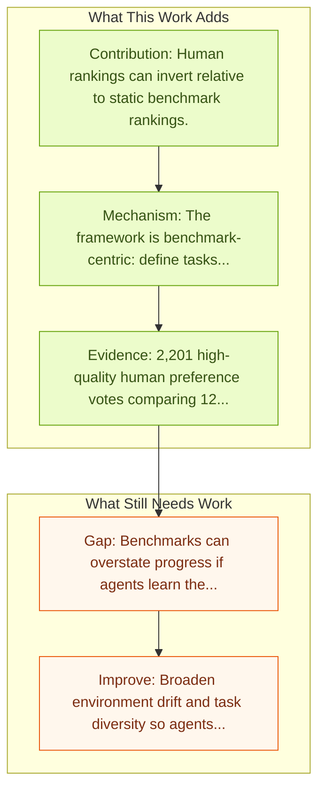

# Computer Agent Arena: Toward Human-Centric Evaluation and Analysis of Computer-Use Agents

Entry report generated on 2026-03-28 (Asia/Tokyo). This report is based on the repository entry, linked source metadata, and audit-time cross-checks.

## Snapshot

| Field | Detail |
| --- | --- |
| Repo entry | Computer Agent Arena: Toward Human-Centric Evaluation and Analysis of Computer-Use Agents |
| Actual target | [Computer Agent Arena: Toward Human-Centric Evaluation and Analysis of Computer-Use Agents](https://openreview.net/forum?id=3x4SDbXbgl) |
| Section | Benchmarks and Datasets |
| Source location | `papers/benchmarks/README.md:298` |
| Primary link type | `link` |
| Audit status | `ok` |
| Date / venue | ICLR 2026 Poster |
| Authors | Ameesh Shah, Jiaxin Cui, Tianbao Xie, Ari Holtzman, Caiming Xiong, Mohit Bansal, Robin Jia |
| Focus tags | `benchmark`, `human-centric`, `evaluation`, `preference` |
| Center of gravity | `human-centric`, `preference` |

## Quick Read

| Lens | Read |
| --- | --- |
| Problem pressure | Human-preference arena for measuring how computer-use agents actually feel in realistic use. |
| Most novel move | The main novelty sits in the evaluation surface itself, especially its emphasis on human-centric, preference, key findings. |
| Strongest evidence | 2,201 high-quality human preference votes comparing 12 different agents. |
| Main caveat | Benchmarks can overstate progress if agents learn the evaluator rather than the underlying task skill, especially around long-horizon... |

## Visual Frame

```mermaid
flowchart LR
  Problem["Problem: Human-preference arena for measuring how computer-use agents..."] --> Novelty["Novelty: The main novelty sits in the evaluation surface itself..."]
  Novelty --> Framework["Framework: The framework is benchmark-centric: define tasks..."]
  Framework --> Evidence["Evidence: 2,201 high-quality human preference votes comparing 12..."]
  Evidence --> Gap["Gap: Benchmarks can overstate progress if agents learn the..."]
  Gap --> Next["Next: Broaden environment drift and task diversity so agents..."]
  classDef insight fill:#dbeafe,stroke:#2563eb,color:#0f172a;
  classDef risk fill:#fee2e2,stroke:#dc2626,color:#7f1d1d;
  classDef next fill:#dcfce7,stroke:#16a34a,color:#14532d;
  class Problem,Novelty,Framework insight;
  class Evidence insight;
  class Gap risk;
  class Next next;
```

## Analysis Map

## Executive Summary

Human-preference arena for measuring how computer-use agents actually feel in realistic use. Computer Agent Arena studies the gap between benchmark scores and actual user preference by building a human-centric evaluation arena for computer-use agents. The benchmark collects 2,201 high-quality human votes comparing 12 agents and shows that rankings based on user preference can differ sharply from rankings on static capability benchmarks. The paper argues that correctness dominates preference, but self-correction behavior and the quality of agent-human interaction materially shape which agent people would actually choose.

## Novelty

- The main novelty sits in the evaluation surface itself, especially its emphasis on human-centric, preference, key findings.
- Computer Agent Arena studies the gap between benchmark scores and actual user preference by building a human-centric evaluation arena for computer-use agents.
- The benchmark collects 2,201 high-quality human votes comparing 12 agents and shows that rankings based on user preference can differ sharply from rankings on static capability benchmarks.

## Core Contributions

- Human rankings can invert relative to static benchmark rankings.
- Correctness matters most, but self-correction behavior and agent-human interaction quality also shape preference.
- 2,201 high-quality human preference votes comparing 12 different agents.
- Computer Agent Arena studies the gap between benchmark scores and actual user preference by building a human-centric evaluation arena for computer-use agents.

## Framework and Operating Logic

- The framework is benchmark-centric: define tasks, environments, and success criteria so later agent work can be evaluated on common ground.
- Computer Agent Arena studies the gap between benchmark scores and actual user preference by building a human-centric evaluation arena for computer-use agents.
- The benchmark collects 2,201 high-quality human votes comparing 12 agents and shows that rankings based on user preference can differ sharply from rankings on static capability benchmarks.

## Evidence and Claimed Results

- 2,201 high-quality human preference votes comparing 12 different agents.
- Human rankings can invert relative to static benchmark rankings.
- Correctness matters most, but self-correction behavior and agent-human interaction quality also shape preference.
- The benchmark collects 2,201 high-quality human votes comparing 12 agents and shows that rankings based on user preference can differ sharply from rankings on static capability benchmarks.

## Gaps and Limitations

- Benchmarks can overstate progress if agents learn the evaluator rather than the underlying task skill, especially around long-horizon transfer, recovery behavior, and distribution shift.
- Even a strong benchmark can miss interruptions, login drift, or real user messiness if the environment is too clean.

## How To Improve

- Broaden environment drift and task diversity so agents cannot overfit a narrow evaluator or a fixed slice of long-horizon transfer, recovery behavior, and distribution shift.
- Add richer partial-credit and failure-taxonomy reporting, not only binary success.
- Pair benchmark scores with human-grounded difficulty and usability checks so the suite better reflects real workflows.

## Why It Matters

- This entry matters because benchmarks decide what the rest of the repo gets rewarded for improving.
- It is part of the evaluative scaffolding that lets model and method papers claim progress in a comparable way.

## Connections In This Repo

- [WebVoyager: End-to-End Web Agent with LMMs](webvoyager-end-to-end-web-agent-with-lmms.md) - shared evaluative role in defining what progress means.
- [A3: Android Agent Arena](a3-android-agent-arena.md) - shared evaluative role in defining what progress means.
- [A Survey on Benchmarks of LLM-based GUI Agents](../survey-papers/a-survey-on-benchmarks-of-llm-based-gui-agents.md) - the survey provides context for the benchmarks and datasets issues highlighted here.
- [How Smart Is Your GUI Agent? A Framework for the Future of Software Interaction](../survey-papers/how-smart-is-your-gui-agent-a-framework-for-the-future-of-software-interaction.md) - the survey provides context for the benchmarks and datasets issues highlighted here.

## Source Basis

- Primary basis: Primary OpenReview abstract and metadata were used because this entry is not available through the arXiv API.
- Audit access note: Metadata resolved cleanly during the audit.
