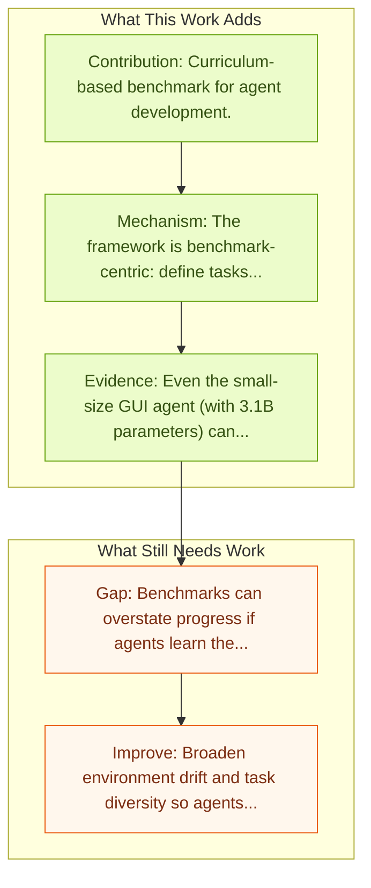

# GUICourse: Vision-Language to Agents

Entry report generated on 2026-03-28 (Asia/Tokyo). This report is based on the repository entry, linked source metadata, and audit-time cross-checks.

## Snapshot

| Field | Detail |
| --- | --- |
| Repo entry | GUICourse: Vision-Language to Agents |
| Actual target | [GUICourse: From General Vision Language Models to Versatile GUI Agents](https://arxiv.org/abs/2406.11317) |
| Section | Benchmarks and Datasets |
| Source location | `papers/benchmarks/README.md:356` |
| Primary link type | `link` |
| Audit status | `ok` |
| Date / venue | 2024 |
| Authors | Wentong Chen, Junbo Cui, Jinyi Hu, Yujia Qin, Junjie Fang, Yue Zhao, Chongyi Wang, Jun Liu, Guirong Chen, Yupeng Huo, Yuan Yao, Yankai Lin, Zhiyuan Liu, Maosong Sun |
| Focus tags | `benchmark` `training` `curriculum` |
| Center of gravity | training, curriculum |

## Quick Read

| Lens | Read |
| --- | --- |
| Problem pressure | Curriculum-based benchmark for agent development. |
| Most novel move | The main novelty sits in the evaluation surface itself, especially its emphasis on training, curriculum. |
| Strongest evidence | Even the small-size GUI agent (with 3.1B parameters) can still work well on single-step and multi-step GUI tasks. |
| Main caveat | Benchmarks can overstate progress if agents learn the evaluator rather than the underlying task skill, especially around long-horizon... |

## Visual Frame

```mermaid
flowchart LR
  Problem["Problem: Curriculum-based benchmark for agent development."] --> Novelty["Novelty: The main novelty sits in the evaluation surface itself..."]
  Novelty --> Framework["Framework: The framework is benchmark-centric: define tasks..."]
  Framework --> Evidence["Evidence: Even the small-size GUI agent (with 3.1B parameters) can..."]
  Evidence --> Gap["Gap: Benchmarks can overstate progress if agents learn the..."]
  Gap --> Next["Next: Broaden environment drift and task diversity so agents..."]
  classDef insight fill:#dbeafe,stroke:#2563eb,color:#0f172a;
  classDef risk fill:#fee2e2,stroke:#dc2626,color:#7f1d1d;
  classDef next fill:#dcfce7,stroke:#16a34a,color:#14532d;
  class Problem,Novelty,Framework insight;
  class Evidence insight;
  class Gap risk;
  class Next next;
```

## Analysis Map

## Executive Summary

Curriculum-based benchmark for agent development. Utilizing Graphic User Interface (GUI) for human-computer interaction is essential for accessing a wide range of digital tools. Recent advancements in Vision Language Models (VLMs) highlight the compelling potential to develop versatile agents to help humans finish GUI navigation tasks. However, current VLMs are challenged in terms of fundamental abilities (OCR and grounding) and GUI knowledge (the functions and control methods of GUI elements), preventing them from becoming practical GUI agents.

## Novelty

- The main novelty sits in the evaluation surface itself, especially its emphasis on training, curriculum.
- Utilizing Graphic User Interface (GUI) for human-computer interaction is essential for accessing a wide range of digital tools.
- Recent advancements in Vision Language Models (VLMs) highlight the compelling potential to develop versatile agents to help humans finish GUI navigation tasks.

## Core Contributions

- Curriculum-based benchmark for agent development.
- Utilizing Graphic User Interface (GUI) for human-computer interaction is essential for accessing a wide range of digital tools.
- Recent advancements in Vision Language Models (VLMs) highlight the compelling potential to develop versatile agents to help humans finish GUI navigation tasks.
- However, current VLMs are challenged in terms of fundamental abilities (OCR and grounding) and GUI knowledge (the functions and control methods of GUI elements), preventing them from becoming practical GUI agents.

## Framework and Operating Logic

- The framework is benchmark-centric: define tasks, environments, and success criteria so later agent work can be evaluated on common ground.
- Utilizing Graphic User Interface (GUI) for human-computer interaction is essential for accessing a wide range of digital tools.
- Recent advancements in Vision Language Models (VLMs) highlight the compelling potential to develop versatile agents to help humans finish GUI navigation tasks.

## Evidence and Claimed Results

- Even the small-size GUI agent (with 3.1B parameters) can still work well on single-step and multi-step GUI tasks.
- Our source codes and datasets are released at https://github.com/yiye3/GUICourse.

## Gaps and Limitations

- Benchmarks can overstate progress if agents learn the evaluator rather than the underlying task skill, especially around long-horizon transfer, recovery behavior, and distribution shift.
- Even a strong benchmark can miss interruptions, login drift, or real user messiness if the environment is too clean.

## How To Improve

- Broaden environment drift and task diversity so agents cannot overfit a narrow evaluator or a fixed slice of long-horizon transfer, recovery behavior, and distribution shift.
- Add richer partial-credit and failure-taxonomy reporting, not only binary success.
- Pair benchmark scores with human-grounded difficulty and usability checks so the suite better reflects real workflows.

## Why It Matters

- This entry matters because benchmarks decide what the rest of the repo gets rewarded for improving.
- It is part of the evaluative scaffolding that lets model and method papers claim progress in a comparable way.

## Connections In This Repo

- [WebRL: Self-Evolving Online Curriculum RL for Web Agents](../methods-and-techniques/webrl-self-evolving-online-curriculum-rl-for-web-agents.md) - the papers sit in the same local research cluster in this repository.
- [AgentHarm: LLM Agent Safety Benchmark](../safety-and-security/agentharm-llm-agent-safety-benchmark.md) - shared evaluative role in defining what progress means.
- [OS-Harm: A Benchmark for Measuring Safety of Computer Use Agents](../safety-and-security/os-harm-a-benchmark-for-measuring-safety-of-computer-use-agents.md) - shared evaluative role in defining what progress means.
- [VPI-Bench: Visual Prompt Injection Attacks for Computer-Use Agents](../safety-and-security/vpi-bench-visual-prompt-injection-attacks-for-computer-use-agents.md) - shared evaluative role in defining what progress means.

## Source Basis

- Primary basis: Primary arXiv abstract metadata was fetched live from the linked paper page.
- Audit access note: Metadata resolved cleanly during the audit.
