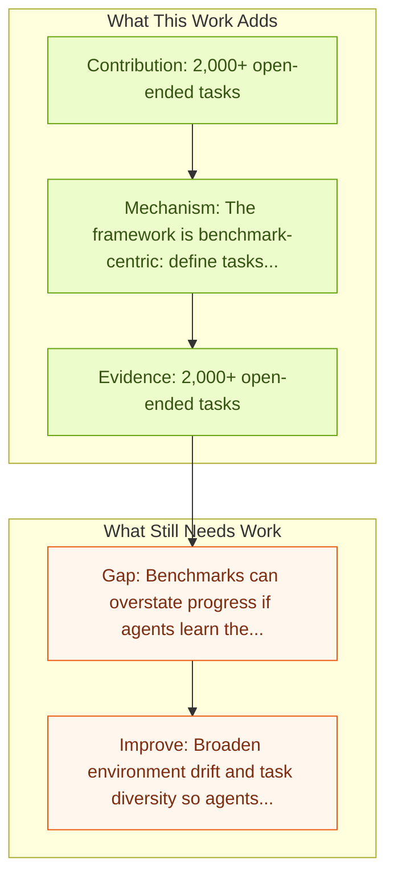

# Mind2Web: Towards a Generalist Agent for the Web

Entry report generated on 2026-03-28 (Asia/Tokyo). This report is based on the repository entry, linked source metadata, and audit-time cross-checks.

## Snapshot

| Field | Detail |
| --- | --- |
| Repo entry | Mind2Web: Towards a Generalist Agent for the Web |
| Actual target | [Mind2Web: Towards a Generalist Agent for the Web](https://arxiv.org/abs/2306.06070) |
| Section | Benchmarks and Datasets |
| Source location | `papers/benchmarks/README.md:73` |
| Primary link type | `link` |
| Audit status | `ok` |
| Date / venue | NeurIPS 2023 Spotlight |
| Authors | Xiang Deng, Yu Gu, Boyuan Zheng, Shijie Chen, Samuel Stevens, Boshi Wang, Huan Sun, Yu Su |
| Focus tags | `benchmark`, `dataset`, `web`, `generalist` |
| Center of gravity | `web` |
| Related assets | [osu-nlp-group.github.io/Mind2Web](https://osu-nlp-group.github.io/Mind2Web/); [GitHub](https://github.com/OSU-NLP-Group/Mind2Web) |

## Quick Read

| Lens | Read |
| --- | --- |
| Problem pressure | First dataset for developing generalist web agents. |
| Most novel move | The main novelty sits in the evaluation surface itself, especially its emphasis on web, generalist. |
| Strongest evidence | 2,000+ open-ended tasks |
| Main caveat | Benchmarks can overstate progress if agents learn the evaluator rather than the underlying task skill, especially around live websites... |

## Visual Frame

```mermaid
flowchart LR
  Problem["Problem: First dataset for developing generalist web agents."] --> Novelty["Novelty: The main novelty sits in the evaluation surface itself..."]
  Novelty --> Framework["Framework: The framework is benchmark-centric: define tasks..."]
  Framework --> Evidence["Evidence: 2,000+ open-ended tasks"]
  Evidence --> Gap["Gap: Benchmarks can overstate progress if agents learn the..."]
  Gap --> Next["Next: Broaden environment drift and task diversity so agents..."]
  classDef insight fill:#dbeafe,stroke:#2563eb,color:#0f172a;
  classDef risk fill:#fee2e2,stroke:#dc2626,color:#7f1d1d;
  classDef next fill:#dcfce7,stroke:#16a34a,color:#14532d;
  class Problem,Novelty,Framework insight;
  class Evidence insight;
  class Gap risk;
  class Next next;
```

## Analysis Map

## Executive Summary

First dataset for developing generalist web agents. We introduce Mind2Web, the first dataset for developing and evaluating generalist agents for the web that can follow language instructions to complete complex tasks on any website. Existing datasets for web agents either use simulated websites or only cover a limited set of websites and tasks, thus not suitable for generalist web agents. With over 2,000 open-ended tasks collected from 137 websites spanning 31 domains and crowdsourced action sequences for the tasks, Mind2Web provides three necessary ingredients for building generalist web agents: 1) diverse domains, websites, and tasks, 2) use of real-world websites instead of simulated and simplified ones, and 3) a broad spectrum of user interaction patterns. The benchmark or dataset is the main contribution rather than a new agent policy.

## Novelty

- The main novelty sits in the evaluation surface itself, especially its emphasis on web, generalist.
- We introduce Mind2Web, the first dataset for developing and evaluating generalist agents for the web that can follow language instructions to complete complex tasks on any website.
- Existing datasets for web agents either use simulated websites or only cover a limited set of websites and tasks, thus not suitable for generalist web agents.

## Core Contributions

- 2,000+ open-ended tasks
- 137 websites
- 31 domains
- Crowdsourced action sequences

## Framework and Operating Logic

- The framework is benchmark-centric: define tasks, environments, and success criteria so later agent work can be evaluated on common ground.
- We introduce Mind2Web, the first dataset for developing and evaluating generalist agents for the web that can follow language instructions to complete complex tasks on any website.
- Existing datasets for web agents either use simulated websites or only cover a limited set of websites and tasks, thus not suitable for generalist web agents.

## Evidence and Claimed Results

- 2,000+ open-ended tasks
- 137 websites
- 31 domains
- Crowdsourced action sequences
- We introduce Mind2Web, the first dataset for developing and evaluating generalist agents for the web that can follow language instructions to complete complex tasks on any website.

## Gaps and Limitations

- Benchmarks can overstate progress if agents learn the evaluator rather than the underlying task skill, especially around live websites, layout drift, and prompt-injection exposure.
- Even a strong benchmark can miss interruptions, login drift, or real user messiness if the environment is too clean.

## How To Improve

- Broaden environment drift and task diversity so agents cannot overfit a narrow evaluator or a fixed slice of live websites, layout drift, and prompt-injection exposure.
- Add richer partial-credit and failure-taxonomy reporting, not only binary success.
- Pair benchmark scores with human-grounded difficulty and usability checks so the suite better reflects real workflows.

## Why It Matters

- This entry matters because benchmarks decide what the rest of the repo gets rewarded for improving.
- It is part of the evaluative scaffolding that lets model and method papers claim progress in a comparable way.

## Connections In This Repo

- [WebGuard: Safety Dataset for Web Agents](../safety-and-security/webguard-safety-dataset-for-web-agents.md) - shared focus on web-agent realism, dynamic pages, or browser-side risk.
- [WebArena: Realistic Web Environment for Building Autonomous Agents](webarena-realistic-web-environment-for-building-autonomous-agents.md) - shared focus on web-agent realism, dynamic pages, or browser-side risk.
- [Online-Mind2Web](online-mind2web.md) - shared focus on web-agent realism, dynamic pages, or browser-side risk.
- [VisualWebArena: Multimodal Web Tasks](visualwebarena-multimodal-web-tasks.md) - shared focus on web-agent realism, dynamic pages, or browser-side risk.

## Source Basis

- Primary basis: abstract-level paper metadata plus the repo-local notes in the source Markdown file.
- Audit access note: Metadata resolved cleanly during the audit.
