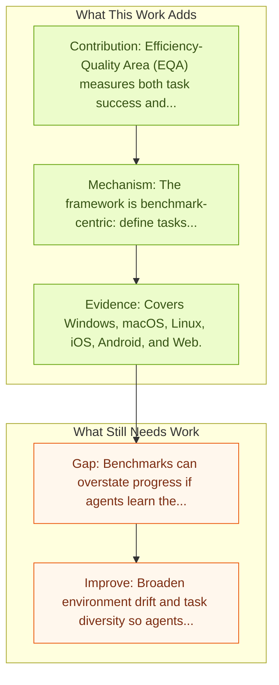

# MMBench-GUI: Hierarchical Multi-Platform Evaluation Framework for GUI Agents

Entry report generated on 2026-03-28 (Asia/Tokyo). This report is based on the repository entry, linked source metadata, and audit-time cross-checks.

## Snapshot

| Field | Detail |
| --- | --- |
| Repo entry | MMBench-GUI: Hierarchical Multi-Platform Evaluation Framework for GUI Agents |
| Actual target | [MMBench-GUI: Hierarchical Multi-Platform Evaluation Framework for GUI Agents](https://arxiv.org/abs/2507.19478) |
| Section | Benchmarks and Datasets |
| Source location | `papers/benchmarks/README.md:245` |
| Primary link type | `link` |
| Audit status | `ok` |
| Date / venue | July 2025 |
| Authors | Xuehui Wang, Zhenyu Wu, JingJing Xie, Zichen Ding, Bowen Yang, Zehao Li, Zhaoyang Liu, Qingyun Li, Xuan Dong, Zhe Chen, Weiyun Wang, Xiangyu Zhao, Jixuan Chen, Haodong Duan, Tianbao Xie, Chenyu Yang, Shiqian Su, Yue Yu, Yuan Huang, Yiqian Liu, Xiao Zhang, Yanting Zhang, Xiangyu Yue, Weijie Su, Xizhou Zhu, Wei Shen, Jifeng Dai, Wenhai Wang |
| Focus tags | `benchmark` `cross-platform` `hierarchical` `efficiency` |
| Center of gravity | cross-platform, hierarchical, efficiency |

## Quick Read

| Lens | Read |
| --- | --- |
| Problem pressure | Hierarchical benchmark for GUI agents spanning desktop, mobile, and web platforms. |
| Most novel move | The main novelty sits in the evaluation surface itself, especially its emphasis on cross-platform, hierarchical, efficiency. |
| Strongest evidence | Covers Windows, macOS, Linux, iOS, Android, and Web. |
| Main caveat | Benchmarks can overstate progress if agents learn the evaluator rather than the underlying task skill, especially around long-horizon... |

## Visual Frame

```mermaid
flowchart LR
  Problem["Problem: Hierarchical benchmark for GUI agents spanning desktop..."] --> Novelty["Novelty: The main novelty sits in the evaluation surface itself..."]
  Novelty --> Framework["Framework: The framework is benchmark-centric: define tasks..."]
  Framework --> Evidence["Evidence: Covers Windows, macOS, Linux, iOS, Android, and Web."]
  Evidence --> Gap["Gap: Benchmarks can overstate progress if agents learn the..."]
  Gap --> Next["Next: Broaden environment drift and task diversity so agents..."]
  classDef insight fill:#dbeafe,stroke:#2563eb,color:#0f172a;
  classDef risk fill:#fee2e2,stroke:#dc2626,color:#7f1d1d;
  classDef next fill:#dcfce7,stroke:#16a34a,color:#14532d;
  class Problem,Novelty,Framework insight;
  class Evidence insight;
  class Gap risk;
  class Next next;
```

## Analysis Map

## Executive Summary

Hierarchical benchmark for GUI agents spanning desktop, mobile, and web platforms. We introduce MMBench-GUI, a hierarchical benchmark for evaluating GUI automation agents across Windows, macOS, Linux, iOS, Android, and Web platforms. It comprises four levels: GUI Content Understanding, Element Grounding, Task Automation, and Task Collaboration, covering essential skills for GUI agents. In addition, we propose a novel Efficiency-Quality Area (EQA) metric to assess GUI agent execution efficiency in online automation scenarios.

## Novelty

- The main novelty sits in the evaluation surface itself, especially its emphasis on cross-platform, hierarchical, efficiency.
- We introduce MMBench-GUI, a hierarchical benchmark for evaluating GUI automation agents across Windows, macOS, Linux, iOS, Android, and Web platforms.
- It comprises four levels: GUI Content Understanding, Element Grounding, Task Automation, and Task Collaboration, covering essential skills for GUI agents.

## Core Contributions

- Efficiency-Quality Area (EQA) measures both task success and execution efficiency.
- Accurate visual grounding is a primary determinant of end-to-end task success.
- Existing agents remain highly inefficient, often taking many redundant steps.
- Covers Windows, macOS, Linux, iOS, Android, and Web.
- Evaluates four levels: content understanding, element grounding, task automation, and task collaboration.

## Framework and Operating Logic

- The framework is benchmark-centric: define tasks, environments, and success criteria so later agent work can be evaluated on common ground.
- We introduce MMBench-GUI, a hierarchical benchmark for evaluating GUI automation agents across Windows, macOS, Linux, iOS, Android, and Web platforms.
- It comprises four levels: GUI Content Understanding, Element Grounding, Task Automation, and Task Collaboration, covering essential skills for GUI agents.

## Evidence and Claimed Results

- Covers Windows, macOS, Linux, iOS, Android, and Web.
- Evaluates four levels: content understanding, element grounding, task automation, and task collaboration.
- Efficiency-Quality Area (EQA) measures both task success and execution efficiency.
- Accurate visual grounding is a primary determinant of end-to-end task success.
- Existing agents remain highly inefficient, often taking many redundant steps.

## Gaps and Limitations

- Benchmarks can overstate progress if agents learn the evaluator rather than the underlying task skill, especially around long-horizon transfer, recovery behavior, and distribution shift.
- Even a strong benchmark can miss interruptions, login drift, or real user messiness if the environment is too clean.

## How To Improve

- Broaden environment drift and task diversity so agents cannot overfit a narrow evaluator or a fixed slice of long-horizon transfer, recovery behavior, and distribution shift.
- Add richer partial-credit and failure-taxonomy reporting, not only binary success.
- Pair benchmark scores with human-grounded difficulty and usability checks so the suite better reflects real workflows.

## Why It Matters

- This entry matters because benchmarks decide what the rest of the repo gets rewarded for improving.
- It is part of the evaluative scaffolding that lets model and method papers claim progress in a comparable way.

## Connections In This Repo

- [GUIGuard: Toward a General Framework for Privacy-Preserving GUI Agents](../safety-and-security/guiguard-toward-a-general-framework-for-privacy-preserving-gui-agents.md) - shared evaluative role in defining what progress means.
- [MobileAgentBench](mobileagentbench.md) - shared evaluative role in defining what progress means.
- [OmniACT](omniact.md) - shared evaluative role in defining what progress means.
- [CogAgent: A Visual Language Model for GUI Agents](../models-and-architectures/cogagent-a-visual-language-model-for-gui-agents.md) - the papers sit in the same local research cluster in this repository.

## Source Basis

- Primary basis: Primary arXiv abstract metadata was fetched live from the linked paper page.
- Audit access note: Metadata resolved cleanly during the audit.
