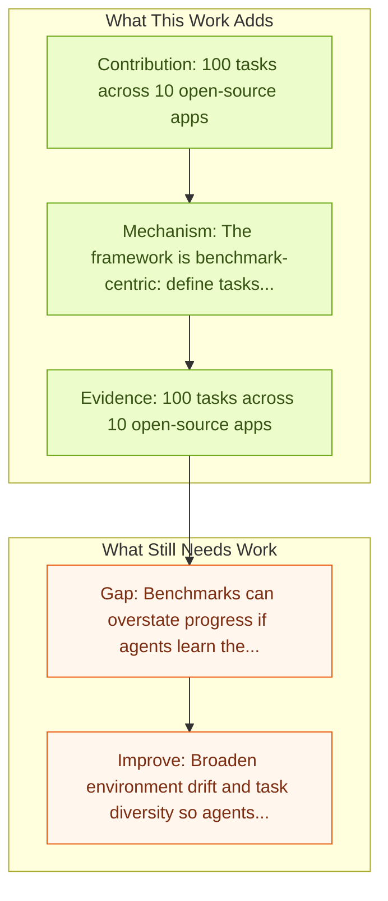

# MobileAgentBench

Entry report generated on 2026-03-28 (Asia/Tokyo). This report is based on the repository entry, linked source metadata, and audit-time cross-checks.

## Snapshot

| Field | Detail |
| --- | --- |
| Repo entry | MobileAgentBench |
| Actual target | [MobileAgentBench: An Efficient and User-Friendly Benchmark for Mobile LLM Agents](https://arxiv.org/abs/2406.08184) |
| Section | Benchmarks and Datasets |
| Source location | `papers/benchmarks/README.md:184` |
| Primary link type | `link` |
| Audit status | `limited-access` |
| Date / venue | June 2024 |
| Authors | Luyuan Wang, Yongyu Deng, Yiwei Zha, Guodong Mao, Qinmin Wang, Tianchen Min, Wei Chen, Shoufa Chen |
| Focus tags | `benchmark` `mobile` `efficiency` |
| Center of gravity | web, mobile |

## Quick Read

| Lens | Read |
| --- | --- |
| Problem pressure | The paper targets a concrete bottleneck in computer-use agents. |
| Most novel move | The main novelty sits in the evaluation surface itself, especially its emphasis on mobile, efficiency. |
| Strongest evidence | 100 tasks across 10 open-source apps |
| Main caveat | Benchmarks can overstate progress if agents learn the evaluator rather than the underlying task skill, especially around mobile... |

## Visual Frame

```mermaid
flowchart LR
  Problem["Problem: Large language model (LLM)-based mobile agents are..."] --> Novelty["Novelty: The main novelty sits in the evaluation surface itself..."]
  Novelty --> Framework["Framework: The framework is benchmark-centric: define tasks..."]
  Framework --> Evidence["Evidence: 100 tasks across 10 open-source apps"]
  Evidence --> Gap["Gap: Benchmarks can overstate progress if agents learn the..."]
  Gap --> Next["Next: Broaden environment drift and task diversity so agents..."]
  classDef insight fill:#dbeafe,stroke:#2563eb,color:#0f172a;
  classDef risk fill:#fee2e2,stroke:#dc2626,color:#7f1d1d;
  classDef next fill:#dcfce7,stroke:#16a34a,color:#14532d;
  class Problem,Novelty,Framework insight;
  class Evidence insight;
  class Gap risk;
  class Next next;
```

## Analysis Map

## Executive Summary

Large language model (LLM)-based mobile agents are increasingly popular due to their capability to interact directly with mobile phone Graphic User Interfaces (GUIs) and their potential to autonomously manage daily tasks. Despite their promising prospects in both academic and industrial sectors, little research has focused on benchmarking the performance of existing mobile agents, due to the inexhaustible states of apps and the vague definition of feasible action sequences. To address this challenge, we propose an efficient and user-friendly benchmark, MobileAgentBench, designed to alleviate the burden of extensive manual testing.

## Novelty

- The main novelty sits in the evaluation surface itself, especially its emphasis on mobile, efficiency.
- Large language model (LLM)-based mobile agents are increasingly popular due to their capability to interact directly with mobile phone Graphic User Interfaces (GUIs) and their potential to autonomously manage daily tasks.
- Despite their promising prospects in both academic and industrial sectors, little research has focused on benchmarking the performance of existing mobile agents, due to the inexhaustible states of apps and the vague definition of feasible action sequences.

## Core Contributions

- 100 tasks across 10 open-source apps
- Systematic comparison of AppAgent, MobileAgent, etc.
- Large language model (LLM)-based mobile agents are increasingly popular due to their capability to interact directly with mobile phone Graphic User Interfaces (GUIs) and their potential to autonomously manage daily tasks.
- Despite their promising prospects in both academic and industrial sectors, little research has focused on benchmarking the performance of existing mobile agents, due to the inexhaustible states of apps and the vague definition of feasible action sequences.

## Framework and Operating Logic

- The framework is benchmark-centric: define tasks, environments, and success criteria so later agent work can be evaluated on common ground.
- Large language model (LLM)-based mobile agents are increasingly popular due to their capability to interact directly with mobile phone Graphic User Interfaces (GUIs) and their potential to autonomously manage daily tasks.
- Despite their promising prospects in both academic and industrial sectors, little research has focused on benchmarking the performance of existing mobile agents, due to the inexhaustible states of apps and the vague definition of feasible action sequences.

## Evidence and Claimed Results

- 100 tasks across 10 open-source apps
- Systematic comparison of AppAgent, MobileAgent, etc.
- We initially define 100 tasks across 10 open-source apps, categorized by multiple levels of difficulty.

## Gaps and Limitations

- Benchmarks can overstate progress if agents learn the evaluator rather than the underlying task skill, especially around mobile interfaces, app transitions, and version drift.
- Even a strong benchmark can miss interruptions, login drift, or real user messiness if the environment is too clean.

## How To Improve

- Broaden environment drift and task diversity so agents cannot overfit a narrow evaluator or a fixed slice of mobile interfaces, app transitions, and version drift.
- Add richer partial-credit and failure-taxonomy reporting, not only binary success.
- Pair benchmark scores with human-grounded difficulty and usability checks so the suite better reflects real workflows.

## Why It Matters

- This entry matters because benchmarks decide what the rest of the repo gets rewarded for improving.
- It is part of the evaluative scaffolding that lets model and method papers claim progress in a comparable way.

## Connections In This Repo

- [AndroidWorld: Dynamic Benchmarking Environment](androidworld-dynamic-benchmarking-environment.md) - shared focus on mobile GUI control and cross-app interaction constraints.
- [GUI Odyssey: Cross-app Mobile Navigation](gui-odyssey-cross-app-mobile-navigation.md) - shared focus on mobile GUI control and cross-app interaction constraints.
- [LLM-Powered GUI Agents in Phone Automation](../survey-papers/llm-powered-gui-agents-in-phone-automation.md) - shared focus on mobile GUI control and cross-app interaction constraints.
- [AppAgent: Multimodal Agents as Smartphone Users](../models-and-architectures/appagent-multimodal-agents-as-smartphone-users.md) - shared focus on mobile GUI control and cross-app interaction constraints.

## Source Basis

- Primary basis: abstract-level paper metadata plus the repo-local notes in the source Markdown file.
- Audit access note: The linked source had limited direct readability during the audit, so the report leans more heavily on accessible metadata and repo context.
