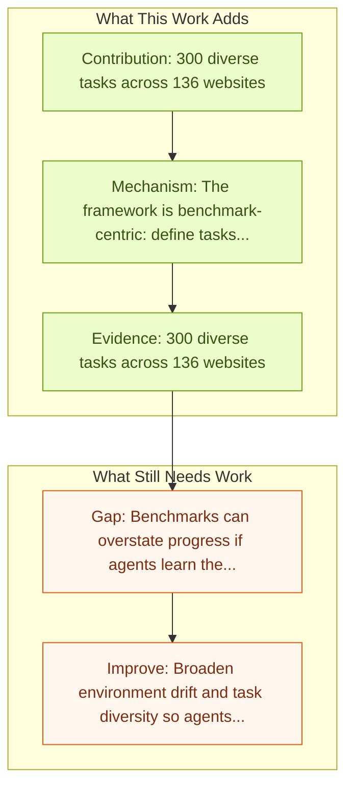

# Online-Mind2Web

Entry report generated on 2026-03-28 (Asia/Tokyo). This report is based on the repository entry, linked source metadata, and audit-time cross-checks.

## Snapshot

| Field | Detail |
| --- | --- |
| Repo entry | Online-Mind2Web |
| Actual target | [An Illusion of Progress? Assessing the Current State of Web Agents](https://arxiv.org/abs/2504.01382) |
| Section | Benchmarks and Datasets |
| Source location | `papers/benchmarks/README.md:91` |
| Primary link type | `link` |
| Audit status | `ok` |
| Date / venue | COLM 2025 |
| Authors | Tianci Xue, Weijian Qi, Tianneng Shi, Chan Hee Song, Boyu Gou, Dawn Song, Huan Sun, Yu Su |
| Focus tags | `benchmark` `web` `live-sites` |
| Center of gravity | web |

## Quick Read

| Lens | Read |
| --- | --- |
| Problem pressure | The paper targets a concrete bottleneck in computer-use agents. |
| Most novel move | The main novelty sits in the evaluation surface itself, especially its emphasis on web, live-sites, improvements over mind2web. |
| Strongest evidence | 300 diverse tasks across 136 websites |
| Main caveat | Benchmarks can overstate progress if agents learn the evaluator rather than the underlying task skill, especially around live websites... |

## Visual Frame

```mermaid
flowchart LR
  Problem["Problem: As digitalization and cloud technologies evolve, the web is..."] --> Novelty["Novelty: The main novelty sits in the evaluation surface itself..."]
  Novelty --> Framework["Framework: The framework is benchmark-centric: define tasks..."]
  Framework --> Evidence["Evidence: 300 diverse tasks across 136 websites"]
  Evidence --> Gap["Gap: Benchmarks can overstate progress if agents learn the..."]
  Gap --> Next["Next: Broaden environment drift and task diversity so agents..."]
  classDef insight fill:#dbeafe,stroke:#2563eb,color:#0f172a;
  classDef risk fill:#fee2e2,stroke:#dc2626,color:#7f1d1d;
  classDef next fill:#dcfce7,stroke:#16a34a,color:#14532d;
  class Problem,Novelty,Framework insight;
  class Evidence insight;
  class Gap risk;
  class Next next;
```

## Analysis Map

## Executive Summary

As digitalization and cloud technologies evolve, the web is becoming increasingly important in the modern society. Autonomous web agents based on large language models (LLMs) hold a great potential in work automation. It is therefore important to accurately measure and monitor the progression of their capabilities. The benchmark or dataset is the main contribution rather than a new agent policy.

## Code and Supporting Artifacts

- Code repository: no dedicated code link is currently tracked in the repo entry.

## Novelty

- The main novelty sits in the evaluation surface itself, especially its emphasis on web, live-sites, improvements over mind2web.
- As digitalization and cloud technologies evolve, the web is becoming increasingly important in the modern society.
- Autonomous web agents based on large language models (LLMs) hold a great potential in work automation.

## Core Contributions

- 300 diverse tasks across 136 websites
- Live website evaluation (vs cached pages)
- Handles cookies, pop-ups, changing layouts
- As digitalization and cloud technologies evolve, the web is becoming increasingly important in the modern society.

## Framework and Operating Logic

- The framework is benchmark-centric: define tasks, environments, and success criteria so later agent work can be evaluated on common ground.
- As digitalization and cloud technologies evolve, the web is becoming increasingly important in the modern society.
- Autonomous web agents based on large language models (LLMs) hold a great potential in work automation.

## Evidence and Claimed Results

- 300 diverse tasks across 136 websites
- Live website evaluation (vs cached pages)
- Handles cookies, pop-ups, changing layouts
- We introduce Online-Mind2Web, an online evaluation benchmark consisting of 300 diverse and realistic tasks spanning 136 websites.
- To facilitate more scalable evaluation and development, we also develop a novel LLM-as-a-Judge automatic evaluation method and show that it can achieve around 85% agreement with human judgment, substantially higher than existing methods.

## Gaps and Limitations

- Benchmarks can overstate progress if agents learn the evaluator rather than the underlying task skill, especially around live websites, layout drift, and prompt-injection exposure.
- Even a strong benchmark can miss interruptions, login drift, or real user messiness if the environment is too clean.

## How To Improve

- Broaden environment drift and task diversity so agents cannot overfit a narrow evaluator or a fixed slice of live websites, layout drift, and prompt-injection exposure.
- Add richer partial-credit and failure-taxonomy reporting, not only binary success.
- Pair benchmark scores with human-grounded difficulty and usability checks so the suite better reflects real workflows.

## Why It Matters

- This entry matters because benchmarks decide what the rest of the repo gets rewarded for improving.
- It is part of the evaluative scaffolding that lets model and method papers claim progress in a comparable way.

## Connections In This Repo

- [HackWorld: Evaluating Computer-Use Agents on Exploiting Web Application Vulnerabilities](../safety-and-security/hackworld-evaluating-computer-use-agents-on-exploiting-web-application-vulnerabilities.md) - shared focus on web-agent realism, dynamic pages, or browser-side risk.
- [WebArena: Realistic Web Environment for Building Autonomous Agents](webarena-realistic-web-environment-for-building-autonomous-agents.md) - shared focus on web-agent realism, dynamic pages, or browser-side risk.
- [Mind2Web: Towards a Generalist Agent for the Web](mind2web-towards-a-generalist-agent-for-the-web.md) - shared focus on web-agent realism, dynamic pages, or browser-side risk.
- [VisualWebArena: Multimodal Web Tasks](visualwebarena-multimodal-web-tasks.md) - shared focus on web-agent realism, dynamic pages, or browser-side risk.

## Source Basis

- Primary basis: abstract-level paper metadata plus the repo-local notes in the source Markdown file.
- Audit access note: Metadata resolved cleanly during the audit.
