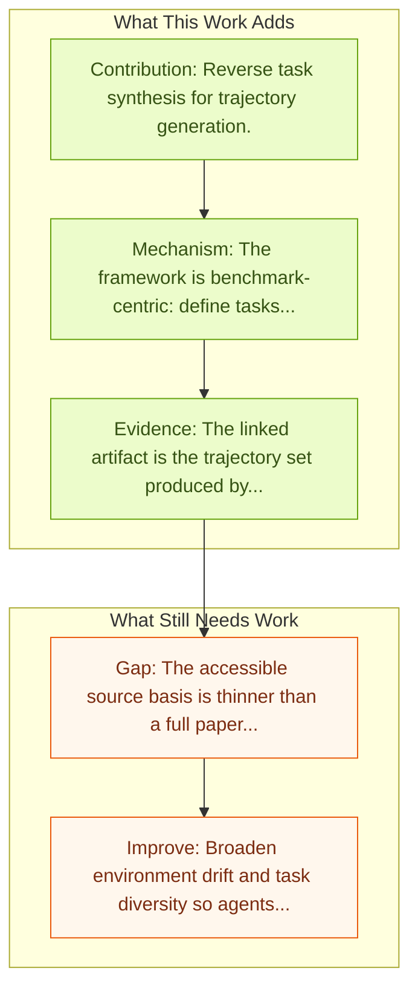

# OS-Genesis Trajectories

Entry report generated on 2026-03-28 (Asia/Tokyo). This report is based on the repository entry, linked source metadata, and audit-time cross-checks.

## Snapshot

| Field | Detail |
| --- | --- |
| Repo entry | OS-Genesis Trajectories |
| Actual target | [OS-Genesis: Automating GUI Agent Trajectory Construction via Reverse Task Synthesis](https://qiushisun.github.io/OS-Genesis-Home/) |
| Section | Benchmarks and Datasets |
| Source location | `papers/benchmarks/README.md:281` |
| Primary link type | `link` |
| Audit status | `project-page` |
| Date / venue | Not stated in local entry |
| Focus tags | `dataset`, `trajectories`, `reverse-synthesis` |
| Center of gravity | `benchmarks` |

## Quick Read

| Lens | Read |
| --- | --- |
| Problem pressure | Reverse task synthesis for trajectory generation. |
| Most novel move | The main novelty sits in the evaluation surface itself, especially its emphasis on trajectories, reverse-synthesis. |
| Strongest evidence | The linked artifact is the trajectory set produced by OS-Genesis. |
| Main caveat | The accessible source basis is thinner than a full paper review, so some claims rest on project metadata, repo notes, or abstract-level... |

## Visual Frame

```mermaid
flowchart LR
  Problem["Problem: Reverse task synthesis for trajectory generation."] --> Novelty["Novelty: The main novelty sits in the evaluation surface itself..."]
  Novelty --> Framework["Framework: The framework is benchmark-centric: define tasks..."]
  Framework --> Evidence["Evidence: The linked artifact is the trajectory set produced by..."]
  Evidence --> Gap["Gap: The accessible source basis is thinner than a full paper..."]
  Gap --> Next["Next: Broaden environment drift and task diversity so agents..."]
  classDef insight fill:#dbeafe,stroke:#2563eb,color:#0f172a;
  classDef risk fill:#fee2e2,stroke:#dc2626,color:#7f1d1d;
  classDef next fill:#dcfce7,stroke:#16a34a,color:#14532d;
  class Problem,Novelty,Framework insight;
  class Evidence insight;
  class Gap risk;
  class Next next;
```

## Analysis Map

## Executive Summary

Reverse task synthesis for trajectory generation. The linked artifact is the trajectory set produced by OS-Genesis. The paired method paper introduces reverse task synthesis, where agents first interact with the environment and only then derive high-quality task descriptions retrospectively. That reversal makes the data pipeline more scalable because it avoids depending on humans to author tasks before every trajectory is collected. The benchmark or dataset is the main contribution rather than a new agent policy.

## Novelty

- The main novelty sits in the evaluation surface itself, especially its emphasis on trajectories, reverse-synthesis.
- The linked artifact is the trajectory set produced by OS-Genesis.
- The paired method paper introduces reverse task synthesis, where agents first interact with the environment and only then derive high-quality task descriptions retrospectively.

## Core Contributions

- Reverse task synthesis for trajectory generation.
- The linked artifact is the trajectory set produced by OS-Genesis.
- The paired method paper introduces reverse task synthesis, where agents first interact with the environment and only then derive high-quality task descriptions retrospectively.
- That reversal makes the data pipeline more scalable because it avoids depending on humans to author tasks before every trajectory is collected.

## Framework and Operating Logic

- The framework is benchmark-centric: define tasks, environments, and success criteria so later agent work can be evaluated on common ground.
- The linked artifact is the trajectory set produced by OS-Genesis.
- The paired method paper introduces reverse task synthesis, where agents first interact with the environment and only then derive high-quality task descriptions retrospectively.

## Evidence and Claimed Results

- The linked artifact is the trajectory set produced by OS-Genesis.
- The paired method paper introduces reverse task synthesis, where agents first interact with the environment and only then derive high-quality task descriptions retrospectively.
- That reversal makes the data pipeline more scalable because it avoids depending on humans to author tasks before every trajectory is collected.

## Gaps and Limitations

- The accessible source basis is thinner than a full paper review, so some claims rest on project metadata, repo notes, or abstract-level evidence rather than a complete methods read.
- Benchmarks can overstate progress if agents learn the evaluator rather than the underlying task skill, especially around long-horizon transfer, recovery behavior, and distribution shift.
- Even a strong benchmark can miss interruptions, login drift, or real user messiness if the environment is too clean.

## How To Improve

- Broaden environment drift and task diversity so agents cannot overfit a narrow evaluator or a fixed slice of long-horizon transfer, recovery behavior, and distribution shift.
- Add richer partial-credit and failure-taxonomy reporting, not only binary success.
- Pair benchmark scores with human-grounded difficulty and usability checks so the suite better reflects real workflows.

## Why It Matters

- This entry matters because benchmarks decide what the rest of the repo gets rewarded for improving.
- It is part of the evaluative scaffolding that lets model and method papers claim progress in a comparable way.

## Connections In This Repo

- [AgentTrek Trajectories](agenttrek-trajectories.md) - shared evaluative role in defining what progress means.
- [AgentTrek: Agent Trajectory Synthesis via Web Tutorials](../methods-and-techniques/agenttrek-agent-trajectory-synthesis-via-web-tutorials.md) - the papers sit in the same local research cluster in this repository.
- [OS-Genesis: Automating GUI Agent Trajectory Construction](../methods-and-techniques/os-genesis-automating-gui-agent-trajectory-construction.md) - the papers sit in the same local research cluster in this repository.
- [WebGuard: Safety Dataset for Web Agents](../safety-and-security/webguard-safety-dataset-for-web-agents.md) - shared evaluative role in defining what progress means.

## Source Basis

- Primary basis: Method-paper arXiv abstract used to deepen the project-page trajectory entry.
- Audit access note: The repo points to a project page, so the report blends page metadata with repo-local notes and, where available, companion abstract-level metadata.
