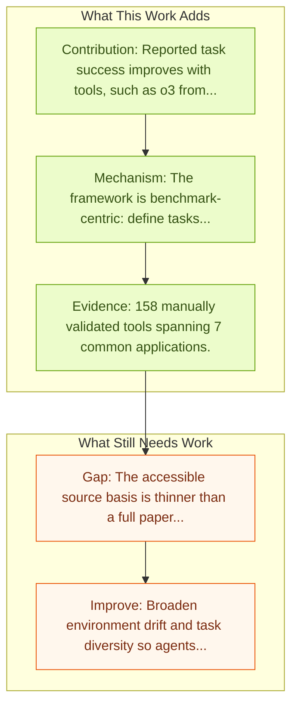

# OS-Genesis Trajectories

Entry report generated on 2026-03-28 (Asia/Tokyo). This report is based on the repository entry, linked source metadata, and audit-time cross-checks.

## Snapshot

| Field | Detail |
| --- | --- |
| Repo entry | OS-Genesis Trajectories |
| Actual target | [OS-Genesis: Automating GUI Agent Trajectory Construction via Reverse Task Synthesis](https://qiushisun.github.io/OS-Genesis-Home/) |
| Section | Benchmarks and Datasets |
| Source location | `papers/benchmarks/README.md:281` |
| Primary link type | `link` |
| Audit status | `project-page` |
| Date / venue | Not stated in local entry |
| Focus tags | `dataset`, `trajectories`, `reverse-synthesis` |
| Center of gravity | `benchmarks` |

## Quick Read

| Lens | Read |
| --- | --- |
| Problem pressure | Benchmark for fair evaluation of GUI control, MCP tool invocation, and decision-making in shared environments. |
| Most novel move | The main novelty sits in the evaluation surface itself, especially its emphasis on tool-calling, desktop, mcp. |
| Strongest evidence | 158 manually validated tools spanning 7 common applications. |
| Main caveat | The accessible source basis is thinner than a full paper review, so some claims rest on project metadata, repo notes, or abstract-level... |

## Visual Frame

```mermaid
flowchart LR
  Problem["Problem: Benchmark for fair evaluation of GUI control, MCP tool..."] --> Novelty["Novelty: The main novelty sits in the evaluation surface itself..."]
  Novelty --> Framework["Framework: The framework is benchmark-centric: define tasks..."]
  Framework --> Evidence["Evidence: 158 manually validated tools spanning 7 common applications."]
  Evidence --> Gap["Gap: The accessible source basis is thinner than a full paper..."]
  Gap --> Next["Next: Broaden environment drift and task diversity so agents..."]
  classDef insight fill:#dbeafe,stroke:#2563eb,color:#0f172a;
  classDef risk fill:#fee2e2,stroke:#dc2626,color:#7f1d1d;
  classDef next fill:#dcfce7,stroke:#16a34a,color:#14532d;
  class Problem,Novelty,Framework insight;
  class Evidence insight;
  class Gap risk;
  class Next next;
```

## Analysis Map

## Executive Summary

Benchmark for fair evaluation of GUI control, MCP tool invocation, and decision-making in shared environments. The linked artifact is the trajectory set produced by OS-Genesis. The paired method paper introduces reverse task synthesis, where agents first interact with the environment and only then derive high-quality task descriptions retrospectively. That reversal makes the data pipeline more scalable because it avoids depending on humans to author tasks before every trajectory is collected.

## Novelty

- The main novelty sits in the evaluation surface itself, especially its emphasis on tool-calling, desktop, mcp.
- The linked artifact is the trajectory set produced by OS-Genesis.
- The paired method paper introduces reverse task synthesis, where agents first interact with the environment and only then derive high-quality task descriptions retrospectively.

## Core Contributions

- Reported task success improves with tools, such as o3 from 8.3% to 20.4% at 15 steps.
- Even strong models invoke tools infrequently, with the paper reporting only 36.3% tool usage at best.
- 158 manually validated tools spanning 7 common applications.
- The linked artifact is the trajectory set produced by OS-Genesis.

## Framework and Operating Logic

- The framework is benchmark-centric: define tasks, environments, and success criteria so later agent work can be evaluated on common ground.
- The linked artifact is the trajectory set produced by OS-Genesis.
- The paired method paper introduces reverse task synthesis, where agents first interact with the environment and only then derive high-quality task descriptions retrospectively.

## Evidence and Claimed Results

- 158 manually validated tools spanning 7 common applications.
- Reported task success improves with tools, such as o3 from 8.3% to 20.4% at 15 steps.
- Even strong models invoke tools infrequently, with the paper reporting only 36.3% tool usage at best.

## Gaps and Limitations

- The accessible source basis is thinner than a full paper review, so some claims rest on project metadata, repo notes, or abstract-level evidence rather than a complete methods read.
- Benchmarks can overstate progress if agents learn the evaluator rather than the underlying task skill, especially around desktop heterogeneity, long workflows, and OS-level side effects.
- Even a strong benchmark can miss interruptions, login drift, or real user messiness if the environment is too clean.

## How To Improve

- Broaden environment drift and task diversity so agents cannot overfit a narrow evaluator or a fixed slice of desktop heterogeneity, long workflows, and OS-level side effects.
- Add richer partial-credit and failure-taxonomy reporting, not only binary success.
- Pair benchmark scores with human-grounded difficulty and usability checks so the suite better reflects real workflows.

## Why It Matters

- This entry matters because benchmarks decide what the rest of the repo gets rewarded for improving.
- It is part of the evaluative scaffolding that lets model and method papers claim progress in a comparable way.

## Connections In This Repo

- [OS-Harm: A Benchmark for Measuring Safety of Computer Use Agents](../safety-and-security/os-harm-a-benchmark-for-measuring-safety-of-computer-use-agents.md) - shared desktop or OS-level interaction surface.
- [OSWorld: Multimodal Agents for Open-Ended Tasks in Real Computer Environments](osworld-multimodal-agents-for-open-ended-tasks-in-real-computer-environments.md) - shared desktop or OS-level interaction surface.
- [Windows Agent Arena (WAA)](windows-agent-arena-waa.md) - shared desktop or OS-level interaction surface.
- [macOSWorld](macosworld.md) - shared desktop or OS-level interaction surface.

## Source Basis

- Primary basis: Method-paper arXiv abstract used to deepen the project-page trajectory entry.
- Audit access note: The repo points to a project page, so the report blends page metadata with repo-local notes and, where available, companion abstract-level metadata.
