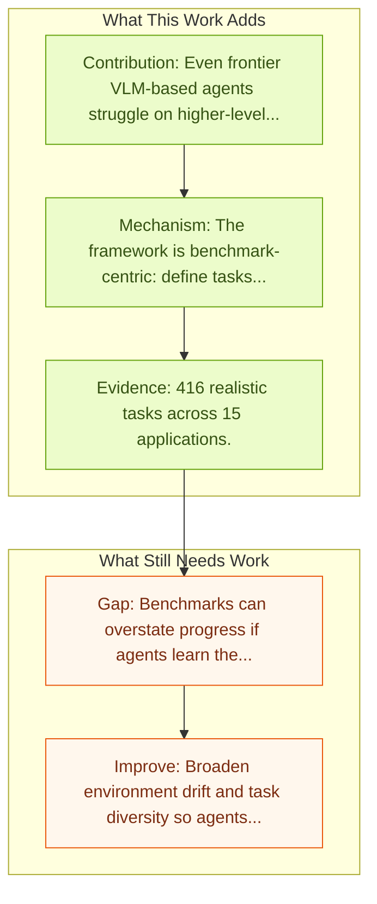

# OS-MAP: How Far Can Computer-Using Agents Go in Breadth and Depth?

Entry report generated on 2026-03-28 (Asia/Tokyo). This report is based on the repository entry, linked source metadata, and audit-time cross-checks.

## Snapshot

| Field | Detail |
| --- | --- |
| Repo entry | OS-MAP: How Far Can Computer-Using Agents Go in Breadth and Depth? |
| Actual target | [OS-MAP: How Far Can Computer-Using Agents Go in Breadth and Depth?](https://arxiv.org/abs/2507.19132) |
| Section | Benchmarks and Datasets |
| Source location | `papers/benchmarks/README.md:264` |
| Primary link type | `link` |
| Audit status | `ok` |
| Date / venue | July 2025 |
| Authors | Xuetian Chen, Yinghao Chen, Xinfeng Yuan, Zhuo Peng, Lu Chen, Yuekeng Li, Zhoujia Zhang, Yingqian Huang, Leyan Huang, Jiaqing Liang, Tianbao Xie, Zhiyong Wu, Qiushi Sun, Biqing Qi, Bowen Zhou |
| Focus tags | `benchmark`, `desktop`, `taxonomy`, `generalization` |
| Center of gravity | `desktop`, `taxonomy`, `generalization` |
| Related assets | [GitHub](https://github.com/OS-Copilot/OS-Map) |

## Quick Read

| Lens | Read |
| --- | --- |
| Problem pressure | Benchmark for daily computer-use automation organized by autonomy level and generalization scope. |
| Most novel move | The main novelty sits in the evaluation surface itself, especially its emphasis on desktop, taxonomy, generalization. |
| Strongest evidence | 416 realistic tasks across 15 applications. |
| Main caveat | Benchmarks can overstate progress if agents learn the evaluator rather than the underlying task skill, especially around desktop... |

## Visual Frame

```mermaid
flowchart LR
  Problem["Problem: Benchmark for daily computer-use automation organized by..."] --> Novelty["Novelty: The main novelty sits in the evaluation surface itself..."]
  Novelty --> Framework["Framework: The framework is benchmark-centric: define tasks..."]
  Framework --> Evidence["Evidence: 416 realistic tasks across 15 applications."]
  Evidence --> Gap["Gap: Benchmarks can overstate progress if agents learn the..."]
  Gap --> Next["Next: Broaden environment drift and task diversity so agents..."]
  classDef insight fill:#dbeafe,stroke:#2563eb,color:#0f172a;
  classDef risk fill:#fee2e2,stroke:#dc2626,color:#7f1d1d;
  classDef next fill:#dcfce7,stroke:#16a34a,color:#14532d;
  class Problem,Novelty,Framework insight;
  class Evidence insight;
  class Gap risk;
  class Next next;
```

## Analysis Map

## Executive Summary

Benchmark for daily computer-use automation organized by autonomy level and generalization scope. Computer-using agents have shown strong potential to boost human productivity and enable new application forms across platforms. While recent advances have led to usable applications, existing benchmarks fail to account for the internal task heterogeneity and the corresponding agent capabilities, as well as their alignment with actual user demands-hindering both targeted capability development and the reliable transition of research progress into practical deployment. To bridge the gap, we present OS-MAP, a benchmark for daily computer-using automation that organizes its 416 realistic tasks across 15 applications along two key dimensions: a five-level taxonomy of automation and a generalization scope derived from a real-world user demand hierarchy.

## Novelty

- The main novelty sits in the evaluation surface itself, especially its emphasis on desktop, taxonomy, generalization.
- Computer-using agents have shown strong potential to boost human productivity and enable new application forms across platforms.
- While recent advances have led to usable applications, existing benchmarks fail to account for the internal task heterogeneity and the corresponding agent capabilities, as well as their alignment with actual user demands-hindering both targeted capability development and the reliable transition of research progress into practical deployment.

## Core Contributions

- Even frontier VLM-based agents struggle on higher-level tasks requiring perception, reasoning, and coordination.
- 416 realistic tasks across 15 applications.
- Five automation levels combined with a user-demand hierarchy form a performance-generalization matrix.
- Computer-using agents have shown strong potential to boost human productivity and enable new application forms across platforms.

## Framework and Operating Logic

- The framework is benchmark-centric: define tasks, environments, and success criteria so later agent work can be evaluated on common ground.
- Computer-using agents have shown strong potential to boost human productivity and enable new application forms across platforms.
- While recent advances have led to usable applications, existing benchmarks fail to account for the internal task heterogeneity and the corresponding agent capabilities, as well as their alignment with actual user demands-hindering both targeted capability development and the reliable transition of research progress into practical deployment.

## Evidence and Claimed Results

- 416 realistic tasks across 15 applications.
- Five automation levels combined with a user-demand hierarchy form a performance-generalization matrix.
- Even frontier VLM-based agents struggle on higher-level tasks requiring perception, reasoning, and coordination.
- To bridge the gap, we present OS-MAP, a benchmark for daily computer-using automation that organizes its 416 realistic tasks across 15 applications along two key dimensions: a five-level taxonomy of automation and a generalization scope derived from a real-world user demand hierarchy.

## Gaps and Limitations

- Benchmarks can overstate progress if agents learn the evaluator rather than the underlying task skill, especially around desktop heterogeneity, long workflows, and OS-level side effects.
- Even a strong benchmark can miss interruptions, login drift, or real user messiness if the environment is too clean.

## How To Improve

- Broaden environment drift and task diversity so agents cannot overfit a narrow evaluator or a fixed slice of desktop heterogeneity, long workflows, and OS-level side effects.
- Add richer partial-credit and failure-taxonomy reporting, not only binary success.
- Pair benchmark scores with human-grounded difficulty and usability checks so the suite better reflects real workflows.

## Why It Matters

- This entry matters because benchmarks decide what the rest of the repo gets rewarded for improving.
- It is part of the evaluative scaffolding that lets model and method papers claim progress in a comparable way.

## Connections In This Repo

- [OS-Harm: A Benchmark for Measuring Safety of Computer Use Agents](../safety-and-security/os-harm-a-benchmark-for-measuring-safety-of-computer-use-agents.md) - shared desktop or OS-level interaction surface.
- [OSWorld: Multimodal Agents for Open-Ended Tasks in Real Computer Environments](osworld-multimodal-agents-for-open-ended-tasks-in-real-computer-environments.md) - shared desktop or OS-level interaction surface.
- [Windows Agent Arena (WAA)](windows-agent-arena-waa.md) - shared desktop or OS-level interaction surface.
- [macOSWorld](macosworld.md) - shared desktop or OS-level interaction surface.

## Source Basis

- Primary basis: Primary arXiv abstract metadata was fetched live from the linked paper page.
- Audit access note: Metadata resolved cleanly during the audit.
