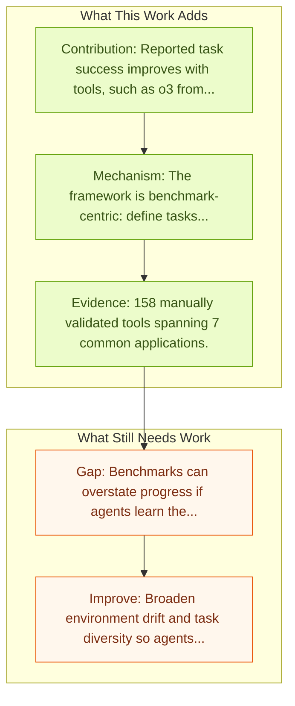

# OSWorld-MCP: Benchmarking MCP Tool Invocation In Computer-Use Agents

Entry report generated on 2026-03-28 (Asia/Tokyo). This report is based on the repository entry, linked source metadata, and audit-time cross-checks.

## Snapshot

| Field | Detail |
| --- | --- |
| Repo entry | OSWorld-MCP: Benchmarking MCP Tool Invocation In Computer-Use Agents |
| Actual target | [OSWorld-MCP: Benchmarking MCP Tool Invocation In Computer-Use Agents](https://arxiv.org/abs/2510.24563) |
| Section | Benchmarks and Datasets |
| Source location | `papers/benchmarks/README.md:282` |
| Primary link type | `link` |
| Audit status | `ok` |
| Date / venue | October 2025 |
| Authors | Hongrui Jia, Jitong Liao, Xi Zhang, Haiyang Xu, Tianbao Xie, Chaoya Jiang, Ming Yan, Si Liu, Wei Ye, Fei Huang |
| Focus tags | `benchmark` `tool-calling` `desktop` `mcp` |
| Center of gravity | tool-calling, desktop, mcp |
| Project page | [osworld-mcp.github.io](https://osworld-mcp.github.io/) |

## Quick Read

| Lens | Read |
| --- | --- |
| Problem pressure | Benchmark for fair evaluation of GUI control, MCP tool invocation, and decision-making in shared environments. |
| Most novel move | The main novelty sits in the evaluation surface itself, especially its emphasis on tool-calling, desktop, mcp. |
| Strongest evidence | 158 manually validated tools spanning 7 common applications. |
| Main caveat | Benchmarks can overstate progress if agents learn the evaluator rather than the underlying task skill, especially around desktop... |

## Visual Frame

```mermaid
flowchart LR
  Problem["Problem: Benchmark for fair evaluation of GUI control, MCP tool..."] --> Novelty["Novelty: The main novelty sits in the evaluation surface itself..."]
  Novelty --> Framework["Framework: The framework is benchmark-centric: define tasks..."]
  Framework --> Evidence["Evidence: 158 manually validated tools spanning 7 common applications."]
  Evidence --> Gap["Gap: Benchmarks can overstate progress if agents learn the..."]
  Gap --> Next["Next: Broaden environment drift and task diversity so agents..."]
  classDef insight fill:#dbeafe,stroke:#2563eb,color:#0f172a;
  classDef risk fill:#fee2e2,stroke:#dc2626,color:#7f1d1d;
  classDef next fill:#dcfce7,stroke:#16a34a,color:#14532d;
  class Problem,Novelty,Framework insight;
  class Evidence insight;
  class Gap risk;
  class Next next;
```

## Analysis Map

## Executive Summary

Benchmark for fair evaluation of GUI control, MCP tool invocation, and decision-making in shared environments. With advances in decision-making and reasoning capabilities, multimodal agents show strong potential in computer application scenarios. Past evaluations have mainly assessed GUI interaction skills, while tool invocation abilities, such as those enabled by the Model Context Protocol (MCP), have been largely overlooked. Comparing agents with integrated tool invocation to those evaluated only on GUI interaction is inherently unfair.

## Code and Supporting Artifacts

- Code repository: no dedicated code link is currently tracked in the repo entry.
- Project page or benchmark site: [osworld-mcp.github.io](https://osworld-mcp.github.io/)

## Novelty

- The main novelty sits in the evaluation surface itself, especially its emphasis on tool-calling, desktop, mcp.
- With advances in decision-making and reasoning capabilities, multimodal agents show strong potential in computer application scenarios.
- Past evaluations have mainly assessed GUI interaction skills, while tool invocation abilities, such as those enabled by the Model Context Protocol (MCP), have been largely overlooked.

## Core Contributions

- Reported task success improves with tools, such as o3 from 8.3% to 20.4% at 15 steps.
- Even strong models invoke tools infrequently, with the paper reporting only 36.3% tool usage at best.
- 158 manually validated tools spanning 7 common applications.
- With advances in decision-making and reasoning capabilities, multimodal agents show strong potential in computer application scenarios.

## Framework and Operating Logic

- The framework is benchmark-centric: define tasks, environments, and success criteria so later agent work can be evaluated on common ground.
- With advances in decision-making and reasoning capabilities, multimodal agents show strong potential in computer application scenarios.
- Past evaluations have mainly assessed GUI interaction skills, while tool invocation abilities, such as those enabled by the Model Context Protocol (MCP), have been largely overlooked.

## Evidence and Claimed Results

- 158 manually validated tools spanning 7 common applications.
- Reported task success improves with tools, such as o3 from 8.3% to 20.4% at 15 steps.
- Even strong models invoke tools infrequently, with the paper reporting only 36.3% tool usage at best.
- Rigorous manual validation yields 158 high-quality tools (covering 7 common applications), each verified for correct functionality, practical applicability, and versatility.
- Extensive evaluations of state-of-the-art multimodal agents on OSWorld-MCP show that MCP tools generally improve task success rates (e.g., from 8.3% to 20.4% for OpenAI o3 at 15 steps, from 40.1% to 43.3% for Claude 4 Sonnet at 50 steps), underscoring the importance of assessing tool invocation capabilities.

## Gaps and Limitations

- Benchmarks can overstate progress if agents learn the evaluator rather than the underlying task skill, especially around desktop heterogeneity, long workflows, and OS-level side effects.
- Even a strong benchmark can miss interruptions, login drift, or real user messiness if the environment is too clean.

## How To Improve

- Broaden environment drift and task diversity so agents cannot overfit a narrow evaluator or a fixed slice of desktop heterogeneity, long workflows, and OS-level side effects.
- Add richer partial-credit and failure-taxonomy reporting, not only binary success.
- Pair benchmark scores with human-grounded difficulty and usability checks so the suite better reflects real workflows.

## Why It Matters

- This entry matters because benchmarks decide what the rest of the repo gets rewarded for improving.
- It is part of the evaluative scaffolding that lets model and method papers claim progress in a comparable way.

## Connections In This Repo

- [OS-Harm: A Benchmark for Measuring Safety of Computer Use Agents](../safety-and-security/os-harm-a-benchmark-for-measuring-safety-of-computer-use-agents.md) - shared desktop or OS-level interaction surface.
- [OSWorld: Multimodal Agents for Open-Ended Tasks in Real Computer Environments](osworld-multimodal-agents-for-open-ended-tasks-in-real-computer-environments.md) - shared desktop or OS-level interaction surface.
- [Windows Agent Arena (WAA)](windows-agent-arena-waa.md) - shared desktop or OS-level interaction surface.
- [macOSWorld](macosworld.md) - shared desktop or OS-level interaction surface.

## Source Basis

- Primary basis: Primary arXiv abstract metadata was fetched live from the linked paper page.
- Audit access note: Metadata resolved cleanly during the audit.
