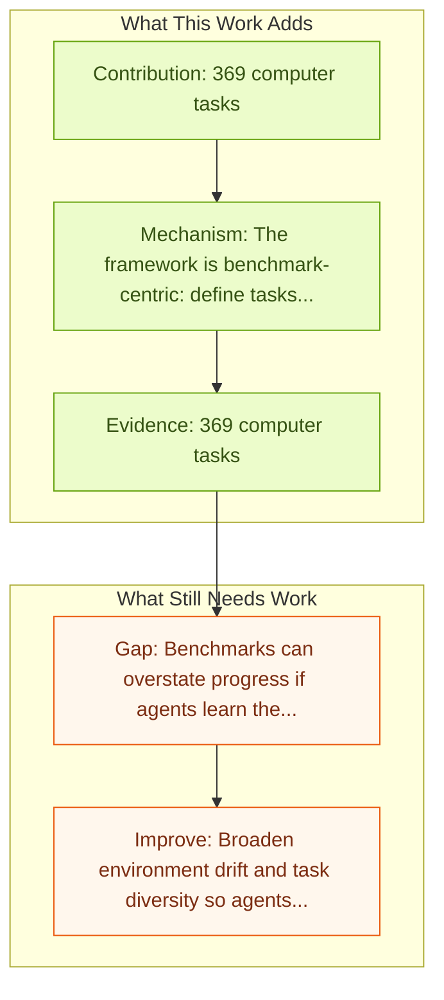

# OSWorld: Multimodal Agents for Open-Ended Tasks in Real Computer Environments

Entry report generated on 2026-03-28 (Asia/Tokyo). This report is based on the repository entry, linked source metadata, and audit-time cross-checks.

## Snapshot

| Field | Detail |
| --- | --- |
| Repo entry | OSWorld: Multimodal Agents for Open-Ended Tasks in Real Computer Environments |
| Actual target | [OSWorld: Benchmarking Multimodal Agents for Open-Ended Tasks in Real Computer Environments](https://arxiv.org/abs/2404.07972) |
| Section | Benchmarks and Datasets |
| Source location | `papers/benchmarks/README.md:7` |
| Primary link type | `link` |
| Audit status | `ok` |
| Date / venue | NeurIPS 2024 |
| Authors | Tianbao Xie, Danyang Zhang, Jixuan Chen, Xiaochuan Li, Siheng Zhao, Ruisheng Cao, Toh Jing Hua, Zhoujun Cheng |
| Focus tags | `benchmark`, `desktop`, `multimodal`, `open-ended` |
| Center of gravity | `web`, `desktop`, `grounding` |
| Related assets | [os-world.github.io](https://os-world.github.io/); [GitHub](https://github.com/xlang-ai/OSWorld) |

## Quick Read

| Lens | Read |
| --- | --- |
| Problem pressure | First-of-its-kind scalable, real computer environment for multimodal agents. |
| Most novel move | The main novelty sits in the evaluation surface itself, especially its emphasis on desktop, multimodal, open-ended. |
| Strongest evidence | 369 computer tasks |
| Main caveat | Benchmarks can overstate progress if agents learn the evaluator rather than the underlying task skill, especially around desktop... |

## Visual Frame

```mermaid
flowchart LR
  Problem["Problem: First-of-its-kind scalable, real computer environment for..."] --> Novelty["Novelty: The main novelty sits in the evaluation surface itself..."]
  Novelty --> Framework["Framework: The framework is benchmark-centric: define tasks..."]
  Framework --> Evidence["Evidence: 369 computer tasks"]
  Evidence --> Gap["Gap: Benchmarks can overstate progress if agents learn the..."]
  Gap --> Next["Next: Broaden environment drift and task diversity so agents..."]
  classDef insight fill:#dbeafe,stroke:#2563eb,color:#0f172a;
  classDef risk fill:#fee2e2,stroke:#dc2626,color:#7f1d1d;
  classDef next fill:#dcfce7,stroke:#16a34a,color:#14532d;
  class Problem,Novelty,Framework insight;
  class Evidence insight;
  class Gap risk;
  class Next next;
```

## Analysis Map

## Executive Summary

First-of-its-kind scalable, real computer environment for multimodal agents. Autonomous agents that accomplish complex computer tasks with minimal human interventions have the potential to transform human-computer interaction, significantly enhancing accessibility and productivity. However, existing benchmarks either lack an interactive environment or are limited to environments specific to certain applications or domains, failing to reflect the diverse and complex nature of real-world computer use, thereby limiting the scope of tasks and agent scalability. To address this issue, we introduce OSWorld, the first-of-its-kind scalable, real computer environment for multimodal agents, supporting task setup, execution-based evaluation, and interactive learning across various operating systems such as Ubuntu, Windows, and macOS.

## Novelty

- The main novelty sits in the evaluation surface itself, especially its emphasis on desktop, multimodal, open-ended.
- Autonomous agents that accomplish complex computer tasks with minimal human interventions have the potential to transform human-computer interaction, significantly enhancing accessibility and productivity.
- However, existing benchmarks either lack an interactive environment or are limited to environments specific to certain applications or domains, failing to reflect the diverse and complex nature of real-world computer use, thereby limiting the scope of tasks and agent scalability.

## Core Contributions

- 369 computer tasks
- Supports Ubuntu, Windows, macOS
- Real web and desktop apps
- OS file I/O and multi-app workflows

## Framework and Operating Logic

- The framework is benchmark-centric: define tasks, environments, and success criteria so later agent work can be evaluated on common ground.
- Autonomous agents that accomplish complex computer tasks with minimal human interventions have the potential to transform human-computer interaction, significantly enhancing accessibility and productivity.
- However, existing benchmarks either lack an interactive environment or are limited to environments specific to certain applications or domains, failing to reflect the diverse and complex nature of real-world computer use, thereby limiting the scope of tasks and agent scalability.

## Evidence and Claimed Results

- 369 computer tasks
- Supports Ubuntu, Windows, macOS
- Real web and desktop apps
- OS file I/O and multi-app workflows
- Building upon OSWorld, we create a benchmark of 369 computer tasks involving real web and desktop apps in open domains, OS file I/O, and workflows spanning multiple applications.

## Gaps and Limitations

- Benchmarks can overstate progress if agents learn the evaluator rather than the underlying task skill, especially around desktop heterogeneity, long workflows, and OS-level side effects.
- Even a strong benchmark can miss interruptions, login drift, or real user messiness if the environment is too clean.

## How To Improve

- Broaden environment drift and task diversity so agents cannot overfit a narrow evaluator or a fixed slice of desktop heterogeneity, long workflows, and OS-level side effects.
- Add richer partial-credit and failure-taxonomy reporting, not only binary success.
- Pair benchmark scores with human-grounded difficulty and usability checks so the suite better reflects real workflows.

## Why It Matters

- This entry matters because benchmarks decide what the rest of the repo gets rewarded for improving.
- It is part of the evaluative scaffolding that lets model and method papers claim progress in a comparable way.

## Connections In This Repo

- [Windows Agent Arena (WAA)](windows-agent-arena-waa.md) - shared desktop or OS-level interaction surface.
- [macOSWorld](macosworld.md) - shared desktop or OS-level interaction surface.
- [OmniACT](omniact.md) - shared desktop or OS-level interaction surface.
- [VisualWebArena: Multimodal Web Tasks](visualwebarena-multimodal-web-tasks.md) - shared evaluative role in defining what progress means.

## Source Basis

- Primary basis: abstract-level paper metadata plus the repo-local notes in the source Markdown file.
- Audit access note: Metadata resolved cleanly during the audit.
