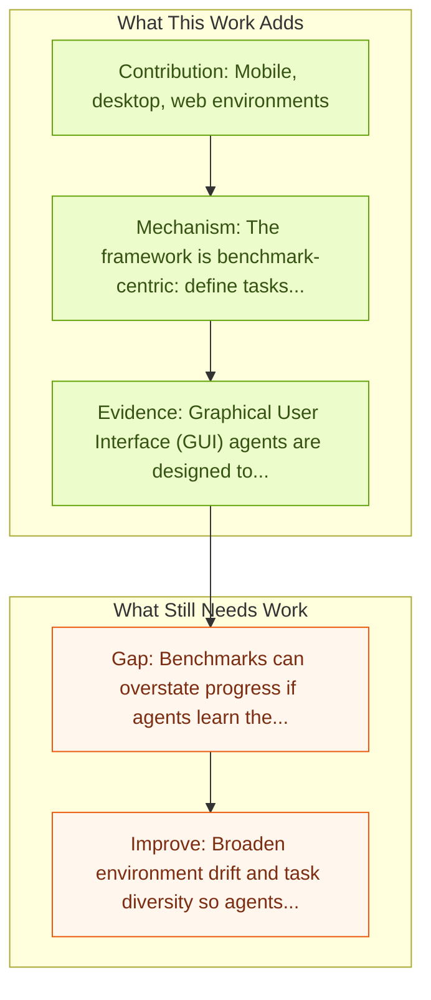

# ScreenSpot / ScreenSpot-Pro

Entry report generated on 2026-03-28 (Asia/Tokyo). This report is based on the repository entry, linked source metadata, and audit-time cross-checks.

## Snapshot

| Field | Detail |
| --- | --- |
| Repo entry | ScreenSpot / ScreenSpot-Pro |
| Actual target | [SeeClick: Harnessing GUI Grounding for Advanced Visual GUI Agents](https://arxiv.org/abs/2401.10935) |
| Section | Benchmarks and Datasets |
| Source location | `papers/benchmarks/README.md:206` |
| Primary link type | `link` |
| Audit status | `ok` |
| Date / venue | 2024/2025 |
| Authors | Kanzhi Cheng, Qiushi Sun, Yougang Chu, Fangzhi Xu, Yantao Li, Jianbing Zhang, Zhiyong Wu |
| Focus tags | `benchmark` `grounding` `high-res` `professional` |
| Center of gravity | web, desktop, mobile |

## Quick Read

| Lens | Read |
| --- | --- |
| Problem pressure | The paper targets a concrete bottleneck in computer-use agents. |
| Most novel move | The main novelty sits in the evaluation surface itself, especially its emphasis on grounding, high-res, professional. |
| Strongest evidence | Graphical User Interface (GUI) agents are designed to automate complex tasks on digital devices, such as smartphones and desktops. |
| Main caveat | Benchmarks can overstate progress if agents learn the evaluator rather than the underlying task skill, especially around precise element... |

## Visual Frame

```mermaid
flowchart LR
  Problem["Problem: Graphical User Interface (GUI) agents are designed to..."] --> Novelty["Novelty: The main novelty sits in the evaluation surface itself..."]
  Novelty --> Framework["Framework: The framework is benchmark-centric: define tasks..."]
  Framework --> Evidence["Evidence: Graphical User Interface (GUI) agents are designed to..."]
  Evidence --> Gap["Gap: Benchmarks can overstate progress if agents learn the..."]
  Gap --> Next["Next: Broaden environment drift and task diversity so agents..."]
  classDef insight fill:#dbeafe,stroke:#2563eb,color:#0f172a;
  classDef risk fill:#fee2e2,stroke:#dc2626,color:#7f1d1d;
  classDef next fill:#dcfce7,stroke:#16a34a,color:#14532d;
  class Problem,Novelty,Framework insight;
  class Evidence insight;
  class Gap risk;
  class Next next;
```

## Analysis Map

## Executive Summary

Graphical User Interface (GUI) agents are designed to automate complex tasks on digital devices, such as smartphones and desktops. Most existing GUI agents interact with the environment through extracted structured data, which can be notably lengthy (e.g., HTML) and occasionally inaccessible (e.g., on desktops). To alleviate this issue, we propose a novel visual GUI agent -- SeeClick, which only relies on screenshots for task automation. The benchmark or dataset is the main contribution rather than a new agent policy.

## Code and Supporting Artifacts

- Code repository: no dedicated code link is currently tracked in the repo entry.

## Novelty

- The main novelty sits in the evaluation surface itself, especially its emphasis on grounding, high-res, professional.
- Graphical User Interface (GUI) agents are designed to automate complex tasks on digital devices, such as smartphones and desktops.
- Most existing GUI agents interact with the environment through extracted structured data, which can be notably lengthy (e.g., HTML) and occasionally inaccessible (e.g., on desktops).

## Core Contributions

- Mobile, desktop, web environments
- First realistic GUI grounding dataset
- 1,581 tasks across 23 applications
- Professional, high-resolution environments
- Industry-focused

## Framework and Operating Logic

- The framework is benchmark-centric: define tasks, environments, and success criteria so later agent work can be evaluated on common ground.
- Graphical User Interface (GUI) agents are designed to automate complex tasks on digital devices, such as smartphones and desktops.
- Most existing GUI agents interact with the environment through extracted structured data, which can be notably lengthy (e.g., HTML) and occasionally inaccessible (e.g., on desktops).

## Evidence and Claimed Results

- Graphical User Interface (GUI) agents are designed to automate complex tasks on digital devices, such as smartphones and desktops.
- Most existing GUI agents interact with the environment through extracted structured data, which can be notably lengthy (e.g., HTML) and occasionally inaccessible (e.g., on desktops).
- To alleviate this issue, we propose a novel visual GUI agent -- SeeClick, which only relies on screenshots for task automation.

## Gaps and Limitations

- Benchmarks can overstate progress if agents learn the evaluator rather than the underlying task skill, especially around precise element localization and recovery after grounding misses.
- Even a strong benchmark can miss interruptions, login drift, or real user messiness if the environment is too clean.

## How To Improve

- Broaden environment drift and task diversity so agents cannot overfit a narrow evaluator or a fixed slice of precise element localization and recovery after grounding misses.
- Add richer partial-credit and failure-taxonomy reporting, not only binary success.
- Pair benchmark scores with human-grounded difficulty and usability checks so the suite better reflects real workflows.

## Why It Matters

- This entry matters because benchmarks decide what the rest of the repo gets rewarded for improving.
- It is part of the evaluative scaffolding that lets model and method papers claim progress in a comparable way.

## Connections In This Repo

- [OmniParser: Pure Vision Based GUI Agent](../models-and-architectures/omniparser-pure-vision-based-gui-agent.md) - shared emphasis on precise UI localization and action placement.
- [SeeClick: Harnessing GUI Grounding for Advanced Visual GUI Agents](../models-and-architectures/seeclick-harnessing-gui-grounding-for-advanced-visual-gui-agents.md) - shared emphasis on precise UI localization and action placement.
- [Ferret-UI: Grounded Mobile UI Understanding](../models-and-architectures/ferret-ui-grounded-mobile-ui-understanding.md) - shared emphasis on precise UI localization and action placement.
- [R-VLM: Region-Aware VLM for Precise GUI Grounding](../models-and-architectures/r-vlm-region-aware-vlm-for-precise-gui-grounding.md) - shared emphasis on precise UI localization and action placement.

## Source Basis

- Primary basis: abstract-level paper metadata plus the repo-local notes in the source Markdown file.
- Audit access note: Metadata resolved cleanly during the audit.
