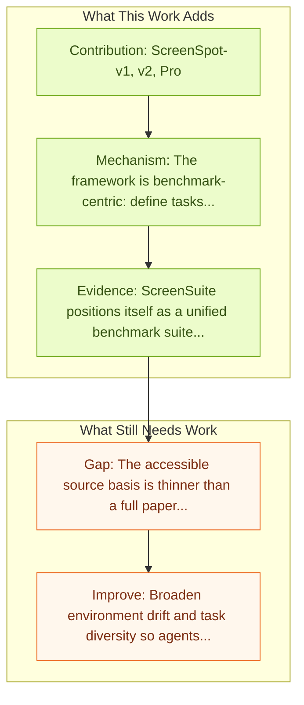

# ScreenSuite (HuggingFace)

Entry report generated on 2026-03-28 (Asia/Tokyo). This report is based on the repository entry, linked source metadata, and audit-time cross-checks.

## Snapshot

| Field | Detail |
| --- | --- |
| Repo entry | ScreenSuite (HuggingFace) |
| Actual target | [ScreenSuite](https://github.com/huggingface/screensuite) |
| Section | Benchmarks and Datasets |
| Source location | `papers/benchmarks/README.md:232` |
| Primary link type | `code` |
| Audit status | `code-only` |
| Date / venue | Not stated in local entry |
| Focus tags | `benchmark` `comprehensive` `unified` |
| Center of gravity | grounding |

## Quick Read

| Lens | Read |
| --- | --- |
| Problem pressure | Most comprehensive benchmarking suite for GUI agents. |
| Most novel move | The main novelty sits in the evaluation surface itself, especially its emphasis on includes. |
| Strongest evidence | ScreenSuite positions itself as a unified benchmark suite rather than a single new dataset. |
| Main caveat | The accessible source basis is thinner than a full paper review, so some claims rest on project metadata, repo notes, or abstract-level... |

## Visual Frame

```mermaid
flowchart LR
  Problem["Problem: Most comprehensive benchmarking suite for GUI agents."] --> Novelty["Novelty: The main novelty sits in the evaluation surface itself..."]
  Novelty --> Framework["Framework: The framework is benchmark-centric: define tasks..."]
  Framework --> Evidence["Evidence: ScreenSuite positions itself as a unified benchmark suite..."]
  Evidence --> Gap["Gap: The accessible source basis is thinner than a full paper..."]
  Gap --> Next["Next: Broaden environment drift and task diversity so agents..."]
  classDef insight fill:#dbeafe,stroke:#2563eb,color:#0f172a;
  classDef risk fill:#fee2e2,stroke:#dc2626,color:#7f1d1d;
  classDef next fill:#dcfce7,stroke:#16a34a,color:#14532d;
  class Problem,Novelty,Framework insight;
  class Evidence insight;
  class Gap risk;
  class Next next;
```

## Analysis Map

## Executive Summary

Most comprehensive benchmarking suite for GUI agents. ScreenSuite positions itself as a unified benchmark suite rather than a single new dataset. Its value comes from packaging major GUI evaluation assets, including ScreenSpot variants and OSWorld, into one maintained interface so model and method papers can compare against a broader spread of tasks without assembling every benchmark by hand.

## Novelty

- The main novelty sits in the evaluation surface itself, especially its emphasis on includes.
- ScreenSuite positions itself as a unified benchmark suite rather than a single new dataset.
- Its value comes from packaging major GUI evaluation assets, including ScreenSpot variants and OSWorld, into one maintained interface so model and method papers can compare against a broader spread of tasks without assembling every benchmark by hand.

## Core Contributions

- ScreenSpot-v1, v2, Pro
- OSWorld
- ScreenSuite positions itself as a unified benchmark suite rather than a single new dataset.
- Its value comes from packaging major GUI evaluation assets, including ScreenSpot variants and OSWorld, into one maintained interface so model and method papers can compare against a broader spread of tasks without assembling every benchmark by hand.

## Framework and Operating Logic

- The framework is benchmark-centric: define tasks, environments, and success criteria so later agent work can be evaluated on common ground.
- ScreenSuite positions itself as a unified benchmark suite rather than a single new dataset.
- Its value comes from packaging major GUI evaluation assets, including ScreenSpot variants and OSWorld, into one maintained interface so model and method papers can compare against a broader spread of tasks without assembling every benchmark by hand.

## Evidence and Claimed Results

- ScreenSuite positions itself as a unified benchmark suite rather than a single new dataset.
- Its value comes from packaging major GUI evaluation assets, including ScreenSpot variants and OSWorld, into one maintained interface so model and method papers can compare against a broader spread of tasks without assembling every benchmark by hand.

## Gaps and Limitations

- The accessible source basis is thinner than a full paper review, so some claims rest on project metadata, repo notes, or abstract-level evidence rather than a complete methods read.
- Benchmarks can overstate progress if agents learn the evaluator rather than the underlying task skill, especially around long-horizon transfer, recovery behavior, and distribution shift.
- Even a strong benchmark can miss interruptions, login drift, or real user messiness if the environment is too clean.

## How To Improve

- Broaden environment drift and task diversity so agents cannot overfit a narrow evaluator or a fixed slice of long-horizon transfer, recovery behavior, and distribution shift.
- Add richer partial-credit and failure-taxonomy reporting, not only binary success.
- Pair benchmark scores with human-grounded difficulty and usability checks so the suite better reflects real workflows.

## Why It Matters

- This entry matters because benchmarks decide what the rest of the repo gets rewarded for improving.
- It is part of the evaluative scaffolding that lets model and method papers claim progress in a comparable way.

## Connections In This Repo

- [Large Language Model-Brained GUI Agents: A Survey](../survey-papers/large-language-model-brained-gui-agents-a-survey.md) - the survey provides context for the benchmarks and datasets issues highlighted here.
- [GUI Agents: A Survey](../survey-papers/gui-agents-a-survey.md) - the survey provides context for the benchmarks and datasets issues highlighted here.
- [AGUVIS: Unified Pure Vision Agents for GUI Interaction](../models-and-architectures/aguvis-unified-pure-vision-agents-for-gui-interaction.md) - the papers sit in the same local research cluster in this repository.
- [AgentHarm: LLM Agent Safety Benchmark](../safety-and-security/agentharm-llm-agent-safety-benchmark.md) - shared evaluative role in defining what progress means.

## Source Basis

- Primary basis: GitHub repository metadata and repo-local notes were the main basis because no primary paper was linked.
- Audit access note: The repo links code rather than a primary paper page, so evidence quality depends on repository documentation and companion metadata.
