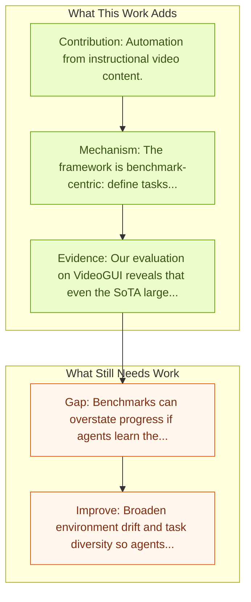

# VideoGUI: Instructional Video Automation

Entry report generated on 2026-03-28 (Asia/Tokyo). This report is based on the repository entry, linked source metadata, and audit-time cross-checks.

## Snapshot

| Field | Detail |
| --- | --- |
| Repo entry | VideoGUI: Instructional Video Automation |
| Actual target | [VideoGUI: A Benchmark for GUI Automation from Instructional Videos](https://arxiv.org/abs/2406.10227) |
| Section | Benchmarks and Datasets |
| Source location | `papers/benchmarks/README.md:347` |
| Primary link type | `link` |
| Audit status | `ok` |
| Date / venue | 2024 |
| Authors | Kevin Qinghong Lin, Linjie Li, Difei Gao, Qinchen WU, Mingyi Yan, Zhengyuan Yang, Lijuan Wang, Mike Zheng Shou |
| Focus tags | `benchmark` `video` `instructions` |
| Center of gravity | video, instructions |

## Quick Read

| Lens | Read |
| --- | --- |
| Problem pressure | Automation from instructional video content. |
| Most novel move | The main novelty sits in the evaluation surface itself, especially its emphasis on video, instructions. |
| Strongest evidence | Our evaluation on VideoGUI reveals that even the SoTA large multimodal model GPT4o performs poorly on visual-centric GUI tasks... |
| Main caveat | Benchmarks can overstate progress if agents learn the evaluator rather than the underlying task skill, especially around long-horizon... |

## Visual Frame

```mermaid
flowchart LR
  Problem["Problem: Automation from instructional video content."] --> Novelty["Novelty: The main novelty sits in the evaluation surface itself..."]
  Novelty --> Framework["Framework: The framework is benchmark-centric: define tasks..."]
  Framework --> Evidence["Evidence: Our evaluation on VideoGUI reveals that even the SoTA large..."]
  Evidence --> Gap["Gap: Benchmarks can overstate progress if agents learn the..."]
  Gap --> Next["Next: Broaden environment drift and task diversity so agents..."]
  classDef insight fill:#dbeafe,stroke:#2563eb,color:#0f172a;
  classDef risk fill:#fee2e2,stroke:#dc2626,color:#7f1d1d;
  classDef next fill:#dcfce7,stroke:#16a34a,color:#14532d;
  class Problem,Novelty,Framework insight;
  class Evidence insight;
  class Gap risk;
  class Next next;
```

## Analysis Map

## Executive Summary

Automation from instructional video content. Graphical User Interface (GUI) automation holds significant promise for enhancing human productivity by assisting with computer tasks. Existing task formulations primarily focus on simple tasks that can be specified by a single, language-only instruction, such as "Insert a new slide." In this work, we introduce VideoGUI, a novel multi-modal benchmark designed to evaluate GUI assistants on visual-centric GUI tasks. Sourced from high-quality web instructional videos, our benchmark focuses on tasks involving professional and novel software (e.g., Adobe Photoshop or Stable Diffusion WebUI) and complex activities (e.g., video editing).

## Novelty

- The main novelty sits in the evaluation surface itself, especially its emphasis on video, instructions.
- Graphical User Interface (GUI) automation holds significant promise for enhancing human productivity by assisting with computer tasks.
- Existing task formulations primarily focus on simple tasks that can be specified by a single, language-only instruction, such as "Insert a new slide." In this work, we introduce VideoGUI, a novel multi-modal benchmark designed to evaluate GUI assistants on visual-centric GUI tasks.

## Core Contributions

- Automation from instructional video content.
- Graphical User Interface (GUI) automation holds significant promise for enhancing human productivity by assisting with computer tasks.
- Existing task formulations primarily focus on simple tasks that can be specified by a single, language-only instruction, such as "Insert a new slide." In this work, we introduce VideoGUI, a novel multi-modal benchmark designed to evaluate GUI assistants on visual-centric GUI tasks.
- Sourced from high-quality web instructional videos, our benchmark focuses on tasks involving professional and novel software (e.g., Adobe Photoshop or Stable Diffusion WebUI) and complex activities (e.g., video editing).

## Framework and Operating Logic

- The framework is benchmark-centric: define tasks, environments, and success criteria so later agent work can be evaluated on common ground.
- Graphical User Interface (GUI) automation holds significant promise for enhancing human productivity by assisting with computer tasks.
- Existing task formulations primarily focus on simple tasks that can be specified by a single, language-only instruction, such as "Insert a new slide." In this work, we introduce VideoGUI, a novel multi-modal benchmark designed to evaluate GUI assistants on visual-centric GUI tasks.

## Evidence and Claimed Results

- Our evaluation on VideoGUI reveals that even the SoTA large multimodal model GPT4o performs poorly on visual-centric GUI tasks, especially for high-level planning.
- Graphical User Interface (GUI) automation holds significant promise for enhancing human productivity by assisting with computer tasks.
- Existing task formulations primarily focus on simple tasks that can be specified by a single, language-only instruction, such as "Insert a new slide." In this work, we introduce VideoGUI, a novel multi-modal benchmark designed to evaluate GUI assistants on visual-centric GUI tasks.

## Gaps and Limitations

- Benchmarks can overstate progress if agents learn the evaluator rather than the underlying task skill, especially around long-horizon transfer, recovery behavior, and distribution shift.
- Even a strong benchmark can miss interruptions, login drift, or real user messiness if the environment is too clean.

## How To Improve

- Broaden environment drift and task diversity so agents cannot overfit a narrow evaluator or a fixed slice of long-horizon transfer, recovery behavior, and distribution shift.
- Add richer partial-credit and failure-taxonomy reporting, not only binary success.
- Pair benchmark scores with human-grounded difficulty and usability checks so the suite better reflects real workflows.

## Why It Matters

- This entry matters because benchmarks decide what the rest of the repo gets rewarded for improving.
- It is part of the evaluative scaffolding that lets model and method papers claim progress in a comparable way.

## Connections In This Repo

- [AgentHarm: LLM Agent Safety Benchmark](../safety-and-security/agentharm-llm-agent-safety-benchmark.md) - shared evaluative role in defining what progress means.
- [OS-Harm: A Benchmark for Measuring Safety of Computer Use Agents](../safety-and-security/os-harm-a-benchmark-for-measuring-safety-of-computer-use-agents.md) - shared evaluative role in defining what progress means.
- [VPI-Bench: Visual Prompt Injection Attacks for Computer-Use Agents](../safety-and-security/vpi-bench-visual-prompt-injection-attacks-for-computer-use-agents.md) - shared evaluative role in defining what progress means.
- [HackWorld: Evaluating Computer-Use Agents on Exploiting Web Application Vulnerabilities](../safety-and-security/hackworld-evaluating-computer-use-agents-on-exploiting-web-application-vulnerabilities.md) - shared evaluative role in defining what progress means.

## Source Basis

- Primary basis: Primary arXiv abstract metadata was fetched live from the linked paper page.
- Audit access note: Metadata resolved cleanly during the audit.
