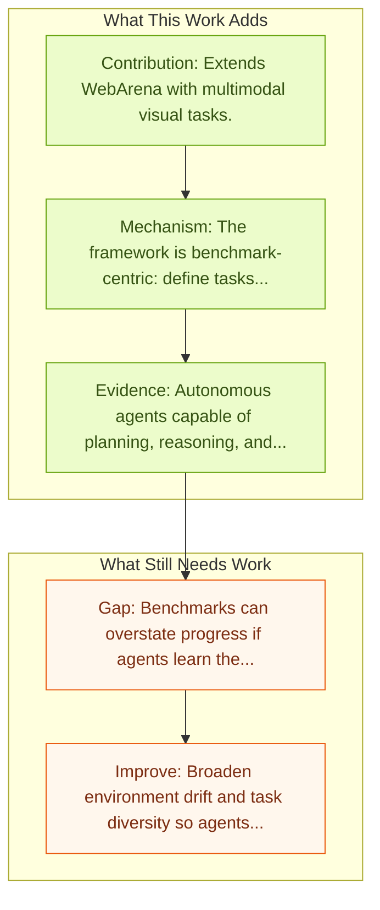

# VisualWebArena: Multimodal Web Tasks

Entry report generated on 2026-03-28 (Asia/Tokyo). This report is based on the repository entry, linked source metadata, and audit-time cross-checks.

## Snapshot

| Field | Detail |
| --- | --- |
| Repo entry | VisualWebArena: Multimodal Web Tasks |
| Actual target | [VisualWebArena: Evaluating Multimodal Agents on Realistic Visual Web Tasks](https://arxiv.org/abs/2401.13649) |
| Section | Benchmarks and Datasets |
| Source location | `papers/benchmarks/README.md:103` |
| Primary link type | `link` |
| Audit status | `ok` |
| Date / venue | ACL 2024 |
| Authors | Jing Yu Koh, Robert Lo, Lawrence Jang, Vikram Duvvur, Ming Chong Lim, Po-Yu Huang, Graham Neubig, Shuyan Zhou, Ruslan Salakhutdinov, Daniel Fried |
| Focus tags | `benchmark` `web` `multimodal` `visual` |
| Center of gravity | web, desktop |

## Quick Read

| Lens | Read |
| --- | --- |
| Problem pressure | Extends WebArena with multimodal visual tasks. |
| Most novel move | The main novelty sits in the evaluation surface itself, especially its emphasis on web, multimodal, visual. |
| Strongest evidence | Autonomous agents capable of planning, reasoning, and executing actions on the web offer a promising avenue for automating computer tasks. |
| Main caveat | Benchmarks can overstate progress if agents learn the evaluator rather than the underlying task skill, especially around live websites... |

## Visual Frame

```mermaid
flowchart LR
  Problem["Problem: Extends WebArena with multimodal visual tasks."] --> Novelty["Novelty: The main novelty sits in the evaluation surface itself..."]
  Novelty --> Framework["Framework: The framework is benchmark-centric: define tasks..."]
  Framework --> Evidence["Evidence: Autonomous agents capable of planning, reasoning, and..."]
  Evidence --> Gap["Gap: Benchmarks can overstate progress if agents learn the..."]
  Gap --> Next["Next: Broaden environment drift and task diversity so agents..."]
  classDef insight fill:#dbeafe,stroke:#2563eb,color:#0f172a;
  classDef risk fill:#fee2e2,stroke:#dc2626,color:#7f1d1d;
  classDef next fill:#dcfce7,stroke:#16a34a,color:#14532d;
  class Problem,Novelty,Framework insight;
  class Evidence insight;
  class Gap risk;
  class Next next;
```

## Analysis Map

## Executive Summary

Extends WebArena with multimodal visual tasks. Autonomous agents capable of planning, reasoning, and executing actions on the web offer a promising avenue for automating computer tasks. However, the majority of existing benchmarks primarily focus on text-based agents, neglecting many natural tasks that require visual information to effectively solve. Given that most computer interfaces cater to human perception, visual information often augments textual data in ways that text-only models struggle to harness effectively.

## Novelty

- The main novelty sits in the evaluation surface itself, especially its emphasis on web, multimodal, visual.
- Autonomous agents capable of planning, reasoning, and executing actions on the web offer a promising avenue for automating computer tasks.
- However, the majority of existing benchmarks primarily focus on text-based agents, neglecting many natural tasks that require visual information to effectively solve.

## Core Contributions

- Extends WebArena with multimodal visual tasks.
- Autonomous agents capable of planning, reasoning, and executing actions on the web offer a promising avenue for automating computer tasks.
- However, the majority of existing benchmarks primarily focus on text-based agents, neglecting many natural tasks that require visual information to effectively solve.
- Given that most computer interfaces cater to human perception, visual information often augments textual data in ways that text-only models struggle to harness effectively.

## Framework and Operating Logic

- The framework is benchmark-centric: define tasks, environments, and success criteria so later agent work can be evaluated on common ground.
- Autonomous agents capable of planning, reasoning, and executing actions on the web offer a promising avenue for automating computer tasks.
- However, the majority of existing benchmarks primarily focus on text-based agents, neglecting many natural tasks that require visual information to effectively solve.

## Evidence and Claimed Results

- Autonomous agents capable of planning, reasoning, and executing actions on the web offer a promising avenue for automating computer tasks.
- However, the majority of existing benchmarks primarily focus on text-based agents, neglecting many natural tasks that require visual information to effectively solve.
- Given that most computer interfaces cater to human perception, visual information often augments textual data in ways that text-only models struggle to harness effectively.

## Gaps and Limitations

- Benchmarks can overstate progress if agents learn the evaluator rather than the underlying task skill, especially around live websites, layout drift, and prompt-injection exposure.
- Even a strong benchmark can miss interruptions, login drift, or real user messiness if the environment is too clean.

## How To Improve

- Broaden environment drift and task diversity so agents cannot overfit a narrow evaluator or a fixed slice of live websites, layout drift, and prompt-injection exposure.
- Add richer partial-credit and failure-taxonomy reporting, not only binary success.
- Pair benchmark scores with human-grounded difficulty and usability checks so the suite better reflects real workflows.

## Why It Matters

- This entry matters because benchmarks decide what the rest of the repo gets rewarded for improving.
- It is part of the evaluative scaffolding that lets model and method papers claim progress in a comparable way.

## Connections In This Repo

- [HackWorld: Evaluating Computer-Use Agents on Exploiting Web Application Vulnerabilities](../safety-and-security/hackworld-evaluating-computer-use-agents-on-exploiting-web-application-vulnerabilities.md) - shared focus on web-agent realism, dynamic pages, or browser-side risk.
- [WebArena: Realistic Web Environment for Building Autonomous Agents](webarena-realistic-web-environment-for-building-autonomous-agents.md) - shared focus on web-agent realism, dynamic pages, or browser-side risk.
- [Mind2Web: Towards a Generalist Agent for the Web](mind2web-towards-a-generalist-agent-for-the-web.md) - shared focus on web-agent realism, dynamic pages, or browser-side risk.
- [Online-Mind2Web](online-mind2web.md) - shared focus on web-agent realism, dynamic pages, or browser-side risk.

## Source Basis

- Primary basis: abstract-level paper metadata plus the repo-local notes in the source Markdown file.
- Audit access note: Metadata resolved cleanly during the audit.
