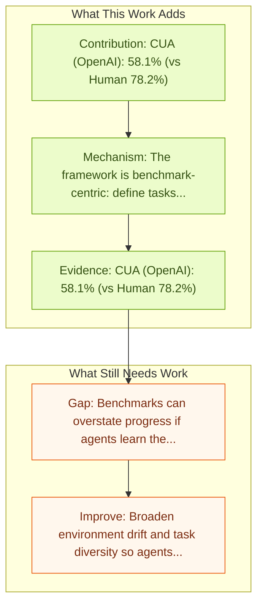

# WebArena: Realistic Web Environment for Building Autonomous Agents

Entry report generated on 2026-03-28 (Asia/Tokyo). This report is based on the repository entry, linked source metadata, and audit-time cross-checks.

## Snapshot

| Field | Detail |
| --- | --- |
| Repo entry | WebArena: Realistic Web Environment for Building Autonomous Agents |
| Actual target | [WebArena: A Realistic Web Environment for Building Autonomous Agents](https://arxiv.org/abs/2307.13854) |
| Section | Benchmarks and Datasets |
| Source location | `papers/benchmarks/README.md:63` |
| Primary link type | `link` |
| Audit status | `limited-access` |
| Date / venue | ICLR 2024 Poster |
| Authors | Shuyan Zhou, Frank F. Xu, Hao Zhu, Xuhui Zhou, Robert Lo, Abishek Sridhar, Xianyi Cheng, Tianyue Ou, Yonatan Bisk, Daniel Fried, Uri Alon, Graham Neubig |
| Focus tags | `benchmark` `web` `realistic` |
| Center of gravity | web |
| Related assets | [webarena.dev](https://webarena.dev/) |

## Quick Read

| Lens | Read |
| --- | --- |
| Problem pressure | The paper targets a concrete bottleneck in computer-use agents. |
| Most novel move | The main novelty sits in the evaluation surface itself, especially its emphasis on web, realistic, current sota. |
| Strongest evidence | CUA (OpenAI): 58.1% (vs Human 78.2%) |
| Main caveat | Benchmarks can overstate progress if agents learn the evaluator rather than the underlying task skill, especially around live websites... |

## Visual Frame

```mermaid
flowchart LR
  Problem["Problem: With advances in generative AI, there is now potential for..."] --> Novelty["Novelty: The main novelty sits in the evaluation surface itself..."]
  Novelty --> Framework["Framework: The framework is benchmark-centric: define tasks..."]
  Framework --> Evidence["Evidence: CUA (OpenAI): 58.1% (vs Human 78.2%)"]
  Evidence --> Gap["Gap: Benchmarks can overstate progress if agents learn the..."]
  Gap --> Next["Next: Broaden environment drift and task diversity so agents..."]
  classDef insight fill:#dbeafe,stroke:#2563eb,color:#0f172a;
  classDef risk fill:#fee2e2,stroke:#dc2626,color:#7f1d1d;
  classDef next fill:#dcfce7,stroke:#16a34a,color:#14532d;
  class Problem,Novelty,Framework insight;
  class Evidence insight;
  class Gap risk;
  class Next next;
```

## Analysis Map

## Executive Summary

With advances in generative AI, there is now potential for autonomous agents to manage daily tasks via natural language commands. However, current agents are primarily created and tested in simplified synthetic environments, leading to a disconnect with real-world scenarios. In this paper, we build an environment for language-guided agents that is highly realistic and reproducible. The benchmark or dataset is the main contribution rather than a new agent policy.

## Novelty

- The main novelty sits in the evaluation surface itself, especially its emphasis on web, realistic, current sota.
- With advances in generative AI, there is now potential for autonomous agents to manage daily tasks via natural language commands.
- However, current agents are primarily created and tested in simplified synthetic environments, leading to a disconnect with real-world scenarios.

## Core Contributions

- CUA (OpenAI): 58.1% (vs Human 78.2%)
- With advances in generative AI, there is now potential for autonomous agents to manage daily tasks via natural language commands.
- However, current agents are primarily created and tested in simplified synthetic environments, leading to a disconnect with real-world scenarios.
- In this paper, we build an environment for language-guided agents that is highly realistic and reproducible.

## Framework and Operating Logic

- The framework is benchmark-centric: define tasks, environments, and success criteria so later agent work can be evaluated on common ground.
- With advances in generative AI, there is now potential for autonomous agents to manage daily tasks via natural language commands.
- However, current agents are primarily created and tested in simplified synthetic environments, leading to a disconnect with real-world scenarios.

## Evidence and Claimed Results

- CUA (OpenAI): 58.1% (vs Human 78.2%)
- The results demonstrate that solving complex tasks is challenging: our best GPT-4-based agent only achieves an end-to-end task success rate of 14.41%, significantly lower than the human performance of 78.24%.

## Gaps and Limitations

- Benchmarks can overstate progress if agents learn the evaluator rather than the underlying task skill, especially around live websites, layout drift, and prompt-injection exposure.
- Even a strong benchmark can miss interruptions, login drift, or real user messiness if the environment is too clean.

## How To Improve

- Broaden environment drift and task diversity so agents cannot overfit a narrow evaluator or a fixed slice of live websites, layout drift, and prompt-injection exposure.
- Add richer partial-credit and failure-taxonomy reporting, not only binary success.
- Pair benchmark scores with human-grounded difficulty and usability checks so the suite better reflects real workflows.

## Why It Matters

- This entry matters because benchmarks decide what the rest of the repo gets rewarded for improving.
- It is part of the evaluative scaffolding that lets model and method papers claim progress in a comparable way.

## Connections In This Repo

- [HackWorld: Evaluating Computer-Use Agents on Exploiting Web Application Vulnerabilities](../safety-and-security/hackworld-evaluating-computer-use-agents-on-exploiting-web-application-vulnerabilities.md) - shared focus on web-agent realism, dynamic pages, or browser-side risk.
- [Mind2Web: Towards a Generalist Agent for the Web](mind2web-towards-a-generalist-agent-for-the-web.md) - shared focus on web-agent realism, dynamic pages, or browser-side risk.
- [Online-Mind2Web](online-mind2web.md) - shared focus on web-agent realism, dynamic pages, or browser-side risk.
- [VisualWebArena: Multimodal Web Tasks](visualwebarena-multimodal-web-tasks.md) - shared focus on web-agent realism, dynamic pages, or browser-side risk.

## Source Basis

- Primary basis: abstract-level paper metadata plus the repo-local notes in the source Markdown file.
- Audit access note: The linked source had limited direct readability during the audit, so the report leans more heavily on accessible metadata and repo context.
