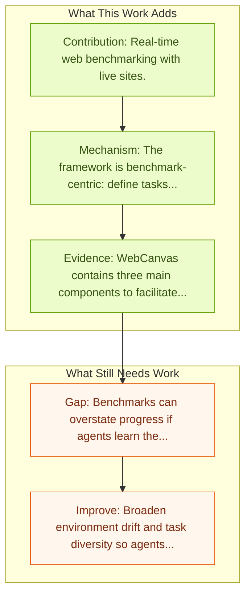

# WebCanvas: Online Web Agent Benchmarking

Entry report generated on 2026-03-28 (Asia/Tokyo). This report is based on the repository entry, linked source metadata, and audit-time cross-checks.

## Snapshot

| Field | Detail |
| --- | --- |
| Repo entry | WebCanvas: Online Web Agent Benchmarking |
| Actual target | [WebCanvas: Benchmarking Web Agents in Online Environments](https://arxiv.org/abs/2406.12373) |
| Section | Benchmarks and Datasets |
| Source location | `papers/benchmarks/README.md:123` |
| Primary link type | `link` |
| Audit status | `limited-access` |
| Date / venue | June 2024 |
| Authors | Yichen Pan, Dehan Kong, Sida Zhou, Cheng Cui, Yifei Leng, Bing Jiang, Hangyu Liu, Yanyi Shang |
| Focus tags | `benchmark`, `web`, `online`, `dynamic` |
| Center of gravity | `web` |

## Quick Read

| Lens | Read |
| --- | --- |
| Problem pressure | Real-time web benchmarking with live sites. |
| Most novel move | The main novelty sits in the evaluation surface itself, especially its emphasis on web, online, dynamic. |
| Strongest evidence | WebCanvas contains three main components to facilitate realistic assessments: (1) A novel evaluation metric which reliably capture... |
| Main caveat | Benchmarks can overstate progress if agents learn the evaluator rather than the underlying task skill, especially around live websites... |

## Visual Frame

```mermaid
flowchart LR
  Problem["Problem: Real-time web benchmarking with live sites."] --> Novelty["Novelty: The main novelty sits in the evaluation surface itself..."]
  Novelty --> Framework["Framework: The framework is benchmark-centric: define tasks..."]
  Framework --> Evidence["Evidence: WebCanvas contains three main components to facilitate..."]
  Evidence --> Gap["Gap: Benchmarks can overstate progress if agents learn the..."]
  Gap --> Next["Next: Broaden environment drift and task diversity so agents..."]
  classDef insight fill:#dbeafe,stroke:#2563eb,color:#0f172a;
  classDef risk fill:#fee2e2,stroke:#dc2626,color:#7f1d1d;
  classDef next fill:#dcfce7,stroke:#16a34a,color:#14532d;
  class Problem,Novelty,Framework insight;
  class Evidence insight;
  class Gap risk;
  class Next next;
```

## Analysis Map

## Executive Summary

Real-time web benchmarking with live sites. For web agents to be practically useful, they must adapt to the continuously evolving web environment characterized by frequent updates to user interfaces and content. However, most existing benchmarks only capture the static aspects of the web. To bridge this gap, we introduce WebCanvas, an innovative online evaluation framework for web agents that effectively addresses the dynamic nature of web interactions.

## Novelty

- The main novelty sits in the evaluation surface itself, especially its emphasis on web, online, dynamic.
- For web agents to be practically useful, they must adapt to the continuously evolving web environment characterized by frequent updates to user interfaces and content.
- However, most existing benchmarks only capture the static aspects of the web.

## Core Contributions

- Real-time web benchmarking with live sites.
- For web agents to be practically useful, they must adapt to the continuously evolving web environment characterized by frequent updates to user interfaces and content.
- However, most existing benchmarks only capture the static aspects of the web.
- To bridge this gap, we introduce WebCanvas, an innovative online evaluation framework for web agents that effectively addresses the dynamic nature of web interactions.

## Framework and Operating Logic

- The framework is benchmark-centric: define tasks, environments, and success criteria so later agent work can be evaluated on common ground.
- For web agents to be practically useful, they must adapt to the continuously evolving web environment characterized by frequent updates to user interfaces and content.
- However, most existing benchmarks only capture the static aspects of the web.

## Evidence and Claimed Results

- WebCanvas contains three main components to facilitate realistic assessments: (1) A novel evaluation metric which reliably capture critical intermediate actions or states necessary for task completions while disregarding noise caused by insignificant events or changed web-elements.
- (2) A benchmark dataset called Mind2Web-Live, a refined version of original Mind2Web static dataset containing 542 tasks with 2439 intermediate evaluation states; (3) Lightweight and generalizable annotation tools and testing pipelines that enables the community to collect and maintain the high-quality, up-to-date dataset.
- Our best-performing agent achieves a task success rate of 23.1% and a task completion rate of 48.8% on the Mind2Web-Live test set.

## Gaps and Limitations

- Benchmarks can overstate progress if agents learn the evaluator rather than the underlying task skill, especially around live websites, layout drift, and prompt-injection exposure.
- Even a strong benchmark can miss interruptions, login drift, or real user messiness if the environment is too clean.

## How To Improve

- Broaden environment drift and task diversity so agents cannot overfit a narrow evaluator or a fixed slice of live websites, layout drift, and prompt-injection exposure.
- Add richer partial-credit and failure-taxonomy reporting, not only binary success.
- Pair benchmark scores with human-grounded difficulty and usability checks so the suite better reflects real workflows.

## Why It Matters

- This entry matters because benchmarks decide what the rest of the repo gets rewarded for improving.
- It is part of the evaluative scaffolding that lets model and method papers claim progress in a comparable way.

## Connections In This Repo

- [WebArena: Realistic Web Environment for Building Autonomous Agents](webarena-realistic-web-environment-for-building-autonomous-agents.md) - shared focus on web-agent realism, dynamic pages, or browser-side risk.
- [Mind2Web: Towards a Generalist Agent for the Web](mind2web-towards-a-generalist-agent-for-the-web.md) - shared focus on web-agent realism, dynamic pages, or browser-side risk.
- [Online-Mind2Web](online-mind2web.md) - shared focus on web-agent realism, dynamic pages, or browser-side risk.
- [VisualWebArena: Multimodal Web Tasks](visualwebarena-multimodal-web-tasks.md) - shared focus on web-agent realism, dynamic pages, or browser-side risk.

## Source Basis

- Primary basis: abstract-level paper metadata plus the repo-local notes in the source Markdown file.
- Audit access note: The linked source had limited direct readability during the audit, so the report leans more heavily on accessible metadata and repo context.
