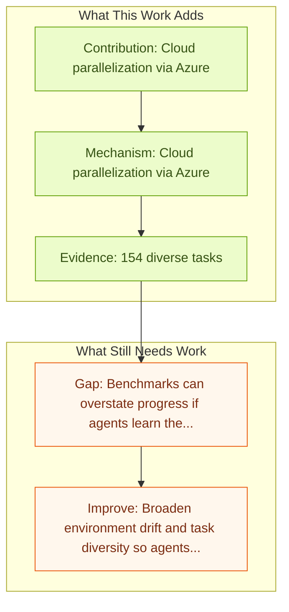

# Windows Agent Arena (WAA)

Entry report generated on 2026-03-28 (Asia/Tokyo). This report is based on the repository entry, linked source metadata, and audit-time cross-checks.

## Snapshot

| Field | Detail |
| --- | --- |
| Repo entry | Windows Agent Arena (WAA) |
| Actual target | [Windows Agent Arena: Evaluating Multi-Modal OS Agents at Scale](https://arxiv.org/abs/2409.08264) |
| Section | Benchmarks and Datasets |
| Source location | `papers/benchmarks/README.md:28` |
| Primary link type | `link` |
| Audit status | `ok` |
| Date / venue | 2024-09-12 |
| Authors | Rogerio Bonatti, Dan Zhao, Francesco Bonacci, Dillon Dupont, Sara Abdali, Yinheng Li, Yadong Lu, Justin Wagle |
| Focus tags | `benchmark`, `windows`, `desktop`, `scalable` |
| Center of gravity | `web`, `desktop`, `grounding` |
| Related assets | [microsoft.github.io/WindowsAgentArena](https://microsoft.github.io/WindowsAgentArena/); [GitHub](https://github.com/microsoft/WindowsAgentArena) |

## Quick Read

| Lens | Read |
| --- | --- |
| Problem pressure | Reproducible environment focusing on Windows OS. |
| Most novel move | The main novelty sits in the evaluation surface itself, especially its emphasis on windows, desktop, scalable. |
| Strongest evidence | 154 diverse tasks |
| Main caveat | Benchmarks can overstate progress if agents learn the evaluator rather than the underlying task skill, especially around desktop... |

## Visual Frame

```mermaid
flowchart LR
  Problem["Problem: Reproducible environment focusing on Windows OS."] --> Novelty["Novelty: The main novelty sits in the evaluation surface itself..."]
  Novelty --> Framework["Framework: Cloud parallelization via Azure"]
  Framework --> Evidence["Evidence: 154 diverse tasks"]
  Evidence --> Gap["Gap: Benchmarks can overstate progress if agents learn the..."]
  Gap --> Next["Next: Broaden environment drift and task diversity so agents..."]
  classDef insight fill:#dbeafe,stroke:#2563eb,color:#0f172a;
  classDef risk fill:#fee2e2,stroke:#dc2626,color:#7f1d1d;
  classDef next fill:#dcfce7,stroke:#16a34a,color:#14532d;
  class Problem,Novelty,Framework insight;
  class Evidence insight;
  class Gap risk;
  class Next next;
```

## Analysis Map

## Executive Summary

Reproducible environment focusing on Windows OS. Large language models (LLMs) show remarkable potential to act as computer agents, enhancing human productivity and software accessibility in multi-modal tasks that require planning and reasoning. However, measuring agent performance in realistic environments remains a challenge since: (i) most benchmarks are limited to specific modalities or domains (e.g. text-only, web navigation, Q&A, coding) and (ii) full benchmark evaluations are slow (on order of magnitude of days) given the multi-step sequential nature of tasks. To address these challenges, we introduce the Windows Agent Arena: a reproducible, general environment focusing exclusively on the Windows operating system (OS) where agents can operate freely within a real Windows OS and use the same wide range of applications, tools, and web browsers available to human users when solving tasks.

## Novelty

- The main novelty sits in the evaluation surface itself, especially its emphasis on windows, desktop, scalable.
- It also stands out for docker containers with Windows 11 VMs.
- Large language models (LLMs) show remarkable potential to act as computer agents, enhancing human productivity and software accessibility in multi-modal tasks that require planning and reasoning.

## Core Contributions

- Cloud parallelization via Azure
- Docker containers with Windows 11 VMs
- 154 diverse tasks
- 10+ applications (LibreOffice, Edge, VS Code, VLC, etc.)

## Framework and Operating Logic

- Cloud parallelization via Azure
- Docker containers with Windows 11 VMs
- Large language models (LLMs) show remarkable potential to act as computer agents, enhancing human productivity and software accessibility in multi-modal tasks that require planning and reasoning.

## Evidence and Claimed Results

- 154 diverse tasks
- 10+ applications (LibreOffice, Edge, VS Code, VLC, etc.)
- We adapt the OSWorld framework (Xie et al., 2024) to create 150+ diverse Windows tasks across representative domains that require agent abilities in planning, screen understanding, and tool usage.
- Our benchmark is scalable and can be seamlessly parallelized in Azure for a full benchmark evaluation in as little as 20 minutes.
- Our agent achieves a success rate of 19.5% in the Windows domain, compared to 74.5% performance of an unassisted human.

## Gaps and Limitations

- Benchmarks can overstate progress if agents learn the evaluator rather than the underlying task skill, especially around desktop heterogeneity, long workflows, and OS-level side effects.
- Even a strong benchmark can miss interruptions, login drift, or real user messiness if the environment is too clean.

## How To Improve

- Broaden environment drift and task diversity so agents cannot overfit a narrow evaluator or a fixed slice of desktop heterogeneity, long workflows, and OS-level side effects.
- Add richer partial-credit and failure-taxonomy reporting, not only binary success.
- Pair benchmark scores with human-grounded difficulty and usability checks so the suite better reflects real workflows.

## Why It Matters

- This entry matters because benchmarks decide what the rest of the repo gets rewarded for improving.
- It is part of the evaluative scaffolding that lets model and method papers claim progress in a comparable way.

## Connections In This Repo

- [OSWorld: Multimodal Agents for Open-Ended Tasks in Real Computer Environments](osworld-multimodal-agents-for-open-ended-tasks-in-real-computer-environments.md) - shared desktop or OS-level interaction surface.
- [macOSWorld](macosworld.md) - shared desktop or OS-level interaction surface.
- [OmniACT](omniact.md) - shared desktop or OS-level interaction surface.
- [ComputerRL: End-to-End Online RL for Computer Use Agents](../methods-and-techniques/computerrl-end-to-end-online-rl-for-computer-use-agents.md) - shared desktop or OS-level interaction surface.

## Source Basis

- Primary basis: abstract-level paper metadata plus the repo-local notes in the source Markdown file.
- Audit access note: Metadata resolved cleanly during the audit.
