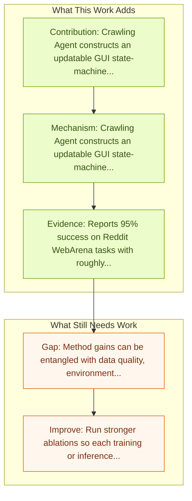

# ActionEngine: From Reactive to Programmatic GUI Agents via State Machine Memory

Entry report generated on 2026-03-28 (Asia/Tokyo). This report is based on the repository entry, linked source metadata, and audit-time cross-checks.

## Snapshot

| Field | Detail |
| --- | --- |
| Repo entry | ActionEngine: From Reactive to Programmatic GUI Agents via State Machine Memory |
| Actual target | [ActionEngine: From Reactive to Programmatic GUI Agents via State Machine Memory](https://arxiv.org/abs/2602.20502) |
| Section | Methods and Techniques |
| Source location | `papers/methods/README.md:157` |
| Primary link type | `link` |
| Audit status | `ok` |
| Date / venue | February 2026 |
| Authors | Hongbin Zhong, Fazle Faisal, Luis França, Tanakorn Leesatapornwongsa, Adriana Szekeres, Kexin Rong, Suman Nath |
| Focus tags | `method`, `program-synthesis`, `web`, `memory` |
| Center of gravity | `program-synthesis`, `web`, `memory` |

## Quick Read

| Lens | Read |
| --- | --- |
| Problem pressure | Training-free framework that turns reactive GUI execution into programmatic planning with persistent state memory. |
| Most novel move | The method's clearest new move is crawling Agent constructs an updatable GUI state-machine memory through offline exploration. |
| Strongest evidence | Reports 95% success on Reddit WebArena tasks with roughly one LLM call on average. |
| Main caveat | Method gains can be entangled with data quality, environment choice, or evaluator assumptions if ablations are thin. |

## Visual Frame

```mermaid
flowchart LR
  Problem["Problem: Training-free framework that turns reactive GUI execution..."] --> Novelty["Novelty: The method's clearest new move is crawling Agent constructs..."]
  Novelty --> Framework["Framework: Crawling Agent constructs an updatable GUI state-machine..."]
  Framework --> Evidence["Evidence: Reports 95% success on Reddit WebArena tasks with roughly..."]
  Evidence --> Gap["Gap: Method gains can be entangled with data quality, environment..."]
  Gap --> Next["Next: Run stronger ablations so each training or inference..."]
  classDef insight fill:#dbeafe,stroke:#2563eb,color:#0f172a;
  classDef risk fill:#fee2e2,stroke:#dc2626,color:#7f1d1d;
  classDef next fill:#dcfce7,stroke:#16a34a,color:#14532d;
  class Problem,Novelty,Framework insight;
  class Evidence insight;
  class Gap risk;
  class Next next;
```

## Analysis Map

## Executive Summary

Training-free framework that turns reactive GUI execution into programmatic planning with persistent state memory. Existing Graphical User Interface (GUI) agents operate through step-by-step calls to vision language models--taking a screenshot, reasoning about the next action, executing it, then repeating on the new page--resulting in high costs and latency that scale with the number of reasoning steps, and limited accuracy due to no persistent memory of previously visited pages. The authors propose ActionEngine, a training-free framework that transitions from reactive execution to programmatic planning through a novel two-agent architecture: a Crawling Agent that constructs an updatable state-machine memory of the GUIs through offline exploration, and an Execution Agent that leverages this memory to synthesize complete, executable Python programs for online task execution. To ensure robustness against evolving interfaces, execution...

## Novelty

- The method's clearest new move is crawling Agent constructs an updatable GUI state-machine memory through offline exploration.
- It also stands out for execution Agent synthesizes complete Python programs for online task execution.
- It also stands out for vision-based re-grounding fallback repairs failures and updates memory when interfaces drift.

## Core Contributions

- Crawling Agent constructs an updatable GUI state-machine memory through offline exploration.
- Execution Agent synthesizes complete Python programs for online task execution.
- Vision-based re-grounding fallback repairs failures and updates memory when interfaces drift.
- Existing Graphical User Interface (GUI) agents operate through step-by-step calls to vision language models--taking a screenshot, reasoning about the next action, executing it, then repeating on the new page--resulting in high costs and latency that scale with the number of reasoning steps, and limited accuracy due to no persistent memory of previously visited pages.

## Framework and Operating Logic

- Crawling Agent constructs an updatable GUI state-machine memory through offline exploration.
- Execution Agent synthesizes complete Python programs for online task execution.
- Vision-based re-grounding fallback repairs failures and updates memory when interfaces drift.
- The abstract indicates that the method should be read as a pipeline change rather than only a bigger base model.

## Evidence and Claimed Results

- Reports 95% success on Reddit WebArena tasks with roughly one LLM call on average.
- Cuts cost by 11.8x and end-to-end latency by 2x relative to the strongest reported vision-only baseline.
- This design drastically improves both efficiency and accuracy: on Reddit tasks from the WebArena benchmark, our agent achieves 95% task success with on average a single LLM call, compared to 66% for the strongest vision-only baseline, while reducing cost by 11.8x and end-to-end latency by 2x.

## Gaps and Limitations

- Method gains can be entangled with data quality, environment choice, or evaluator assumptions if ablations are thin.
- Better grounding or reflection does not automatically solve live websites, layout drift, and prompt-injection exposure.

## How To Improve

- Run stronger ablations so each training or inference component carries a clearly attributable gain.
- Stress-test the method on longer workflows and harder transfer settings involving live websites, layout drift, and prompt-injection exposure.
- Publish sharper failure analyses for the cases where the method improves one stage of control but still fails end-to-end.

## Why It Matters

- This entry matters because training and inference design often determine whether a capable base model can actually become a useful agent.
- It usually connects high-level capability claims to the data, tuning, or orchestration choices that make them work.

## Connections In This Repo

- [WebRL: Self-Evolving Online Curriculum RL for Web Agents](webrl-self-evolving-online-curriculum-rl-for-web-agents.md) - shared focus on web-agent realism, dynamic pages, or browser-side risk.
- [AgentTrek: Agent Trajectory Synthesis via Web Tutorials](agenttrek-agent-trajectory-synthesis-via-web-tutorials.md) - shared focus on web-agent realism, dynamic pages, or browser-side risk.
- [SeeAct: GPT-4V Web Agent via Visual Grounding](seeact-gpt-4v-web-agent-via-visual-grounding.md) - shared focus on web-agent realism, dynamic pages, or browser-side risk.
- [WebArena: Realistic Web Environment for Building Autonomous Agents](../benchmarks-and-datasets/webarena-realistic-web-environment-for-building-autonomous-agents.md) - shared focus on web-agent realism, dynamic pages, or browser-side risk.

## Source Basis

- Primary basis: Primary arXiv abstract metadata was fetched live from the linked paper page.
- Audit access note: Metadata resolved cleanly during the audit.
