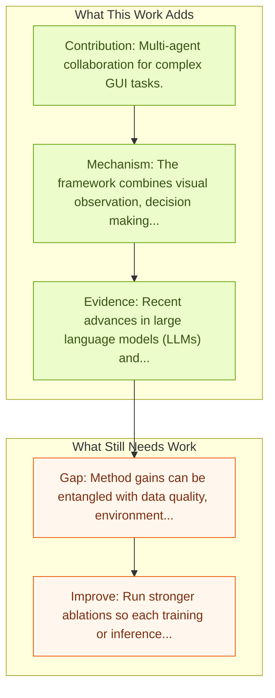

# Chain-of-Agents: Multi-Agent Collaboration

Entry report generated on 2026-03-28 (Asia/Tokyo). This report is based on the repository entry, linked source metadata, and audit-time cross-checks.

## Snapshot

| Field | Detail |
| --- | --- |
| Repo entry | Chain-of-Agents: Multi-Agent Collaboration |
| Actual target | [Chain-of-Agents: End-to-End Agent Foundation Models via Multi-Agent Distillation and Agentic RL](https://arxiv.org/abs/2508.13167) |
| Section | Methods and Techniques |
| Source location | `papers/methods/README.md:143` |
| Primary link type | `link` |
| Audit status | `ok` |
| Date / venue | August 2025 |
| Authors | Weizhen Li, Jianbo Lin, Zhuosong Jiang, Jingyi Cao, Xinpeng Liu, Jiayu Zhang, Zhenqiang Huang, Qianben Chen |
| Focus tags | `method`, `multi-agent`, `collaboration` |
| Center of gravity | `web` |

## Quick Read

| Lens | Read |
| --- | --- |
| Problem pressure | Multi-agent collaboration for complex GUI tasks. |
| Most novel move | The method's clearest new move is multi-agent collaboration for complex GUI tasks. |
| Strongest evidence | Recent advances in large language models (LLMs) and multi-agent systems have demonstrated remarkable capabilities in complex... |
| Main caveat | Method gains can be entangled with data quality, environment choice, or evaluator assumptions if ablations are thin. |

## Visual Frame

```mermaid
flowchart LR
  Problem["Problem: Multi-agent collaboration for complex GUI tasks."] --> Novelty["Novelty: The method's clearest new move is multi-agent collaboration..."]
  Novelty --> Framework["Framework: The framework combines visual observation, decision making..."]
  Framework --> Evidence["Evidence: Recent advances in large language models (LLMs) and..."]
  Evidence --> Gap["Gap: Method gains can be entangled with data quality, environment..."]
  Gap --> Next["Next: Run stronger ablations so each training or inference..."]
  classDef insight fill:#dbeafe,stroke:#2563eb,color:#0f172a;
  classDef risk fill:#fee2e2,stroke:#dc2626,color:#7f1d1d;
  classDef next fill:#dcfce7,stroke:#16a34a,color:#14532d;
  class Problem,Novelty,Framework insight;
  class Evidence insight;
  class Gap risk;
  class Next next;
```

## Analysis Map

## Executive Summary

Multi-agent collaboration for complex GUI tasks. Recent advances in large language models (LLMs) and multi-agent systems have demonstrated remarkable capabilities in complex problem-solving tasks such as deep research, vibe coding, and mathematical reasoning. However, most existing multi-agent systems are built upon manual prompt/workflow engineering with sophisticated agent frameworks, making them computationally inefficient, less capable, and can not benefit from data-centric learning. In this work, we introduce Chain-of-Agents (CoA), a novel paradigm of LLM reasoning that enables native end-to-end complex problem-solving in the same way as a multi-agent system (i.e., multi-turn problem solving with multiple tools and multiple agents) within one model.

## Novelty

- The method's clearest new move is multi-agent collaboration for complex GUI tasks.
- Recent advances in large language models (LLMs) and multi-agent systems have demonstrated remarkable capabilities in complex problem-solving tasks such as deep research, vibe coding, and mathematical reasoning.
- However, most existing multi-agent systems are built upon manual prompt/workflow engineering with sophisticated agent frameworks, making them computationally inefficient, less capable, and can not benefit from data-centric learning.

## Core Contributions

- Multi-agent collaboration for complex GUI tasks.
- Recent advances in large language models (LLMs) and multi-agent systems have demonstrated remarkable capabilities in complex problem-solving tasks such as deep research, vibe coding, and mathematical reasoning.
- However, most existing multi-agent systems are built upon manual prompt/workflow engineering with sophisticated agent frameworks, making them computationally inefficient, less capable, and can not benefit from data-centric learning.
- In this work, we introduce Chain-of-Agents (CoA), a novel paradigm of LLM reasoning that enables native end-to-end complex problem-solving in the same way as a multi-agent system (i.e., multi-turn problem solving with multiple tools and multiple agents) within one model.

## Framework and Operating Logic

- The framework combines visual observation, decision making, and action execution into a reusable control loop.
- The abstract indicates that the method should be read as a pipeline change rather than only a bigger base model.
- Recent advances in large language models (LLMs) and multi-agent systems have demonstrated remarkable capabilities in complex problem-solving tasks such as deep research, vibe coding, and mathematical reasoning.

## Evidence and Claimed Results

- Recent advances in large language models (LLMs) and multi-agent systems have demonstrated remarkable capabilities in complex problem-solving tasks such as deep research, vibe coding, and mathematical reasoning.
- However, most existing multi-agent systems are built upon manual prompt/workflow engineering with sophisticated agent frameworks, making them computationally inefficient, less capable, and can not benefit from data-centric learning.
- In this work, we introduce Chain-of-Agents (CoA), a novel paradigm of LLM reasoning that enables native end-to-end complex problem-solving in the same way as a multi-agent system (i.e., multi-turn problem solving with multiple tools and multiple agents) within one model.

## Gaps and Limitations

- Method gains can be entangled with data quality, environment choice, or evaluator assumptions if ablations are thin.
- Better grounding or reflection does not automatically solve long-horizon transfer, recovery behavior, and distribution shift.

## How To Improve

- Run stronger ablations so each training or inference component carries a clearly attributable gain.
- Stress-test the method on longer workflows and harder transfer settings involving long-horizon transfer, recovery behavior, and distribution shift.
- Publish sharper failure analyses for the cases where the method improves one stage of control but still fails end-to-end.

## Why It Matters

- This entry matters because training and inference design often determine whether a capable base model can actually become a useful agent.
- It usually connects high-level capability claims to the data, tuning, or orchestration choices that make them work.

## Connections In This Repo

- [Magentic-One: Multi-Agent with Human-in-Loop](magentic-one-multi-agent-with-human-in-loop.md) - neighbor entry in the same methods and techniques cluster.
- [Mobile-Agent-v3: Fundamental Agents for GUI Automation](../models-and-architectures/mobile-agent-v3-fundamental-agents-for-gui-automation.md) - the method complements the model or benchmark side of the same research cluster.
- [Infectious Jailbreaks in Multi-Agent Systems](../safety-and-security/infectious-jailbreaks-in-multi-agent-systems.md) - the papers sit in the same local research cluster in this repository.
- [ComputerRL: End-to-End Online RL for Computer Use Agents](computerrl-end-to-end-online-rl-for-computer-use-agents.md) - neighbor entry in the same methods and techniques cluster.

## Source Basis

- Primary basis: abstract-level paper metadata plus the repo-local notes in the source Markdown file.
- Audit access note: Metadata resolved cleanly during the audit.
