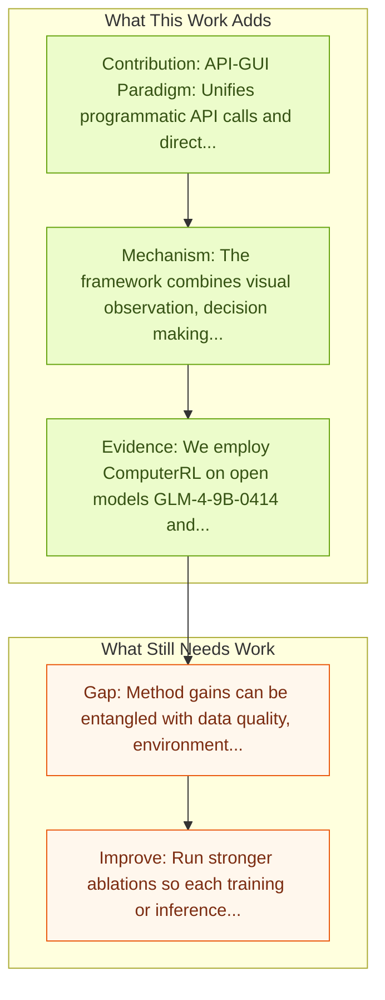

# ComputerRL: End-to-End Online RL for Computer Use Agents

Entry report generated on 2026-03-28 (Asia/Tokyo). This report is based on the repository entry, linked source metadata, and audit-time cross-checks.

## Snapshot

| Field | Detail |
| --- | --- |
| Repo entry | ComputerRL: End-to-End Online RL for Computer Use Agents |
| Actual target | [ComputerRL: Scaling End-to-End Online Reinforcement Learning for Computer Use Agents](https://arxiv.org/abs/2508.14040) |
| Section | Methods and Techniques |
| Source location | `papers/methods/README.md:7` |
| Primary link type | `link` |
| Audit status | `ok` |
| Date / venue | ICLR 2026 Poster |
| Authors | Hanyu Lai, Xiao Liu, Yanxiao Zhao, Han Xu, Hanchen Zhang, Bohao Jing, Yanyu Ren, Shuntian Yao, Yuxiao Dong, Jie Tang |
| Focus tags | `method` `reinforcement-learning` `desktop` `distributed` |
| Center of gravity | desktop |

## Quick Read

| Lens | Read |
| --- | --- |
| Problem pressure | Framework for autonomous desktop intelligence. |
| Most novel move | The method's clearest new move is API-GUI Paradigm: Unifies programmatic API calls and direct GUI interaction. |
| Strongest evidence | We employ ComputerRL on open models GLM-4-9B-0414 and GLM-4.1V-9B-Thinking, and evaluate them on the OSWorld benchmark. |
| Main caveat | Method gains can be entangled with data quality, environment choice, or evaluator assumptions if ablations are thin. |

## Visual Frame

```mermaid
flowchart LR
  Problem["Problem: Framework for autonomous desktop intelligence."] --> Novelty["Novelty: The method's clearest new move is API-GUI Paradigm: Unifies..."]
  Novelty --> Framework["Framework: The framework combines visual observation, decision making..."]
  Framework --> Evidence["Evidence: We employ ComputerRL on open models GLM-4-9B-0414 and..."]
  Evidence --> Gap["Gap: Method gains can be entangled with data quality, environment..."]
  Gap --> Next["Next: Run stronger ablations so each training or inference..."]
  classDef insight fill:#dbeafe,stroke:#2563eb,color:#0f172a;
  classDef risk fill:#fee2e2,stroke:#dc2626,color:#7f1d1d;
  classDef next fill:#dcfce7,stroke:#16a34a,color:#14532d;
  class Problem,Novelty,Framework insight;
  class Evidence insight;
  class Gap risk;
  class Next next;
```

## Analysis Map

## Executive Summary

Framework for autonomous desktop intelligence. We introduce ComputerRL, a framework for autonomous desktop intelligence that enables agents to operate complex digital workspaces skillfully. ComputerRL features the API-GUI paradigm, which unifies programmatic API calls and direct GUI interaction to address the inherent mismatch between machine agents and human-centric desktop environments. Scaling end-to-end RL training is crucial for improvement and generalization across diverse desktop tasks; however, it remains challenging due to environmental inefficiency and instability during extended training.

## Code and Supporting Artifacts

- Code repository: no dedicated code link is currently tracked in the repo entry.

## Novelty

- The method's clearest new move is API-GUI Paradigm: Unifies programmatic API calls and direct GUI interaction.
- It also stands out for distributed RL Infrastructure: Orchestrates thousands of parallel virtual desktop environments.
- It also stands out for entropulse: Training strategy alternating RL with supervised fine-tuning to mitigate entropy collapse.

## Core Contributions

- API-GUI Paradigm: Unifies programmatic API calls and direct GUI interaction
- Distributed RL Infrastructure: Orchestrates thousands of parallel virtual desktop environments
- Entropulse: Training strategy alternating RL with supervised fine-tuning to mitigate entropy collapse
- We introduce ComputerRL, a framework for autonomous desktop intelligence that enables agents to operate complex digital workspaces skillfully.

## Framework and Operating Logic

- The framework combines visual observation, decision making, and action execution into a reusable control loop.
- The abstract indicates that the method should be read as a pipeline change rather than only a bigger base model.
- We introduce ComputerRL, a framework for autonomous desktop intelligence that enables agents to operate complex digital workspaces skillfully.

## Evidence and Claimed Results

- We employ ComputerRL on open models GLM-4-9B-0414 and GLM-4.1V-9B-Thinking, and evaluate them on the OSWorld benchmark.
- The AutoGLM-OS-9B achieves a new state-of-the-art accuracy of 48.9%, demonstrating significant improvements for general agents in desktop automation.
- The algorithm and framework are adopted in building AutoGLM (Liu et al., 2024b).

## Gaps and Limitations

- Method gains can be entangled with data quality, environment choice, or evaluator assumptions if ablations are thin.
- Better grounding or reflection does not automatically solve desktop heterogeneity, long workflows, and OS-level side effects.

## How To Improve

- Run stronger ablations so each training or inference component carries a clearly attributable gain.
- Stress-test the method on longer workflows and harder transfer settings involving desktop heterogeneity, long workflows, and OS-level side effects.
- Publish sharper failure analyses for the cases where the method improves one stage of control but still fails end-to-end.

## Why It Matters

- This entry matters because training and inference design often determine whether a capable base model can actually become a useful agent.
- It usually connects high-level capability claims to the data, tuning, or orchestration choices that make them work.

## Connections In This Repo

- [Grounding Computer Use Agents on Human Demonstrations](grounding-computer-use-agents-on-human-demonstrations.md) - shared desktop or OS-level interaction surface.
- [OS-Copilot: Towards Generalist Computer Agents](os-copilot-towards-generalist-computer-agents.md) - shared desktop or OS-level interaction surface.
- [OpenCUA: Open Foundations for Computer-Use Agents](../models-and-architectures/opencua-open-foundations-for-computer-use-agents.md) - shared desktop or OS-level interaction surface.
- [Mobile-Agent-v3.5: Multi-platform Fundamental GUI Agents](../models-and-architectures/mobile-agent-v3-5-multi-platform-fundamental-gui-agents.md) - shared desktop or OS-level interaction surface.

## Source Basis

- Primary basis: abstract-level paper metadata plus the repo-local notes in the source Markdown file.
- Audit access note: Metadata resolved cleanly during the audit.
