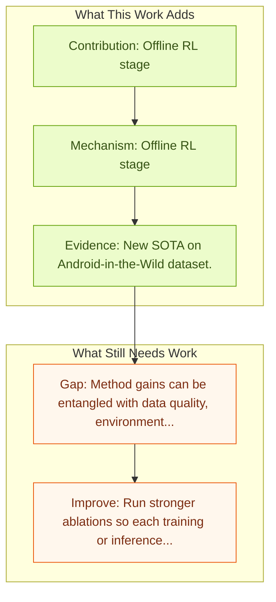

# DigiRL: Training In-The-Wild Device-Control

Entry report generated on 2026-03-28 (Asia/Tokyo). This report is based on the repository entry, linked source metadata, and audit-time cross-checks.

## Snapshot

| Field | Detail |
| --- | --- |
| Repo entry | DigiRL: Training In-The-Wild Device-Control |
| Actual target | [DigiRL: Training In-The-Wild Device-Control Agents with Autonomous Reinforcement Learning](https://arxiv.org/abs/2406.11896) |
| Section | Methods and Techniques |
| Source location | `papers/methods/README.md:40` |
| Primary link type | `link` |
| Audit status | `ok` |
| Date / venue | NeurIPS 2024 |
| Authors | Hao Bai, Yifei Zhou, Mert Cemri, Jiayi Pan, Alane Suhr, Sergey Levine, Aviral Kumar |
| Focus tags | `method`, `reinforcement-learning`, `mobile`, `android` |
| Center of gravity | `mobile` |

## Quick Read

| Lens | Read |
| --- | --- |
| Problem pressure | Autonomous RL for device-control agents. |
| Most novel move | The method's clearest new move is offline RL stage. |
| Strongest evidence | New SOTA on Android-in-the-Wild dataset. |
| Main caveat | Method gains can be entangled with data quality, environment choice, or evaluator assumptions if ablations are thin. |

## Visual Frame

```mermaid
flowchart LR
  Problem["Problem: Autonomous RL for device-control agents."] --> Novelty["Novelty: The method's clearest new move is offline RL stage."]
  Novelty --> Framework["Framework: Offline RL stage"]
  Framework --> Evidence["Evidence: New SOTA on Android-in-the-Wild dataset."]
  Evidence --> Gap["Gap: Method gains can be entangled with data quality, environment..."]
  Gap --> Next["Next: Run stronger ablations so each training or inference..."]
  classDef insight fill:#dbeafe,stroke:#2563eb,color:#0f172a;
  classDef risk fill:#fee2e2,stroke:#dc2626,color:#7f1d1d;
  classDef next fill:#dcfce7,stroke:#16a34a,color:#14532d;
  class Problem,Novelty,Framework insight;
  class Evidence insight;
  class Gap risk;
  class Next next;
```

## Analysis Map

## Executive Summary

Autonomous RL for device-control agents. Training corpuses for vision language models (VLMs) typically lack sufficient amounts of decision-centric data. This renders off-the-shelf VLMs sub-optimal for decision-making tasks such as in-the-wild device control through graphical user interfaces (GUIs). While training with static demonstrations has shown some promise, we show that such methods fall short for controlling real GUIs due to their failure to deal with real-world stochasticity and non-stationarity not captured in static observational data.

## Novelty

- The method's clearest new move is offline RL stage.
- It also stands out for offline-to-online RL transition.
- Training corpuses for vision language models (VLMs) typically lack sufficient amounts of decision-centric data.

## Core Contributions

- Offline RL stage
- Offline-to-online RL transition
- Training corpuses for vision language models (VLMs) typically lack sufficient amounts of decision-centric data.
- This renders off-the-shelf VLMs sub-optimal for decision-making tasks such as in-the-wild device control through graphical user interfaces (GUIs).

## Framework and Operating Logic

- Offline RL stage
- Offline-to-online RL transition
- The abstract indicates that the method should be read as a pipeline change rather than only a bigger base model.

## Evidence and Claimed Results

- New SOTA on Android-in-the-Wild dataset.
- ## Data Synthesis Methods
- We demonstrate the effectiveness of DigiRL using the Android-in-the-Wild (AitW) dataset, where our 1.3B VLM trained with RL achieves a 49.5% absolute improvement -- from 17.7 to 67.2% success rate -- over supervised fine-tuning with static human demonstration data.
- These results significantly surpass not only the prior best agents, including AppAgent with GPT-4V (8.3% success rate) and the 17B CogAgent trained with AitW data (38.5%), but also the prior best autonomous RL approach based on filtered behavior cloning (57.8%), thereby establishing a new state-of-the-art for digital agents for in-the-wild device control.

## Gaps and Limitations

- Method gains can be entangled with data quality, environment choice, or evaluator assumptions if ablations are thin.
- Better grounding or reflection does not automatically solve mobile interfaces, app transitions, and version drift.

## How To Improve

- Run stronger ablations so each training or inference component carries a clearly attributable gain.
- Stress-test the method on longer workflows and harder transfer settings involving mobile interfaces, app transitions, and version drift.
- Publish sharper failure analyses for the cases where the method improves one stage of control but still fails end-to-end.

## Why It Matters

- This entry matters because training and inference design often determine whether a capable base model can actually become a useful agent.
- It usually connects high-level capability claims to the data, tuning, or orchestration choices that make them work.

## Connections In This Repo

- [AppAgent: Multimodal Agents as Smartphone Users](../models-and-architectures/appagent-multimodal-agents-as-smartphone-users.md) - shared focus on mobile GUI control and cross-app interaction constraints.
- [AndroidWorld: Dynamic Benchmarking Environment](../benchmarks-and-datasets/androidworld-dynamic-benchmarking-environment.md) - shared focus on mobile GUI control and cross-app interaction constraints.
- [LLM-Powered GUI Agents in Phone Automation](../survey-papers/llm-powered-gui-agents-in-phone-automation.md) - shared focus on mobile GUI control and cross-app interaction constraints.
- [Mobile-Agent-v3: Fundamental Agents for GUI Automation](../models-and-architectures/mobile-agent-v3-fundamental-agents-for-gui-automation.md) - shared focus on mobile GUI control and cross-app interaction constraints.

## Source Basis

- Primary basis: abstract-level paper metadata plus the repo-local notes in the source Markdown file.
- Audit access note: Metadata resolved cleanly during the audit.
