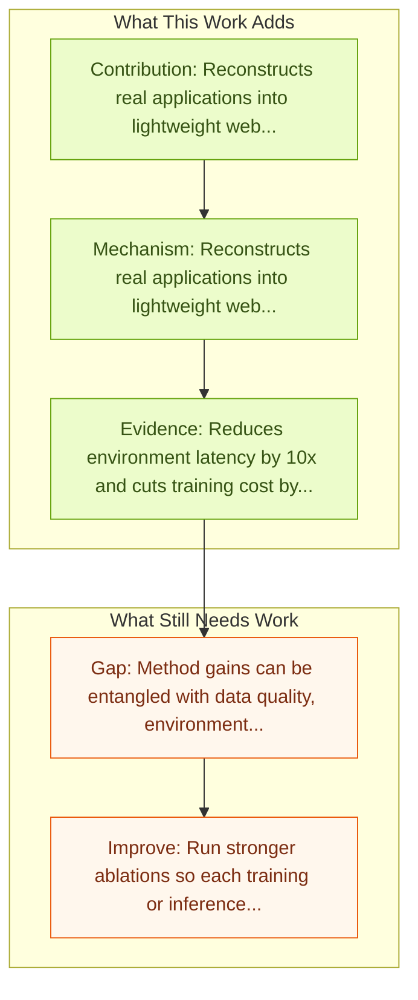

# GUI-GENESIS: Automated Synthesis of Efficient Environments with Verifiable Rewards for GUI Agent Post-Training

Entry report generated on 2026-03-28 (Asia/Tokyo). This report is based on the repository entry, linked source metadata, and audit-time cross-checks.

## Snapshot

| Field | Detail |
| --- | --- |
| Repo entry | GUI-GENESIS: Automated Synthesis of Efficient Environments with Verifiable Rewards for GUI Agent Post-Training |
| Actual target | [GUI-GENESIS: Automated Synthesis of Efficient Environments with Verifiable Rewards for GUI Agent Post-Training](https://arxiv.org/abs/2602.14093) |
| Section | Methods and Techniques |
| Source location | `papers/methods/README.md:175` |
| Primary link type | `link` |
| Audit status | `ok` |
| Date / venue | February 2026 |
| Authors | Yuan Cao, Dezhi Ran, Mengzhou Wu, Yuzhe Guo, Xin Chen, Ang Li, Gang Cao, Gong Zhi, Hao Yu, Linyi Li, Wei Yang, Tao Xie |
| Focus tags | `method` `data-synthesis` `post-training` `rl` |
| Center of gravity | data-synthesis, post-training, rl |

## Quick Read

| Lens | Read |
| --- | --- |
| Problem pressure | Framework for automatically synthesizing efficient GUI training environments with verifiable rewards. |
| Most novel move | The method's clearest new move is reconstructs real applications into lightweight web environments using multimodal code models. |
| Strongest evidence | Reduces environment latency by 10x and cuts training cost by more than $28,000 per epoch. |
| Main caveat | Method gains can be entangled with data quality, environment choice, or evaluator assumptions if ablations are thin. |

## Visual Frame

```mermaid
flowchart LR
  Problem["Problem: Framework for automatically synthesizing efficient GUI..."] --> Novelty["Novelty: The method's clearest new move is reconstructs real..."]
  Novelty --> Framework["Framework: Reconstructs real applications into lightweight web..."]
  Framework --> Evidence["Evidence: Reduces environment latency by 10x and cuts training cost by..."]
  Evidence --> Gap["Gap: Method gains can be entangled with data quality, environment..."]
  Gap --> Next["Next: Run stronger ablations so each training or inference..."]
  classDef insight fill:#dbeafe,stroke:#2563eb,color:#0f172a;
  classDef risk fill:#fee2e2,stroke:#dc2626,color:#7f1d1d;
  classDef next fill:#dcfce7,stroke:#16a34a,color:#14532d;
  class Problem,Novelty,Framework insight;
  class Evidence insight;
  class Gap risk;
  class Next next;
```

## Analysis Map

## Executive Summary

Framework for automatically synthesizing efficient GUI training environments with verifiable rewards. Post-training GUI agents in interactive environments is critical for developing generalization and long-horizon planning capabilities. However, training on real-world applications is hindered by high latency, poor reproducibility, and unverifiable rewards relying on noisy visual proxies. To address the limitations, we present GUI-GENESIS, the first framework to automatically synthesize efficient GUI training environments with verifiable rewards.

## Code and Supporting Artifacts

- Code repository: no dedicated code link is currently tracked in the repo entry.

## Novelty

- The method's clearest new move is reconstructs real applications into lightweight web environments using multimodal code models.
- It also stands out for replaces noisy visual reward estimation with executable code-native reward assertions.
- Post-training GUI agents in interactive environments is critical for developing generalization and long-horizon planning capabilities.

## Core Contributions

- Reconstructs real applications into lightweight web environments using multimodal code models.
- Replaces noisy visual reward estimation with executable code-native reward assertions.
- Post-training GUI agents in interactive environments is critical for developing generalization and long-horizon planning capabilities.
- However, training on real-world applications is hindered by high latency, poor reproducibility, and unverifiable rewards relying on noisy visual proxies.

## Framework and Operating Logic

- Reconstructs real applications into lightweight web environments using multimodal code models.
- Replaces noisy visual reward estimation with executable code-native reward assertions.
- The abstract indicates that the method should be read as a pipeline change rather than only a bigger base model.

## Evidence and Claimed Results

- Reduces environment latency by 10x and cuts training cost by more than $28,000 per epoch.
- Reports gains of 14.54% over the base model and 3.27% over real-world RL baselines on held-out tasks.
- ## Multi-Agent Methods
- Extensive experiments show that GUI-GENESIS reduces environment latency by 10 times and costs by over $28,000 per epoch compared to training on real applications.
- Notably, agents trained with GUI-GENESIS outperform the base model by 14.54% and even real-world RL baselines by 3.27% on held-out real-world tasks.

## Gaps and Limitations

- Method gains can be entangled with data quality, environment choice, or evaluator assumptions if ablations are thin.
- Better grounding or reflection does not automatically solve long-horizon transfer, recovery behavior, and distribution shift.

## How To Improve

- Run stronger ablations so each training or inference component carries a clearly attributable gain.
- Stress-test the method on longer workflows and harder transfer settings involving long-horizon transfer, recovery behavior, and distribution shift.
- Publish sharper failure analyses for the cases where the method improves one stage of control but still fails end-to-end.

## Why It Matters

- This entry matters because training and inference design often determine whether a capable base model can actually become a useful agent.
- It usually connects high-level capability claims to the data, tuning, or orchestration choices that make them work.

## Connections In This Repo

- [AgentTrek: Agent Trajectory Synthesis via Web Tutorials](agenttrek-agent-trajectory-synthesis-via-web-tutorials.md) - neighbor entry in the same methods and techniques cluster.
- [OS-Genesis: Automating GUI Agent Trajectory Construction](os-genesis-automating-gui-agent-trajectory-construction.md) - neighbor entry in the same methods and techniques cluster.
- [ComputerRL: End-to-End Online RL for Computer Use Agents](computerrl-end-to-end-online-rl-for-computer-use-agents.md) - neighbor entry in the same methods and techniques cluster.
- [WebRL: Self-Evolving Online Curriculum RL for Web Agents](webrl-self-evolving-online-curriculum-rl-for-web-agents.md) - neighbor entry in the same methods and techniques cluster.

## Source Basis

- Primary basis: Primary arXiv abstract metadata was fetched live from the linked paper page.
- Audit access note: Metadata resolved cleanly during the audit.
