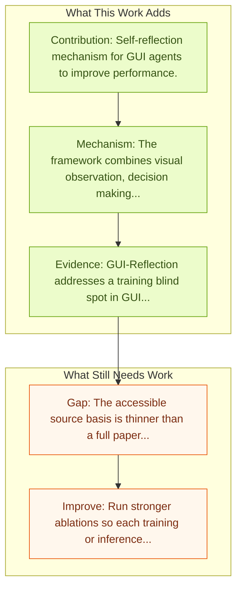

# GUI-Reflection: Self-Reflection for GUI Agents

Entry report generated on 2026-03-28 (Asia/Tokyo). This report is based on the repository entry, linked source metadata, and audit-time cross-checks.

## Snapshot

| Field | Detail |
| --- | --- |
| Repo entry | GUI-Reflection: Self-Reflection for GUI Agents |
| Actual target | [GUI-Reflection: Self-Reflection for GUI Agents](https://penghao-wu.github.io/GUI_Reflection) |
| Section | Methods and Techniques |
| Source location | `papers/methods/README.md:132` |
| Primary link type | `website` |
| Audit status | `project-page` |
| Date / venue | 2025 |
| Authors | Penghao Wu, Shengnan Ma, Bo Wang, Jiaheng Yu, Lewei Lu, Ziwei Liu |
| Focus tags | `method` `self-reflection` `error-correction` |
| Center of gravity | methods |
| Project page | [Project](https://penghao-wu.github.io/GUI_Reflection) |

## Quick Read

| Lens | Read |
| --- | --- |
| Problem pressure | Self-reflection mechanism for GUI agents to improve performance. |
| Most novel move | The method's clearest new move is self-reflection mechanism for GUI agents to improve performance. |
| Strongest evidence | GUI-Reflection addresses a training blind spot in GUI automation: most multimodal GUI models learn from nearly error-free traces and... |
| Main caveat | The accessible source basis is thinner than a full paper review, so some claims rest on project metadata, repo notes, or abstract-level... |

## Visual Frame

```mermaid
flowchart LR
  Problem["Problem: Self-reflection mechanism for GUI agents to improve performance."] --> Novelty["Novelty: The method's clearest new move is self-reflection mechanism..."]
  Novelty --> Framework["Framework: The framework combines visual observation, decision making..."]
  Framework --> Evidence["Evidence: GUI-Reflection addresses a training blind spot in GUI..."]
  Evidence --> Gap["Gap: The accessible source basis is thinner than a full paper..."]
  Gap --> Next["Next: Run stronger ablations so each training or inference..."]
  classDef insight fill:#dbeafe,stroke:#2563eb,color:#0f172a;
  classDef risk fill:#fee2e2,stroke:#dc2626,color:#7f1d1d;
  classDef next fill:#dcfce7,stroke:#16a34a,color:#14532d;
  class Problem,Novelty,Framework insight;
  class Evidence insight;
  class Gap risk;
  class Next next;
```

## Analysis Map

## Executive Summary

Self-reflection mechanism for GUI agents to improve performance. GUI-Reflection addresses a training blind spot in GUI automation: most multimodal GUI models learn from nearly error-free traces and therefore rarely learn recovery behavior. The framework adds explicit self-reflection and error-correction behavior across GUI-specific pre-training, supervised fine-tuning, and online reflection tuning. It also builds automated reflection data pipelines and a task suite aimed at reflection-oriented abilities rather than only grounding accuracy.

## Code and Supporting Artifacts

- Code repository: no dedicated code link is currently tracked in the repo entry.
- Project page or benchmark site: [Project](https://penghao-wu.github.io/GUI_Reflection)

## Novelty

- The method's clearest new move is self-reflection mechanism for GUI agents to improve performance.
- GUI-Reflection addresses a training blind spot in GUI automation: most multimodal GUI models learn from nearly error-free traces and therefore rarely learn recovery behavior.
- The framework adds explicit self-reflection and error-correction behavior across GUI-specific pre-training, supervised fine-tuning, and online reflection tuning.

## Core Contributions

- Self-reflection mechanism for GUI agents to improve performance.
- GUI-Reflection addresses a training blind spot in GUI automation: most multimodal GUI models learn from nearly error-free traces and therefore rarely learn recovery behavior.
- The framework adds explicit self-reflection and error-correction behavior across GUI-specific pre-training, supervised fine-tuning, and online reflection tuning.
- It also builds automated reflection data pipelines and a task suite aimed at reflection-oriented abilities rather than only grounding accuracy.

## Framework and Operating Logic

- The framework combines visual observation, decision making, and action execution into a reusable control loop.
- The abstract indicates that the method should be read as a pipeline change rather than only a bigger base model.
- GUI-Reflection addresses a training blind spot in GUI automation: most multimodal GUI models learn from nearly error-free traces and therefore rarely learn recovery behavior.

## Evidence and Claimed Results

- GUI-Reflection addresses a training blind spot in GUI automation: most multimodal GUI models learn from nearly error-free traces and therefore rarely learn recovery behavior.
- The framework adds explicit self-reflection and error-correction behavior across GUI-specific pre-training, supervised fine-tuning, and online reflection tuning.
- It also builds automated reflection data pipelines and a task suite aimed at reflection-oriented abilities rather than only grounding accuracy.

## Gaps and Limitations

- The accessible source basis is thinner than a full paper review, so some claims rest on project metadata, repo notes, or abstract-level evidence rather than a complete methods read.
- Method gains can be entangled with data quality, environment choice, or evaluator assumptions if ablations are thin.
- Better grounding or reflection does not automatically solve long-horizon transfer, recovery behavior, and distribution shift.

## How To Improve

- Run stronger ablations so each training or inference component carries a clearly attributable gain.
- Stress-test the method on longer workflows and harder transfer settings involving long-horizon transfer, recovery behavior, and distribution shift.
- Publish sharper failure analyses for the cases where the method improves one stage of control but still fails end-to-end.

## Why It Matters

- This entry matters because training and inference design often determine whether a capable base model can actually become a useful agent.
- It usually connects high-level capability claims to the data, tuning, or orchestration choices that make them work.

## Connections In This Repo

- [ComputerRL: End-to-End Online RL for Computer Use Agents](computerrl-end-to-end-online-rl-for-computer-use-agents.md) - neighbor entry in the same methods and techniques cluster.
- [WebRL: Self-Evolving Online Curriculum RL for Web Agents](webrl-self-evolving-online-curriculum-rl-for-web-agents.md) - neighbor entry in the same methods and techniques cluster.
- [DigiRL: Training In-The-Wild Device-Control](digirl-training-in-the-wild-device-control.md) - neighbor entry in the same methods and techniques cluster.
- [AgentTrek: Agent Trajectory Synthesis via Web Tutorials](agenttrek-agent-trajectory-synthesis-via-web-tutorials.md) - neighbor entry in the same methods and techniques cluster.

## Source Basis

- Primary basis: Companion arXiv abstract used because the project page was unstable during audit.
- Audit access note: The repo points to a project page, so the report blends page metadata with repo-local notes and, where available, companion abstract-level metadata.
