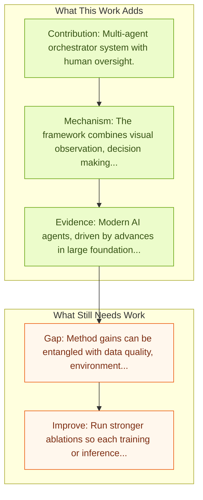

# Magentic-One: Multi-Agent with Human-in-Loop

Entry report generated on 2026-03-28 (Asia/Tokyo). This report is based on the repository entry, linked source metadata, and audit-time cross-checks.

## Snapshot

| Field | Detail |
| --- | --- |
| Repo entry | Magentic-One: Multi-Agent with Human-in-Loop |
| Actual target | [Magentic-One: A Generalist Multi-Agent System for Solving Complex Tasks](https://arxiv.org/abs/2411.04468) |
| Section | Methods and Techniques |
| Source location | `papers/methods/README.md:152` |
| Primary link type | `link` |
| Audit status | `ok` |
| Date / venue | November 2024 |
| Authors | Adam Fourney, Gagan Bansal, Hussein Mozannar, Cheng Tan, Eduardo Salinas,  Erkang,  Zhu, Friederike Niedtner |
| Focus tags | `method`, `multi-agent`, `human-in-loop`, `microsoft` |
| Center of gravity | `web` |

## Quick Read

| Lens | Read |
| --- | --- |
| Problem pressure | Multi-agent orchestrator system with human oversight. |
| Most novel move | The method's clearest new move is multi-agent orchestrator system with human oversight. |
| Strongest evidence | Modern AI agents, driven by advances in large foundation models, promise to enhance our productivity and transform our lives by... |
| Main caveat | Method gains can be entangled with data quality, environment choice, or evaluator assumptions if ablations are thin. |

## Visual Frame

```mermaid
flowchart LR
  Problem["Problem: Multi-agent orchestrator system with human oversight."] --> Novelty["Novelty: The method's clearest new move is multi-agent orchestrator..."]
  Novelty --> Framework["Framework: The framework combines visual observation, decision making..."]
  Framework --> Evidence["Evidence: Modern AI agents, driven by advances in large foundation..."]
  Evidence --> Gap["Gap: Method gains can be entangled with data quality, environment..."]
  Gap --> Next["Next: Run stronger ablations so each training or inference..."]
  classDef insight fill:#dbeafe,stroke:#2563eb,color:#0f172a;
  classDef risk fill:#fee2e2,stroke:#dc2626,color:#7f1d1d;
  classDef next fill:#dcfce7,stroke:#16a34a,color:#14532d;
  class Problem,Novelty,Framework insight;
  class Evidence insight;
  class Gap risk;
  class Next next;
```

## Analysis Map

## Executive Summary

Multi-agent orchestrator system with human oversight. Modern AI agents, driven by advances in large foundation models, promise to enhance our productivity and transform our lives by augmenting our knowledge and capabilities. To achieve this vision, AI agents must effectively plan, perform multi-step reasoning and actions, respond to novel observations, and recover from errors, to successfully complete complex tasks across a wide range of scenarios. In this work, we introduce Magentic-One, a high-performing open-source agentic system for solving such tasks.

## Novelty

- The method's clearest new move is multi-agent orchestrator system with human oversight.
- Modern AI agents, driven by advances in large foundation models, promise to enhance our productivity and transform our lives by augmenting our knowledge and capabilities.
- To achieve this vision, AI agents must effectively plan, perform multi-step reasoning and actions, respond to novel observations, and recover from errors, to successfully complete complex tasks across a wide range of scenarios.

## Core Contributions

- Multi-agent orchestrator system with human oversight.
- Modern AI agents, driven by advances in large foundation models, promise to enhance our productivity and transform our lives by augmenting our knowledge and capabilities.
- To achieve this vision, AI agents must effectively plan, perform multi-step reasoning and actions, respond to novel observations, and recover from errors, to successfully complete complex tasks across a wide range of scenarios.
- In this work, we introduce Magentic-One, a high-performing open-source agentic system for solving such tasks.

## Framework and Operating Logic

- The framework combines visual observation, decision making, and action execution into a reusable control loop.
- The abstract indicates that the method should be read as a pipeline change rather than only a bigger base model.
- Modern AI agents, driven by advances in large foundation models, promise to enhance our productivity and transform our lives by augmenting our knowledge and capabilities.

## Evidence and Claimed Results

- Modern AI agents, driven by advances in large foundation models, promise to enhance our productivity and transform our lives by augmenting our knowledge and capabilities.
- To achieve this vision, AI agents must effectively plan, perform multi-step reasoning and actions, respond to novel observations, and recover from errors, to successfully complete complex tasks across a wide range of scenarios.
- In this work, we introduce Magentic-One, a high-performing open-source agentic system for solving such tasks.

## Gaps and Limitations

- Method gains can be entangled with data quality, environment choice, or evaluator assumptions if ablations are thin.
- Better grounding or reflection does not automatically solve long-horizon transfer, recovery behavior, and distribution shift.

## How To Improve

- Run stronger ablations so each training or inference component carries a clearly attributable gain.
- Stress-test the method on longer workflows and harder transfer settings involving long-horizon transfer, recovery behavior, and distribution shift.
- Publish sharper failure analyses for the cases where the method improves one stage of control but still fails end-to-end.

## Why It Matters

- This entry matters because training and inference design often determine whether a capable base model can actually become a useful agent.
- It usually connects high-level capability claims to the data, tuning, or orchestration choices that make them work.

## Connections In This Repo

- [Chain-of-Agents: Multi-Agent Collaboration](chain-of-agents-multi-agent-collaboration.md) - neighbor entry in the same methods and techniques cluster.
- [UFO: Windows OS UI Agent via GPT-4V](ufo-windows-os-ui-agent-via-gpt-4v.md) - neighbor entry in the same methods and techniques cluster.
- [OmniParser: Pure Vision Based GUI Agent](../models-and-architectures/omniparser-pure-vision-based-gui-agent.md) - the method complements the model or benchmark side of the same research cluster.
- [Mobile-Agent-v3: Fundamental Agents for GUI Automation](../models-and-architectures/mobile-agent-v3-fundamental-agents-for-gui-automation.md) - the method complements the model or benchmark side of the same research cluster.

## Source Basis

- Primary basis: abstract-level paper metadata plus the repo-local notes in the source Markdown file.
- Audit access note: Metadata resolved cleanly during the audit.
