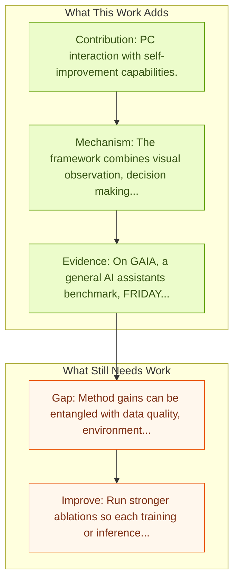

# OS-Copilot: Towards Generalist Computer Agents

Entry report generated on 2026-03-28 (Asia/Tokyo). This report is based on the repository entry, linked source metadata, and audit-time cross-checks.

## Snapshot

| Field | Detail |
| --- | --- |
| Repo entry | OS-Copilot: Towards Generalist Computer Agents |
| Actual target | [OS-Copilot: Towards Generalist Computer Agents with Self-Improvement](https://arxiv.org/abs/2402.07456) |
| Section | Methods and Techniques |
| Source location | `papers/methods/README.md:231` |
| Primary link type | `link` |
| Audit status | `ok` |
| Date / venue | February 2024 |
| Authors | Zhiyong Wu, Chengcheng Han, Zichen Ding, Zhenmin Weng, Zhoumianze Liu, Shunyu Yao, Tao Yu, Lingpeng Kong |
| Focus tags | `method` `desktop` `self-improvement` |
| Center of gravity | desktop, self-improvement |

## Quick Read

| Lens | Read |
| --- | --- |
| Problem pressure | PC interaction with self-improvement capabilities. |
| Most novel move | The method's clearest new move is PC interaction with self-improvement capabilities. |
| Strongest evidence | On GAIA, a general AI assistants benchmark, FRIDAY outperforms previous methods by 35%, showcasing strong generalization to unseen... |
| Main caveat | Method gains can be entangled with data quality, environment choice, or evaluator assumptions if ablations are thin. |

## Visual Frame

```mermaid
flowchart LR
  Problem["Problem: PC interaction with self-improvement capabilities."] --> Novelty["Novelty: The method's clearest new move is PC interaction with..."]
  Novelty --> Framework["Framework: The framework combines visual observation, decision making..."]
  Framework --> Evidence["Evidence: On GAIA, a general AI assistants benchmark, FRIDAY..."]
  Evidence --> Gap["Gap: Method gains can be entangled with data quality, environment..."]
  Gap --> Next["Next: Run stronger ablations so each training or inference..."]
  classDef insight fill:#dbeafe,stroke:#2563eb,color:#0f172a;
  classDef risk fill:#fee2e2,stroke:#dc2626,color:#7f1d1d;
  classDef next fill:#dcfce7,stroke:#16a34a,color:#14532d;
  class Problem,Novelty,Framework insight;
  class Evidence insight;
  class Gap risk;
  class Next next;
```

## Analysis Map

## Executive Summary

PC interaction with self-improvement capabilities. Autonomous interaction with the computer has been a longstanding challenge with great potential, and the recent proliferation of large language models (LLMs) has markedly accelerated progress in building digital agents. However, most of these agents are designed to interact with a narrow domain, such as a specific software or website. This narrow focus constrains their applicability for general computer tasks.

## Code and Supporting Artifacts

- Code repository: no dedicated code link is currently tracked in the repo entry.

## Novelty

- The method's clearest new move is PC interaction with self-improvement capabilities.
- Autonomous interaction with the computer has been a longstanding challenge with great potential, and the recent proliferation of large language models (LLMs) has markedly accelerated progress in building digital agents.
- However, most of these agents are designed to interact with a narrow domain, such as a specific software or website.

## Core Contributions

- PC interaction with self-improvement capabilities.
- Autonomous interaction with the computer has been a longstanding challenge with great potential, and the recent proliferation of large language models (LLMs) has markedly accelerated progress in building digital agents.
- However, most of these agents are designed to interact with a narrow domain, such as a specific software or website.
- This narrow focus constrains their applicability for general computer tasks.

## Framework and Operating Logic

- The framework combines visual observation, decision making, and action execution into a reusable control loop.
- The abstract indicates that the method should be read as a pipeline change rather than only a bigger base model.
- Autonomous interaction with the computer has been a longstanding challenge with great potential, and the recent proliferation of large language models (LLMs) has markedly accelerated progress in building digital agents.

## Evidence and Claimed Results

- On GAIA, a general AI assistants benchmark, FRIDAY outperforms previous methods by 35%, showcasing strong generalization to unseen applications via accumulated skills from previous tasks.
- Autonomous interaction with the computer has been a longstanding challenge with great potential, and the recent proliferation of large language models (LLMs) has markedly accelerated progress in building digital agents.
- However, most of these agents are designed to interact with a narrow domain, such as a specific software or website.

## Gaps and Limitations

- Method gains can be entangled with data quality, environment choice, or evaluator assumptions if ablations are thin.
- Better grounding or reflection does not automatically solve desktop heterogeneity, long workflows, and OS-level side effects.

## How To Improve

- Run stronger ablations so each training or inference component carries a clearly attributable gain.
- Stress-test the method on longer workflows and harder transfer settings involving desktop heterogeneity, long workflows, and OS-level side effects.
- Publish sharper failure analyses for the cases where the method improves one stage of control but still fails end-to-end.

## Why It Matters

- This entry matters because training and inference design often determine whether a capable base model can actually become a useful agent.
- It usually connects high-level capability claims to the data, tuning, or orchestration choices that make them work.

## Connections In This Repo

- [ComputerRL: End-to-End Online RL for Computer Use Agents](computerrl-end-to-end-online-rl-for-computer-use-agents.md) - shared desktop or OS-level interaction surface.
- [Grounding Computer Use Agents on Human Demonstrations](grounding-computer-use-agents-on-human-demonstrations.md) - shared desktop or OS-level interaction surface.
- [OpenCUA: Open Foundations for Computer-Use Agents](../models-and-architectures/opencua-open-foundations-for-computer-use-agents.md) - shared desktop or OS-level interaction surface.
- [Mobile-Agent-v3.5: Multi-platform Fundamental GUI Agents](../models-and-architectures/mobile-agent-v3-5-multi-platform-fundamental-gui-agents.md) - shared desktop or OS-level interaction surface.

## Source Basis

- Primary basis: Primary arXiv abstract metadata was fetched live from the linked paper page.
- Audit access note: Metadata resolved cleanly during the audit.
