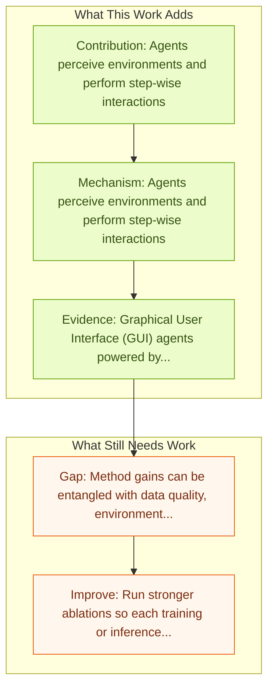

# OS-Genesis: Automating GUI Agent Trajectory Construction

Entry report generated on 2026-03-28 (Asia/Tokyo). This report is based on the repository entry, linked source metadata, and audit-time cross-checks.

## Snapshot

| Field | Detail |
| --- | --- |
| Repo entry | OS-Genesis: Automating GUI Agent Trajectory Construction |
| Actual target | [OS-Genesis: Automating GUI Agent Trajectory Construction via Reverse Task Synthesis](https://arxiv.org/abs/2412.19723) |
| Section | Methods and Techniques |
| Source location | `papers/methods/README.md:75` |
| Primary link type | `link` |
| Audit status | `ok` |
| Date / venue | December 2024 |
| Authors | Qiushi Sun, Kanzhi Cheng, Zichen Ding, Chuanyang Jin, Yian Wang, Fangzhi Xu, Zhenyu Wu, Chengyou Jia |
| Focus tags | `method`, `data-synthesis`, `reverse-task`, `trajectories` |
| Center of gravity | `desktop` |
| Related assets | [Project](https://qiushisun.github.io/OS-Genesis-Home/) |

## Quick Read

| Lens | Read |
| --- | --- |
| Problem pressure | Novel reverse trajectory collection process. |
| Most novel move | The method's clearest new move is agents perceive environments and perform step-wise interactions. |
| Strongest evidence | Graphical User Interface (GUI) agents powered by Vision-Language Models (VLMs) have demonstrated human-like computer control capability. |
| Main caveat | Method gains can be entangled with data quality, environment choice, or evaluator assumptions if ablations are thin. |

## Visual Frame

```mermaid
flowchart LR
  Problem["Problem: Novel reverse trajectory collection process."] --> Novelty["Novelty: The method's clearest new move is agents perceive..."]
  Novelty --> Framework["Framework: Agents perceive environments and perform step-wise interactions"]
  Framework --> Evidence["Evidence: Graphical User Interface (GUI) agents powered by..."]
  Evidence --> Gap["Gap: Method gains can be entangled with data quality, environment..."]
  Gap --> Next["Next: Run stronger ablations so each training or inference..."]
  classDef insight fill:#dbeafe,stroke:#2563eb,color:#0f172a;
  classDef risk fill:#fee2e2,stroke:#dc2626,color:#7f1d1d;
  classDef next fill:#dcfce7,stroke:#16a34a,color:#14532d;
  class Problem,Novelty,Framework insight;
  class Evidence insight;
  class Gap risk;
  class Next next;
```

## Analysis Map

## Executive Summary

Novel reverse trajectory collection process. Graphical User Interface (GUI) agents powered by Vision-Language Models (VLMs) have demonstrated human-like computer control capability. Despite their utility in advancing digital automation, a critical bottleneck persists: collecting high-quality trajectory data for training. Common practices for collecting such data rely on human supervision or synthetic data generation through executing pre-defined tasks, which are either resource-intensive or unable to guarantee data quality.

## Novelty

- The method's clearest new move is agents perceive environments and perform step-wise interactions.
- It also stands out for retrospectively derive high-quality tasks.
- It also stands out for trajectory reward model ensures quality.

## Core Contributions

- Agents perceive environments and perform step-wise interactions
- Retrospectively derive high-quality tasks
- Trajectory reward model ensures quality
- Graphical User Interface (GUI) agents powered by Vision-Language Models (VLMs) have demonstrated human-like computer control capability.

## Framework and Operating Logic

- Agents perceive environments and perform step-wise interactions
- Retrospectively derive high-quality tasks
- Trajectory reward model ensures quality
- The abstract indicates that the method should be read as a pipeline change rather than only a bigger base model.

## Evidence and Claimed Results

- Graphical User Interface (GUI) agents powered by Vision-Language Models (VLMs) have demonstrated human-like computer control capability.
- Despite their utility in advancing digital automation, a critical bottleneck persists: collecting high-quality trajectory data for training.
- Common practices for collecting such data rely on human supervision or synthetic data generation through executing pre-defined tasks, which are either resource-intensive or unable to guarantee data quality.

## Gaps and Limitations

- Method gains can be entangled with data quality, environment choice, or evaluator assumptions if ablations are thin.
- Better grounding or reflection does not automatically solve long-horizon transfer, recovery behavior, and distribution shift.

## How To Improve

- Run stronger ablations so each training or inference component carries a clearly attributable gain.
- Stress-test the method on longer workflows and harder transfer settings involving long-horizon transfer, recovery behavior, and distribution shift.
- Publish sharper failure analyses for the cases where the method improves one stage of control but still fails end-to-end.

## Why It Matters

- This entry matters because training and inference design often determine whether a capable base model can actually become a useful agent.
- It usually connects high-level capability claims to the data, tuning, or orchestration choices that make them work.

## Connections In This Repo

- [AgentTrek: Agent Trajectory Synthesis via Web Tutorials](agenttrek-agent-trajectory-synthesis-via-web-tutorials.md) - neighbor entry in the same methods and techniques cluster.
- [AgentTrek Trajectories](../benchmarks-and-datasets/agenttrek-trajectories.md) - the method complements the model or benchmark side of the same research cluster.
- [OS-Genesis Trajectories](../benchmarks-and-datasets/os-genesis-trajectories.md) - the method complements the model or benchmark side of the same research cluster.
- [ComputerRL: End-to-End Online RL for Computer Use Agents](computerrl-end-to-end-online-rl-for-computer-use-agents.md) - neighbor entry in the same methods and techniques cluster.

## Source Basis

- Primary basis: abstract-level paper metadata plus the repo-local notes in the source Markdown file.
- Audit access note: Metadata resolved cleanly during the audit.
