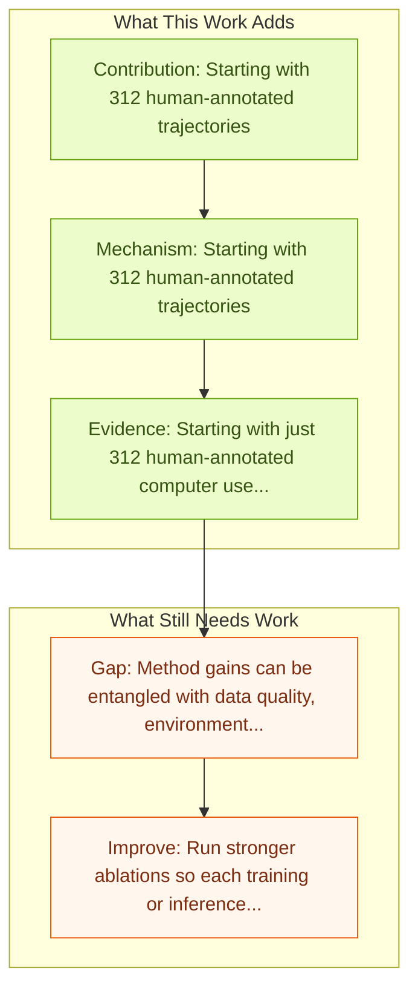

# PC Agent-E: Efficient Agent Training for Computer Use

Entry report generated on 2026-03-28 (Asia/Tokyo). This report is based on the repository entry, linked source metadata, and audit-time cross-checks.

## Snapshot

| Field | Detail |
| --- | --- |
| Repo entry | PC Agent-E: Efficient Agent Training for Computer Use |
| Actual target | [Efficient Agent Training for Computer Use](https://arxiv.org/abs/2505.13909) |
| Section | Methods and Techniques |
| Source location | `papers/methods/README.md:90` |
| Primary link type | `link` |
| Audit status | `ok` |
| Date / venue | ICLR 2026 |
| Authors | Yanheng He, Jiahe Jin, Pengfei Liu |
| Focus tags | `method` `efficient-training` `data-efficient` |
| Center of gravity | desktop |

## Quick Read

| Lens | Read |
| --- | --- |
| Problem pressure | Efficient training framework with minimal human demonstrations. |
| Most novel move | The method's clearest new move is starting with 312 human-annotated trajectories. |
| Strongest evidence | Starting with just 312 human-annotated computer use trajectories, we further augment them by synthesizing diverse alternative action... |
| Main caveat | Method gains can be entangled with data quality, environment choice, or evaluator assumptions if ablations are thin. |

## Visual Frame

```mermaid
flowchart LR
  Problem["Problem: Efficient training framework with minimal human demonstrations."] --> Novelty["Novelty: The method's clearest new move is starting with 312..."]
  Novelty --> Framework["Framework: Starting with 312 human-annotated trajectories"]
  Framework --> Evidence["Evidence: Starting with just 312 human-annotated computer use..."]
  Evidence --> Gap["Gap: Method gains can be entangled with data quality, environment..."]
  Gap --> Next["Next: Run stronger ablations so each training or inference..."]
  classDef insight fill:#dbeafe,stroke:#2563eb,color:#0f172a;
  classDef risk fill:#fee2e2,stroke:#dc2626,color:#7f1d1d;
  classDef next fill:#dcfce7,stroke:#16a34a,color:#14532d;
  class Problem,Novelty,Framework insight;
  class Evidence insight;
  class Gap risk;
  class Next next;
```

## Analysis Map

## Executive Summary

Efficient training framework with minimal human demonstrations. Scaling up high-quality trajectory data has long been a critical bottleneck for developing human-like computer use agents. We introduce PC Agent-E, an efficient agent training framework that significantly reduces reliance on large-scale human demonstrations. Starting with just 312 human-annotated computer use trajectories, we further augment them by synthesizing diverse alternative action decisions with Claude 3.7 Sonnet.

## Novelty

- The method's clearest new move is starting with 312 human-annotated trajectories.
- It also stands out for synthesize diverse action decisions with Claude 3.7 Sonnet.
- It also stands out for significantly reduces reliance on large-scale demonstrations.

## Core Contributions

- Starting with 312 human-annotated trajectories
- Synthesize diverse action decisions with Claude 3.7 Sonnet
- Significantly reduces reliance on large-scale demonstrations
- ## Grounding Methods

## Framework and Operating Logic

- Starting with 312 human-annotated trajectories
- Synthesize diverse action decisions with Claude 3.7 Sonnet
- Significantly reduces reliance on large-scale demonstrations
- ## Grounding Methods

## Evidence and Claimed Results

- Starting with just 312 human-annotated computer use trajectories, we further augment them by synthesizing diverse alternative action decisions with Claude 3.7 Sonnet.
- Trained on these enriched trajectories, our PC Agent-E model achieved a remarkable 141 relative improvement, and even surpassed the Claude 3.7 Sonnet by 10% in relative terms on WindowsAgentArena-V2, an improved benchmark we also released.
- By integrating robust human computer use skills with automated AI data synthesis capabilities, our method not only brought substantial improvements over training on human trajectories alone, but also significantly surpassed direct distillation from Claude 3.7 Sonnet.

## Gaps and Limitations

- Method gains can be entangled with data quality, environment choice, or evaluator assumptions if ablations are thin.
- Better grounding or reflection does not automatically solve long-horizon transfer, recovery behavior, and distribution shift.

## How To Improve

- Run stronger ablations so each training or inference component carries a clearly attributable gain.
- Stress-test the method on longer workflows and harder transfer settings involving long-horizon transfer, recovery behavior, and distribution shift.
- Publish sharper failure analyses for the cases where the method improves one stage of control but still fails end-to-end.

## Why It Matters

- This entry matters because training and inference design often determine whether a capable base model can actually become a useful agent.
- It usually connects high-level capability claims to the data, tuning, or orchestration choices that make them work.

## Connections In This Repo

- [ComputerRL: End-to-End Online RL for Computer Use Agents](computerrl-end-to-end-online-rl-for-computer-use-agents.md) - neighbor entry in the same methods and techniques cluster.
- [WebRL: Self-Evolving Online Curriculum RL for Web Agents](webrl-self-evolving-online-curriculum-rl-for-web-agents.md) - neighbor entry in the same methods and techniques cluster.
- [DigiRL: Training In-The-Wild Device-Control](digirl-training-in-the-wild-device-control.md) - neighbor entry in the same methods and techniques cluster.
- [AgentTrek: Agent Trajectory Synthesis via Web Tutorials](agenttrek-agent-trajectory-synthesis-via-web-tutorials.md) - neighbor entry in the same methods and techniques cluster.

## Source Basis

- Primary basis: abstract-level paper metadata plus the repo-local notes in the source Markdown file.
- Audit access note: Metadata resolved cleanly during the audit.
