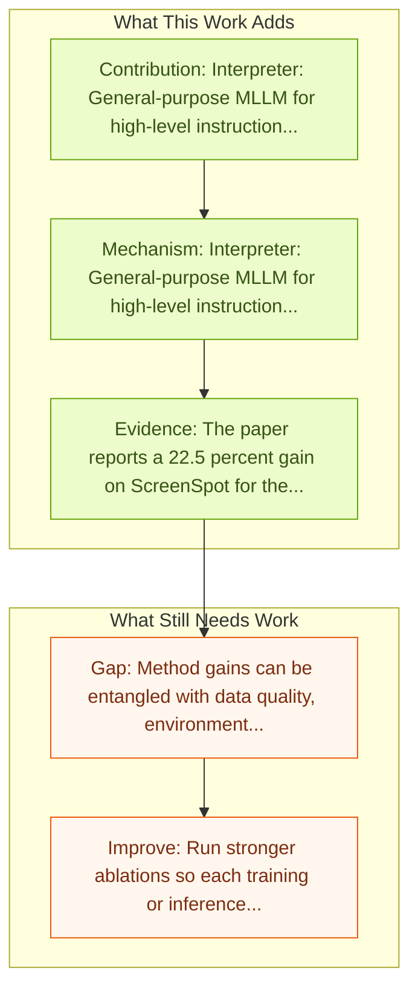

# Ponder & Press: Advancing VLM Grounding

Entry report generated on 2026-03-28 (Asia/Tokyo). This report is based on the repository entry, linked source metadata, and audit-time cross-checks.

> Link mismatch: The repo entry points to `https://arxiv.org/abs/2409.04566`, which currently resolves to an unrelated paper titled "Multipartite entanglement." Recommended replacement: [https://arxiv.org/abs/2412.01268](https://arxiv.org/abs/2412.01268).

## Snapshot

| Field | Detail |
| --- | --- |
| Repo entry | Ponder & Press: Advancing VLM Grounding |
| Actual target | [arXiv:2409.04566](https://arxiv.org/abs/2409.04566) |
| Section | Methods and Techniques |
| Source location | `papers/methods/README.md:119` |
| Primary link type | `link` |
| Audit status | `ok` |
| Date / venue | September 2024 |
| Authors | Yiqin Wang, Haoji Zhang, Jingqi Tian, Yansong Tang |
| Focus tags | `method` `grounding` `dual-model` |
| Center of gravity | grounding |
| Intended paper | [Ponder & Press: Advancing Visual GUI Agent towards General Computer Control](https://arxiv.org/abs/2412.01268) |
| Current broken target | [Multipartite entanglement](https://arxiv.org/abs/2409.04566) |

## Quick Read

| Lens | Read |
| --- | --- |
| Problem pressure | Dual-model approach for GUI automation. |
| Most novel move | The method's clearest new move is interpreter: General-purpose MLLM for high-level instruction translation. |
| Strongest evidence | The paper reports a 22.5 percent gain on ScreenSpot for the locator and strong results across offline and interactive GUI benchmarks. |
| Main caveat | Method gains can be entangled with data quality, environment choice, or evaluator assumptions if ablations are thin. |

## Visual Frame

```mermaid
flowchart LR
  Problem["Problem: Dual-model approach for GUI automation."] --> Novelty["Novelty: The method's clearest new move is interpreter..."]
  Novelty --> Framework["Framework: Interpreter: General-purpose MLLM for high-level instruction..."]
  Framework --> Evidence["Evidence: The paper reports a 22.5 percent gain on ScreenSpot for the..."]
  Evidence --> Gap["Gap: Method gains can be entangled with data quality, environment..."]
  Gap --> Next["Next: Run stronger ablations so each training or inference..."]
  classDef insight fill:#dbeafe,stroke:#2563eb,color:#0f172a;
  classDef risk fill:#fee2e2,stroke:#dc2626,color:#7f1d1d;
  classDef next fill:#dcfce7,stroke:#16a34a,color:#14532d;
  class Problem,Novelty,Framework insight;
  class Evidence insight;
  class Gap risk;
  class Next next;
```

## Analysis Map

## Executive Summary

Dual-model approach for GUI automation. Ponder & Press splits visual GUI control into two roles: an interpreter that turns user intent into a detailed action description and a GUI-specific locator that grounds the action precisely on screen. The framework is fully visual, avoiding HTML or accessibility-tree dependence, and it is positioned as a general computer control method across web, desktop, and mobile. The paper reports a 22.5 percent gain on ScreenSpot for the locator and strong results across offline and interactive GUI benchmarks.

## Novelty

- The method's clearest new move is interpreter: General-purpose MLLM for high-level instruction translation.
- It also stands out for locator: GUI-specific MLLM for precise element identification.
- Ponder & Press splits visual GUI control into two roles: an interpreter that turns user intent into a detailed action description and a GUI-specific locator that grounds the action precisely on screen.

## Core Contributions

- Interpreter: General-purpose MLLM for high-level instruction translation
- Locator: GUI-specific MLLM for precise element identification
- Ponder & Press splits visual GUI control into two roles: an interpreter that turns user intent into a detailed action description and a GUI-specific locator that grounds the action precisely on screen.
- The framework is fully visual, avoiding HTML or accessibility-tree dependence, and it is positioned as a general computer control method across web, desktop, and mobile.

## Framework and Operating Logic

- Interpreter: General-purpose MLLM for high-level instruction translation
- Locator: GUI-specific MLLM for precise element identification
- The abstract indicates that the method should be read as a pipeline change rather than only a bigger base model.

## Evidence and Claimed Results

- The paper reports a 22.5 percent gain on ScreenSpot for the locator and strong results across offline and interactive GUI benchmarks.
- Ponder & Press splits visual GUI control into two roles: an interpreter that turns user intent into a detailed action description and a GUI-specific locator that grounds the action precisely on screen.
- The framework is fully visual, avoiding HTML or accessibility-tree dependence, and it is positioned as a general computer control method across web, desktop, and mobile.

## Gaps and Limitations

- Method gains can be entangled with data quality, environment choice, or evaluator assumptions if ablations are thin.
- Better grounding or reflection does not automatically solve precise element localization and recovery after grounding misses.

## How To Improve

- Run stronger ablations so each training or inference component carries a clearly attributable gain.
- Stress-test the method on longer workflows and harder transfer settings involving precise element localization and recovery after grounding misses.
- Publish sharper failure analyses for the cases where the method improves one stage of control but still fails end-to-end.

## Why It Matters

- This entry matters because training and inference design often determine whether a capable base model can actually become a useful agent.
- It usually connects high-level capability claims to the data, tuning, or orchestration choices that make them work.

## Connections In This Repo

- [SeeAct: GPT-4V Web Agent via Visual Grounding](seeact-gpt-4v-web-agent-via-visual-grounding.md) - shared emphasis on precise UI localization and action placement.
- [Grounding Computer Use Agents on Human Demonstrations](grounding-computer-use-agents-on-human-demonstrations.md) - shared emphasis on precise UI localization and action placement.
- [OmniParser: Pure Vision Based GUI Agent](../models-and-architectures/omniparser-pure-vision-based-gui-agent.md) - shared emphasis on precise UI localization and action placement.
- [SeeClick: Harnessing GUI Grounding for Advanced Visual GUI Agents](../models-and-architectures/seeclick-harnessing-gui-grounding-for-advanced-visual-gui-agents.md) - shared emphasis on precise UI localization and action placement.

## Source Basis

- Primary basis: Replacement arXiv paper used because the repo URL resolves to an unrelated paper.
- Audit access note: Metadata resolved cleanly during the audit.
- Integrity note: The repository entry currently points to the wrong paper; this report is intentionally written against the confirmed intended target.
