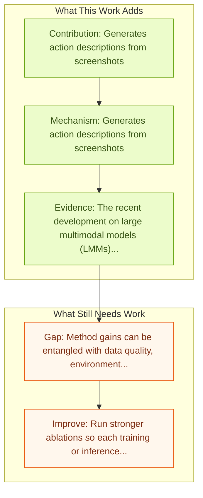

# SeeAct: GPT-4V Web Agent via Visual Grounding

Entry report generated on 2026-03-28 (Asia/Tokyo). This report is based on the repository entry, linked source metadata, and audit-time cross-checks.

## Snapshot

| Field | Detail |
| --- | --- |
| Repo entry | SeeAct: GPT-4V Web Agent via Visual Grounding |
| Actual target | [GPT-4V(ision) is a Generalist Web Agent, if Grounded](https://arxiv.org/abs/2401.01614) |
| Section | Methods and Techniques |
| Source location | `papers/methods/README.md:106` |
| Primary link type | `link` |
| Audit status | `ok` |
| Date / venue | January 2024 |
| Authors | Boyuan Zheng, Boyu Gou, Jihyung Kil, Huan Sun, Yu Su |
| Focus tags | `method`, `grounding`, `web`, `gpt-4v` |
| Center of gravity | `web`, `grounding` |

## Quick Read

| Lens | Read |
| --- | --- |
| Problem pressure | GPT-4V-based generalist web agent with visual grounding. |
| Most novel move | The method's clearest new move is generates action descriptions from screenshots. |
| Strongest evidence | The recent development on large multimodal models (LMMs), especially GPT-4V(ision) and Gemini, has been quickly expanding the capability... |
| Main caveat | Method gains can be entangled with data quality, environment choice, or evaluator assumptions if ablations are thin. |

## Visual Frame

```mermaid
flowchart LR
  Problem["Problem: GPT-4V-based generalist web agent with visual grounding."] --> Novelty["Novelty: The method's clearest new move is generates action..."]
  Novelty --> Framework["Framework: Generates action descriptions from screenshots"]
  Framework --> Evidence["Evidence: The recent development on large multimodal models (LMMs)..."]
  Evidence --> Gap["Gap: Method gains can be entangled with data quality, environment..."]
  Gap --> Next["Next: Run stronger ablations so each training or inference..."]
  classDef insight fill:#dbeafe,stroke:#2563eb,color:#0f172a;
  classDef risk fill:#fee2e2,stroke:#dc2626,color:#7f1d1d;
  classDef next fill:#dcfce7,stroke:#16a34a,color:#14532d;
  class Problem,Novelty,Framework insight;
  class Evidence insight;
  class Gap risk;
  class Next next;
```

## Analysis Map

## Executive Summary

GPT-4V-based generalist web agent with visual grounding. The recent development on large multimodal models (LMMs), especially GPT-4V(ision) and Gemini, has been quickly expanding the capability boundaries of multimodal models beyond traditional tasks like image captioning and visual question answering. In this work, we explore the potential of LMMs like GPT-4V as a generalist web agent that can follow natural language instructions to complete tasks on any given website. The authors propose SEEACT, a generalist web agent that harnesses the power of LMMs for integrated visual understanding and acting on the web.

## Novelty

- The method's clearest new move is generates action descriptions from screenshots.
- It also stands out for converts to executable actions with grounding techniques.
- The recent development on large multimodal models (LMMs), especially GPT-4V(ision) and Gemini, has been quickly expanding the capability boundaries of multimodal models beyond traditional tasks like image captioning and visual question answering.

## Core Contributions

- Generates action descriptions from screenshots
- Converts to executable actions with grounding techniques
- The recent development on large multimodal models (LMMs), especially GPT-4V(ision) and Gemini, has been quickly expanding the capability boundaries of multimodal models beyond traditional tasks like image captioning and visual question answering.
- In this work, we explore the potential of LMMs like GPT-4V as a generalist web agent that can follow natural language instructions to complete tasks on any given website.

## Framework and Operating Logic

- Generates action descriptions from screenshots
- Converts to executable actions with grounding techniques
- The abstract indicates that the method should be read as a pipeline change rather than only a bigger base model.

## Evidence and Claimed Results

- The recent development on large multimodal models (LMMs), especially GPT-4V(ision) and Gemini, has been quickly expanding the capability boundaries of multimodal models beyond traditional tasks like image captioning and visual question answering.
- In this work, we explore the potential of LMMs like GPT-4V as a generalist web agent that can follow natural language instructions to complete tasks on any given website.
- We evaluate on the recent MIND2WEB benchmark.
- We show that GPT-4V presents a great potential for web agents -- it can successfully complete 51.1 of the tasks on live websites if we manually ground its textual plans into actions on the websites.

## Gaps and Limitations

- Method gains can be entangled with data quality, environment choice, or evaluator assumptions if ablations are thin.
- Better grounding or reflection does not automatically solve live websites, layout drift, and prompt-injection exposure.

## How To Improve

- Run stronger ablations so each training or inference component carries a clearly attributable gain.
- Stress-test the method on longer workflows and harder transfer settings involving live websites, layout drift, and prompt-injection exposure.
- Publish sharper failure analyses for the cases where the method improves one stage of control but still fails end-to-end.

## Why It Matters

- This entry matters because training and inference design often determine whether a capable base model can actually become a useful agent.
- It usually connects high-level capability claims to the data, tuning, or orchestration choices that make them work.

## Connections In This Repo

- [WebRL: Self-Evolving Online Curriculum RL for Web Agents](webrl-self-evolving-online-curriculum-rl-for-web-agents.md) - shared focus on web-agent realism, dynamic pages, or browser-side risk.
- [AgentTrek: Agent Trajectory Synthesis via Web Tutorials](agenttrek-agent-trajectory-synthesis-via-web-tutorials.md) - shared focus on web-agent realism, dynamic pages, or browser-side risk.
- [Ponder & Press: Advancing VLM Grounding](ponder-press-advancing-vlm-grounding.md) - shared emphasis on precise UI localization and action placement.
- [Grounding Computer Use Agents on Human Demonstrations](grounding-computer-use-agents-on-human-demonstrations.md) - shared emphasis on precise UI localization and action placement.

## Source Basis

- Primary basis: abstract-level paper metadata plus the repo-local notes in the source Markdown file.
- Audit access note: Metadata resolved cleanly during the audit.
