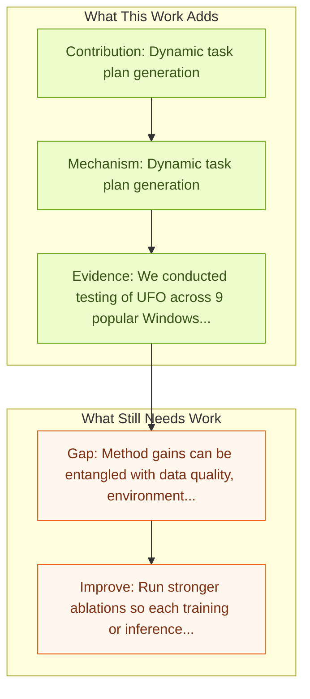

# UFO: Windows OS UI Agent via GPT-4V

Entry report generated on 2026-03-28 (Asia/Tokyo). This report is based on the repository entry, linked source metadata, and audit-time cross-checks.

## Snapshot

| Field | Detail |
| --- | --- |
| Repo entry | UFO: Windows OS UI Agent via GPT-4V |
| Actual target | [UFO: A UI-Focused Agent for Windows OS Interaction](https://arxiv.org/abs/2402.07939) |
| Section | Methods and Techniques |
| Source location | `papers/methods/README.md:164` |
| Primary link type | `link` |
| Audit status | `ok` |
| Date / venue | February 2024 |
| Authors | Chaoyun Zhang, Liqun Li, Shilin He, Xu Zhang, Bo Qiao, Si Qin, Minghua Ma, Yu Kang |
| Focus tags | `method`, `windows`, `gpt-4v`, `microsoft` |
| Center of gravity | `desktop`, `grounding` |
| Related assets | [GitHub](https://github.com/microsoft/UFO) |

## Quick Read

| Lens | Read |
| --- | --- |
| Problem pressure | First system to leverage GPT-4V for Windows environment interaction. |
| Most novel move | The method's clearest new move is dynamic task plan generation. |
| Strongest evidence | We conducted testing of UFO across 9 popular Windows applications, encompassing a variety of scenarios reflective of users' daily usage. |
| Main caveat | Method gains can be entangled with data quality, environment choice, or evaluator assumptions if ablations are thin. |

## Visual Frame

```mermaid
flowchart LR
  Problem["Problem: First system to leverage GPT-4V for Windows environment..."] --> Novelty["Novelty: The method's clearest new move is dynamic task plan generation."]
  Novelty --> Framework["Framework: Dynamic task plan generation"]
  Framework --> Evidence["Evidence: We conducted testing of UFO across 9 popular Windows..."]
  Evidence --> Gap["Gap: Method gains can be entangled with data quality, environment..."]
  Gap --> Next["Next: Run stronger ablations so each training or inference..."]
  classDef insight fill:#dbeafe,stroke:#2563eb,color:#0f172a;
  classDef risk fill:#fee2e2,stroke:#dc2626,color:#7f1d1d;
  classDef next fill:#dcfce7,stroke:#16a34a,color:#14532d;
  class Problem,Novelty,Framework insight;
  class Evidence insight;
  class Gap risk;
  class Next next;
```

## Analysis Map

## Executive Summary

First system to leverage GPT-4V for Windows environment interaction. We introduce UFO, an innovative UI-Focused agent to fulfill user requests tailored to applications on Windows OS, harnessing the capabilities of GPT-Vision. UFO employs a dual-agent framework to meticulously observe and analyze the graphical user interface (GUI) and control information of Windows applications. This enables the agent to seamlessly navigate and operate within individual applications and across them to fulfill user requests, even when spanning multiple applications.

## Novelty

- The method's clearest new move is dynamic task plan generation.
- It also stands out for prompt-based action execution.
- It also stands out for generalization across web tasks.

## Core Contributions

- Dynamic task plan generation
- Prompt-based action execution
- Generalization across web tasks
- We introduce UFO, an innovative UI-Focused agent to fulfill user requests tailored to applications on Windows OS, harnessing the capabilities of GPT-Vision.

## Framework and Operating Logic

- Dynamic task plan generation
- Prompt-based action execution
- Generalization across web tasks
- The abstract indicates that the method should be read as a pipeline change rather than only a bigger base model.

## Evidence and Claimed Results

- We conducted testing of UFO across 9 popular Windows applications, encompassing a variety of scenarios reflective of users' daily usage.
- We introduce UFO, an innovative UI-Focused agent to fulfill user requests tailored to applications on Windows OS, harnessing the capabilities of GPT-Vision.
- UFO employs a dual-agent framework to meticulously observe and analyze the graphical user interface (GUI) and control information of Windows applications.

## Gaps and Limitations

- Method gains can be entangled with data quality, environment choice, or evaluator assumptions if ablations are thin.
- Better grounding or reflection does not automatically solve desktop heterogeneity, long workflows, and OS-level side effects.

## How To Improve

- Run stronger ablations so each training or inference component carries a clearly attributable gain.
- Stress-test the method on longer workflows and harder transfer settings involving desktop heterogeneity, long workflows, and OS-level side effects.
- Publish sharper failure analyses for the cases where the method improves one stage of control but still fails end-to-end.

## Why It Matters

- This entry matters because training and inference design often determine whether a capable base model can actually become a useful agent.
- It usually connects high-level capability claims to the data, tuning, or orchestration choices that make them work.

## Connections In This Repo

- [Windows Agent Arena (WAA)](../benchmarks-and-datasets/windows-agent-arena-waa.md) - shared desktop or OS-level interaction surface.
- [SeeAct: GPT-4V Web Agent via Visual Grounding](seeact-gpt-4v-web-agent-via-visual-grounding.md) - neighbor entry in the same methods and techniques cluster.
- [Magentic-One: Multi-Agent with Human-in-Loop](magentic-one-multi-agent-with-human-in-loop.md) - neighbor entry in the same methods and techniques cluster.
- [OmniParser: Pure Vision Based GUI Agent](../models-and-architectures/omniparser-pure-vision-based-gui-agent.md) - the method complements the model or benchmark side of the same research cluster.

## Source Basis

- Primary basis: abstract-level paper metadata plus the repo-local notes in the source Markdown file.
- Audit access note: Metadata resolved cleanly during the audit.
