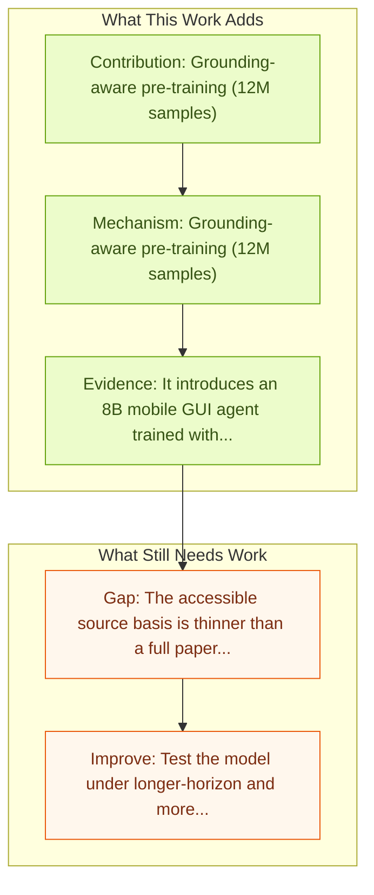

# AgentCPM-GUI: On-device Mobile Agent

Entry report generated on 2026-03-28 (Asia/Tokyo). This report is based on the repository entry, linked source metadata, and audit-time cross-checks.

## Snapshot

| Field | Detail |
| --- | --- |
| Repo entry | AgentCPM-GUI: On-device Mobile Agent |
| Actual target | [AgentCPM-GUI: On-device Mobile Agent](https://github.com/OpenBMB/AgentCPM-GUI) |
| Section | Models and Architectures |
| Source location | `papers/models/README.md:161` |
| Primary link type | `code` |
| Audit status | `code-only` |
| Date / venue | 2025 |
| Authors | Zhong Zhang, Yaxi Lu, Yikun Fu, Yupeng Huo, Shenzhi Yang, Yesai Wu, Han Si, Xin Cong, Haotian Chen, Yankai Lin, Jie Xie, Wei Zhou |
| Focus tags | `model` `mobile` `on-device` `8b` |
| Center of gravity | mobile |

## Quick Read

| Lens | Read |
| --- | --- |
| Problem pressure | 8B-parameter on-device GUI agent for Android. |
| Most novel move | The architecture-level novelty is most visible in grounding-aware pre-training (12M samples). |
| Strongest evidence | It introduces an 8B mobile GUI agent trained with grounding-aware pre-training, supervised fine-tuning on curated Chinese and English... |
| Main caveat | The accessible source basis is thinner than a full paper review, so some claims rest on project metadata, repo notes, or abstract-level... |

## Visual Frame

```mermaid
flowchart LR
  Problem["Problem: 8B-parameter on-device GUI agent for Android."] --> Novelty["Novelty: The architecture-level novelty is most visible in..."]
  Novelty --> Framework["Framework: Grounding-aware pre-training (12M samples)"]
  Framework --> Evidence["Evidence: It introduces an 8B mobile GUI agent trained with..."]
  Evidence --> Gap["Gap: The accessible source basis is thinner than a full paper..."]
  Gap --> Next["Next: Test the model under longer-horizon and more..."]
  classDef insight fill:#dbeafe,stroke:#2563eb,color:#0f172a;
  classDef risk fill:#fee2e2,stroke:#dc2626,color:#7f1d1d;
  classDef next fill:#dcfce7,stroke:#16a34a,color:#14532d;
  class Problem,Novelty,Framework insight;
  class Evidence insight;
  class Gap risk;
  class Next next;
```

## Analysis Map

## Executive Summary

8B-parameter on-device GUI agent for Android. The paper targets practical on-device mobile control, where training data quality, cross-lingual diversity, and generalization remain major bottlenecks. It introduces an 8B mobile GUI agent trained with grounding-aware pre-training, supervised fine-tuning on curated Chinese and English trajectories, and reinforcement fine-tuning with GRPO. The design also uses a compact action space to keep output efficient on-device while aiming to improve planning and grounding in unfamiliar interfaces.

## Novelty

- The architecture-level novelty is most visible in grounding-aware pre-training (12M samples).
- It also stands out for supervised fine-tuning (55K trajectories).
- It also stands out for RL fine-tuning with GRPO.

## Core Contributions

- Grounding-aware pre-training (12M samples)
- Supervised fine-tuning (55K trajectories)
- RL fine-tuning with GRPO
- The paper targets practical on-device mobile control, where training data quality, cross-lingual diversity, and generalization remain major bottlenecks.

## Framework and Operating Logic

- Grounding-aware pre-training (12M samples)
- Supervised fine-tuning (55K trajectories)
- RL fine-tuning with GRPO

## Evidence and Claimed Results

- It introduces an 8B mobile GUI agent trained with grounding-aware pre-training, supervised fine-tuning on curated Chinese and English trajectories, and reinforcement fine-tuning with GRPO.
- The paper targets practical on-device mobile control, where training data quality, cross-lingual diversity, and generalization remain major bottlenecks.
- The design also uses a compact action space to keep output efficient on-device while aiming to improve planning and grounding in unfamiliar interfaces.

## Gaps and Limitations

- The accessible source basis is thinner than a full paper review, so some claims rest on project metadata, repo notes, or abstract-level evidence rather than a complete methods read.
- Strong model-side results still leave open whether the gains survive mobile interfaces, app transitions, and version drift.
- A stronger agent core does not by itself guarantee safer planning, error recovery, or tool-use discipline.

## How To Improve

- Test the model under longer-horizon and more safety-sensitive workloads rather than only narrow benchmark slices.
- Separate perception gains from planning gains with clearer studies over mobile interfaces, app transitions, and version drift.
- Report richer failure modes, especially around recovery after an early grounding or reasoning error.

## Why It Matters

- This entry matters because architecture choices determine whether GUI understanding becomes reliable control rather than passive description.
- It also acts as a capability anchor that other benchmark and method papers in the repo can be read against.

## Connections In This Repo

- [AppAgent: Multimodal Agents as Smartphone Users](appagent-multimodal-agents-as-smartphone-users.md) - shared focus on mobile GUI control and cross-app interaction constraints.
- [Mobile-Agent-v3: Fundamental Agents for GUI Automation](mobile-agent-v3-fundamental-agents-for-gui-automation.md) - shared focus on mobile GUI control and cross-app interaction constraints.
- [AutoGLM: Autonomous Foundation Agents for GUIs](autoglm-autonomous-foundation-agents-for-guis.md) - shared focus on mobile GUI control and cross-app interaction constraints.
- [Ferret-UI: Grounded Mobile UI Understanding](ferret-ui-grounded-mobile-ui-understanding.md) - shared focus on mobile GUI control and cross-app interaction constraints.

## Source Basis

- Primary basis: Companion arXiv abstract used to deepen the code-only entry.
- Audit access note: The repo links code rather than a primary paper page, so evidence quality depends on repository documentation and companion metadata.
