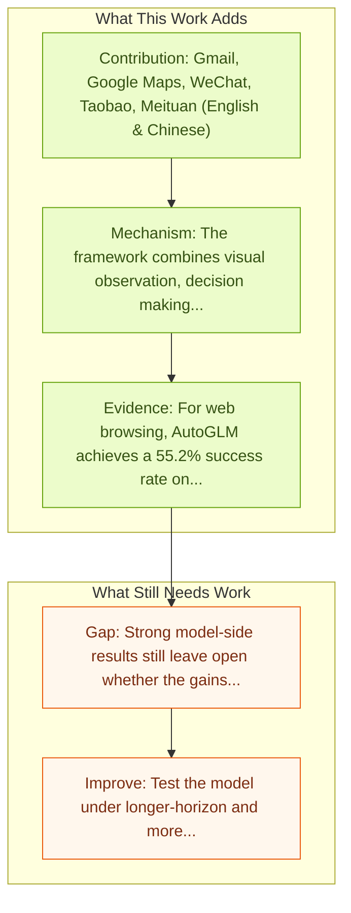

# AutoGLM: Autonomous Foundation Agents for GUIs

Entry report generated on 2026-03-28 (Asia/Tokyo). This report is based on the repository entry, linked source metadata, and audit-time cross-checks.

## Snapshot

| Field | Detail |
| --- | --- |
| Repo entry | AutoGLM: Autonomous Foundation Agents for GUIs |
| Actual target | [AutoGLM: Autonomous Foundation Agents for GUIs](https://arxiv.org/abs/2411.00820) |
| Section | Models and Architectures |
| Source location | `papers/models/README.md:147` |
| Primary link type | `link` |
| Audit status | `ok` |
| Date / venue | November 2024 |
| Authors | Xiao Liu, Bo Qin, Dongzhu Liang, Guang Dong, Hanyu Lai, Hanchen Zhang, Hanlin Zhao, Iat Long Iong, Jiadai Sun, Jiaqi Wang, Junjie Gao, Junjun Shan, Kangning Liu, Shudan Zhang, Shuntian Yao, Siyi Cheng, Wentao Yao, Wenyi Zhao, Xinghan Liu, Xinyi Liu, Xinying Chen, Xinyue Yang, Yang Yang, Yifan Xu, Yu Yang, Yujia Wang, Yulin Xu, Zehan Qi, Yuxiao Dong, Jie Tang |
| Focus tags | `model` `mobile` `chatglm` `open-source` |
| Center of gravity | web, mobile, grounding |
| Code repo | [GitHub](https://github.com/THUDM/AutoGLM) |
| Model hub | [HuggingFace](https://huggingface.co/THUDM/AutoGLM-Phone-9B) |

## Quick Read

| Lens | Read |
| --- | --- |
| Problem pressure | Open-source phone agent framework built on ChatGLM family. |
| Most novel move | The architecture-level novelty is most visible in mobile. |
| Strongest evidence | For web browsing, AutoGLM achieves a 55.2% success rate on VAB-WebArena-Lite (improving to 59.1% with a second attempt) and 96.2% on... |
| Main caveat | Strong model-side results still leave open whether the gains survive mobile interfaces, app transitions, and version drift. |

## Visual Frame

```mermaid
flowchart LR
  Problem["Problem: Open-source phone agent framework built on ChatGLM family."] --> Novelty["Novelty: The architecture-level novelty is most visible in mobile."]
  Novelty --> Framework["Framework: The framework combines visual observation, decision making..."]
  Framework --> Evidence["Evidence: For web browsing, AutoGLM achieves a 55.2% success rate on..."]
  Evidence --> Gap["Gap: Strong model-side results still leave open whether the gains..."]
  Gap --> Next["Next: Test the model under longer-horizon and more..."]
  classDef insight fill:#dbeafe,stroke:#2563eb,color:#0f172a;
  classDef risk fill:#fee2e2,stroke:#dc2626,color:#7f1d1d;
  classDef next fill:#dcfce7,stroke:#16a34a,color:#14532d;
  class Problem,Novelty,Framework insight;
  class Evidence insight;
  class Gap risk;
  class Next next;
```

## Analysis Map

## Executive Summary

Open-source phone agent framework built on ChatGLM family. The authors present AutoGLM, a new series in the ChatGLM family, designed to serve as foundation agents for autonomous control of digital devices through Graphical User Interfaces (GUIs). While foundation models excel at acquiring human knowledge, they often struggle with decision-making in dynamic real-world environments, limiting their progress toward artificial general intelligence. This limitation underscores the importance of developing foundation agents capable of learning through autonomous environmental interactions by reinforcing existing models.

## Code and Supporting Artifacts

- Code repository: [GitHub](https://github.com/THUDM/AutoGLM)
- Model weights or hub: [HuggingFace](https://huggingface.co/THUDM/AutoGLM-Phone-9B)

## Novelty

- The architecture-level novelty is most visible in mobile.
- The authors present AutoGLM, a new series in the ChatGLM family, designed to serve as foundation agents for autonomous control of digital devices through Graphical User Interfaces (GUIs).
- While foundation models excel at acquiring human knowledge, they often struggle with decision-making in dynamic real-world environments, limiting their progress toward artificial general intelligence.

## Core Contributions

- Gmail, Google Maps, WeChat, Taobao, Meituan (English & Chinese)
- The authors present AutoGLM, a new series in the ChatGLM family, designed to serve as foundation agents for autonomous control of digital devices through Graphical User Interfaces (GUIs).
- While foundation models excel at acquiring human knowledge, they often struggle with decision-making in dynamic real-world environments, limiting their progress toward artificial general intelligence.
- This limitation underscores the importance of developing foundation agents capable of learning through autonomous environmental interactions by reinforcing existing models.

## Framework and Operating Logic

- The framework combines visual observation, decision making, and action execution into a reusable control loop.
- The authors present AutoGLM, a new series in the ChatGLM family, designed to serve as foundation agents for autonomous control of digital devices through Graphical User Interfaces (GUIs).
- While foundation models excel at acquiring human knowledge, they often struggle with decision-making in dynamic real-world environments, limiting their progress toward artificial general intelligence.

## Evidence and Claimed Results

- For web browsing, AutoGLM achieves a 55.2% success rate on VAB-WebArena-Lite (improving to 59.1% with a second attempt) and 96.2% on OpenTable evaluation tasks.
- In Android device control, AutoGLM attains a 36.2% success rate on AndroidLab (VAB-Mobile) and 89.7% on common tasks in popular Chinese APPs.

## Gaps and Limitations

- Strong model-side results still leave open whether the gains survive mobile interfaces, app transitions, and version drift.
- A stronger agent core does not by itself guarantee safer planning, error recovery, or tool-use discipline.

## How To Improve

- Test the model under longer-horizon and more safety-sensitive workloads rather than only narrow benchmark slices.
- Separate perception gains from planning gains with clearer studies over mobile interfaces, app transitions, and version drift.
- Report richer failure modes, especially around recovery after an early grounding or reasoning error.

## Why It Matters

- This entry matters because architecture choices determine whether GUI understanding becomes reliable control rather than passive description.
- It also acts as a capability anchor that other benchmark and method papers in the repo can be read against.

## Connections In This Repo

- [AppAgent: Multimodal Agents as Smartphone Users](appagent-multimodal-agents-as-smartphone-users.md) - shared focus on mobile GUI control and cross-app interaction constraints.
- [Mobile-Agent-v3: Fundamental Agents for GUI Automation](mobile-agent-v3-fundamental-agents-for-gui-automation.md) - shared focus on mobile GUI control and cross-app interaction constraints.
- [AgentCPM-GUI: On-device Mobile Agent](agentcpm-gui-on-device-mobile-agent.md) - shared focus on mobile GUI control and cross-app interaction constraints.
- [Ferret-UI: Grounded Mobile UI Understanding](ferret-ui-grounded-mobile-ui-understanding.md) - shared focus on mobile GUI control and cross-app interaction constraints.

## Source Basis

- Primary basis: abstract-level paper metadata plus the repo-local notes in the source Markdown file.
- Audit access note: Metadata resolved cleanly during the audit.
