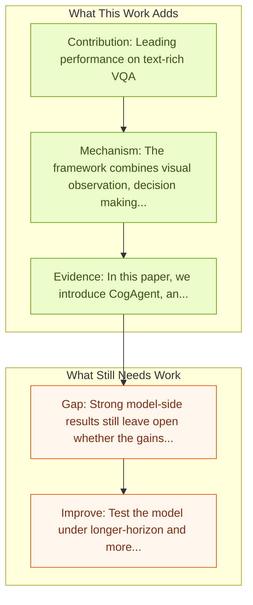

# CogAgent: A Visual Language Model for GUI Agents

Entry report generated on 2026-03-28 (Asia/Tokyo). This report is based on the repository entry, linked source metadata, and audit-time cross-checks.

## Snapshot

| Field | Detail |
| --- | --- |
| Repo entry | CogAgent: A Visual Language Model for GUI Agents |
| Actual target | [CogAgent: A Visual Language Model for GUI Agents](https://arxiv.org/abs/2312.08914) |
| Section | Models and Architectures |
| Source location | `papers/models/README.md:37` |
| Primary link type | `link` |
| Audit status | `ok` |
| Date / venue | CVPR 2024 Highlight |
| Authors | Wenyi Hong, Weihan Wang, Qingsong Lv, Jiazheng Xu, Wenmeng Yu, Junhui Ji, Yan Wang, Zihan Wang, Yuxuan Zhang, Juanzi Li, Bin Xu, Yuxiao Dong, Ming Ding, Jie Tang |
| Focus tags | `model` `vlm` `18b` `cross-platform` |
| Center of gravity | web, desktop, mobile |

## Quick Read

| Lens | Read |
| --- | --- |
| Problem pressure | 18-billion-parameter VLM leveraging high-resolution image encoders to interpret complex GUI elements. |
| Most novel move | The architecture-level novelty is most visible in vlm. |
| Strongest evidence | In this paper, we introduce CogAgent, an 18-billion-parameter visual language model (VLM) specializing in GUI understanding and navigation. |
| Main caveat | Strong model-side results still leave open whether the gains survive long-horizon transfer, recovery behavior, and distribution shift. |

## Visual Frame

```mermaid
flowchart LR
  Problem["Problem: 18-billion-parameter VLM leveraging high-resolution image..."] --> Novelty["Novelty: The architecture-level novelty is most visible in vlm."]
  Novelty --> Framework["Framework: The framework combines visual observation, decision making..."]
  Framework --> Evidence["Evidence: In this paper, we introduce CogAgent, an..."]
  Evidence --> Gap["Gap: Strong model-side results still leave open whether the gains..."]
  Gap --> Next["Next: Test the model under longer-horizon and more..."]
  classDef insight fill:#dbeafe,stroke:#2563eb,color:#0f172a;
  classDef risk fill:#fee2e2,stroke:#dc2626,color:#7f1d1d;
  classDef next fill:#dcfce7,stroke:#16a34a,color:#14532d;
  class Problem,Novelty,Framework insight;
  class Evidence insight;
  class Gap risk;
  class Next next;
```

## Analysis Map

## Executive Summary

18-billion-parameter VLM leveraging high-resolution image encoders to interpret complex GUI elements. People are spending an enormous amount of time on digital devices through graphical user interfaces (GUIs), e.g., computer or smartphone screens. Large language models (LLMs) such as ChatGPT can assist people in tasks like writing emails, but struggle to understand and interact with GUIs, thus limiting their potential to increase automation levels. In this paper, we introduce CogAgent, an 18-billion-parameter visual language model (VLM) specializing in GUI understanding and navigation.

## Novelty

- The architecture-level novelty is most visible in vlm.
- People are spending an enormous amount of time on digital devices through graphical user interfaces (GUIs), e.g., computer or smartphone screens.
- Large language models (LLMs) such as ChatGPT can assist people in tasks like writing emails, but struggle to understand and interact with GUIs, thus limiting their potential to increase automation levels.

## Core Contributions

- Leading performance on text-rich VQA
- GUI navigation benchmarks across PC and Android
- High-resolution image understanding (1120x1120)
- People are spending an enormous amount of time on digital devices through graphical user interfaces (GUIs), e.g., computer or smartphone screens.

## Framework and Operating Logic

- The framework combines visual observation, decision making, and action execution into a reusable control loop.
- People are spending an enormous amount of time on digital devices through graphical user interfaces (GUIs), e.g., computer or smartphone screens.
- Large language models (LLMs) such as ChatGPT can assist people in tasks like writing emails, but struggle to understand and interact with GUIs, thus limiting their potential to increase automation levels.

## Evidence and Claimed Results

- In this paper, we introduce CogAgent, an 18-billion-parameter visual language model (VLM) specializing in GUI understanding and navigation.
- By utilizing both low-resolution and high-resolution image encoders, CogAgent supports input at a resolution of 1120*1120, enabling it to recognize tiny page elements and text.
- As a generalist visual language model, CogAgent achieves the state of the art on five text-rich and four general VQA benchmarks, including VQAv2, OK-VQA, Text-VQA, ST-VQA, ChartQA, infoVQA, DocVQA, MM-Vet, and POPE.
- CogAgent, using only screenshots as input, outperforms LLM-based methods that consume extracted HTML text on both PC and Android GUI navigation tasks -- Mind2Web and AITW, advancing the state of the art.

## Gaps and Limitations

- Strong model-side results still leave open whether the gains survive long-horizon transfer, recovery behavior, and distribution shift.
- A stronger agent core does not by itself guarantee safer planning, error recovery, or tool-use discipline.

## How To Improve

- Test the model under longer-horizon and more safety-sensitive workloads rather than only narrow benchmark slices.
- Separate perception gains from planning gains with clearer studies over long-horizon transfer, recovery behavior, and distribution shift.
- Report richer failure modes, especially around recovery after an early grounding or reasoning error.

## Why It Matters

- This entry matters because architecture choices determine whether GUI understanding becomes reliable control rather than passive description.
- It also acts as a capability anchor that other benchmark and method papers in the repo can be read against.

## Connections In This Repo

- [ScreenAgent: A VLM-driven Computer Control Agent](screenagent-a-vlm-driven-computer-control-agent.md) - neighbor entry in the same models and architectures cluster.
- [Qwen2.5-VL Technical Report](qwen2-5-vl-technical-report.md) - neighbor entry in the same models and architectures cluster.
- [AGUVIS: Unified Pure Vision Agents for GUI Interaction](aguvis-unified-pure-vision-agents-for-gui-interaction.md) - neighbor entry in the same models and architectures cluster.
- [ScaleCUA: Scaling Open-Source Computer Use Agents with Cross-Platform Data](scalecua-scaling-open-source-computer-use-agents-with-cross-platform-data.md) - neighbor entry in the same models and architectures cluster.

## Source Basis

- Primary basis: abstract-level paper metadata plus the repo-local notes in the source Markdown file.
- Audit access note: Metadata resolved cleanly during the audit.
