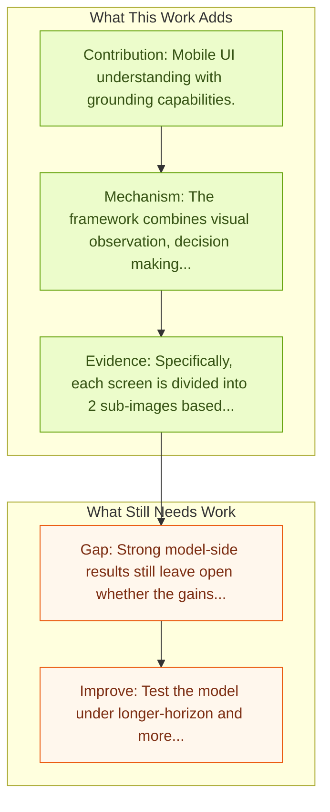

# Ferret-UI: Grounded Mobile UI Understanding

Entry report generated on 2026-03-28 (Asia/Tokyo). This report is based on the repository entry, linked source metadata, and audit-time cross-checks.

## Snapshot

| Field | Detail |
| --- | --- |
| Repo entry | Ferret-UI: Grounded Mobile UI Understanding |
| Actual target | [Ferret-UI: Grounded Mobile UI Understanding with Multimodal LLMs](https://arxiv.org/abs/2404.05719) |
| Section | Models and Architectures |
| Source location | `papers/models/README.md:176` |
| Primary link type | `link` |
| Audit status | `ok` |
| Date / venue | April 2024 |
| Authors | Keen You, Haotian Zhang, Eldon Schoop, Floris Weers, Amanda Swearngin, Jeffrey Nichols, Yinfei Yang, Zhe Gan |
| Focus tags | `model` `mobile` `grounding` `apple` |
| Center of gravity | mobile, grounding |

## Quick Read

| Lens | Read |
| --- | --- |
| Problem pressure | Mobile UI understanding with grounding capabilities. |
| Most novel move | The architecture-level novelty is most visible in mobile. |
| Strongest evidence | Specifically, each screen is divided into 2 sub-images based on the original aspect ratio (i.e., horizontal division for portrait... |
| Main caveat | Strong model-side results still leave open whether the gains survive mobile interfaces, app transitions, and version drift. |

## Visual Frame

```mermaid
flowchart LR
  Problem["Problem: Mobile UI understanding with grounding capabilities."] --> Novelty["Novelty: The architecture-level novelty is most visible in mobile."]
  Novelty --> Framework["Framework: The framework combines visual observation, decision making..."]
  Framework --> Evidence["Evidence: Specifically, each screen is divided into 2 sub-images based..."]
  Evidence --> Gap["Gap: Strong model-side results still leave open whether the gains..."]
  Gap --> Next["Next: Test the model under longer-horizon and more..."]
  classDef insight fill:#dbeafe,stroke:#2563eb,color:#0f172a;
  classDef risk fill:#fee2e2,stroke:#dc2626,color:#7f1d1d;
  classDef next fill:#dcfce7,stroke:#16a34a,color:#14532d;
  class Problem,Novelty,Framework insight;
  class Evidence insight;
  class Gap risk;
  class Next next;
```

## Analysis Map

## Executive Summary

Mobile UI understanding with grounding capabilities. Recent advancements in multimodal large language models (MLLMs) have been noteworthy, yet, these general-domain MLLMs often fall short in their ability to comprehend and interact effectively with user interface (UI) screens. In this paper, we present Ferret-UI, a new MLLM tailored for enhanced understanding of mobile UI screens, equipped with referring, grounding, and reasoning capabilities. Given that UI screens typically exhibit a more elongated aspect ratio and contain smaller objects of interest (e.g., icons, texts) than natural images, we incorporate "any resolution" on top of Ferret to magnify details and leverage enhanced visual features.

## Novelty

- The architecture-level novelty is most visible in mobile.
- Recent advancements in multimodal large language models (MLLMs) have been noteworthy, yet, these general-domain MLLMs often fall short in their ability to comprehend and interact effectively with user interface (UI) screens.
- In this paper, we present Ferret-UI, a new MLLM tailored for enhanced understanding of mobile UI screens, equipped with referring, grounding, and reasoning capabilities.

## Core Contributions

- Mobile UI understanding with grounding capabilities.
- Recent advancements in multimodal large language models (MLLMs) have been noteworthy, yet, these general-domain MLLMs often fall short in their ability to comprehend and interact effectively with user interface (UI) screens.
- In this paper, we present Ferret-UI, a new MLLM tailored for enhanced understanding of mobile UI screens, equipped with referring, grounding, and reasoning capabilities.
- Given that UI screens typically exhibit a more elongated aspect ratio and contain smaller objects of interest (e.g., icons, texts) than natural images, we incorporate "any resolution" on top of Ferret to magnify details and leverage enhanced visual features.

## Framework and Operating Logic

- The framework combines visual observation, decision making, and action execution into a reusable control loop.
- Recent advancements in multimodal large language models (MLLMs) have been noteworthy, yet, these general-domain MLLMs often fall short in their ability to comprehend and interact effectively with user interface (UI) screens.
- In this paper, we present Ferret-UI, a new MLLM tailored for enhanced understanding of mobile UI screens, equipped with referring, grounding, and reasoning capabilities.

## Evidence and Claimed Results

- Specifically, each screen is divided into 2 sub-images based on the original aspect ratio (i.e., horizontal division for portrait screens and vertical division for landscape screens).
- Ferret-UI excels not only beyond most open-source UI MLLMs, but also surpasses GPT-4V on all the elementary UI tasks.

## Gaps and Limitations

- Strong model-side results still leave open whether the gains survive mobile interfaces, app transitions, and version drift.
- A stronger agent core does not by itself guarantee safer planning, error recovery, or tool-use discipline.

## How To Improve

- Test the model under longer-horizon and more safety-sensitive workloads rather than only narrow benchmark slices.
- Separate perception gains from planning gains with clearer studies over mobile interfaces, app transitions, and version drift.
- Report richer failure modes, especially around recovery after an early grounding or reasoning error.

## Why It Matters

- This entry matters because architecture choices determine whether GUI understanding becomes reliable control rather than passive description.
- It also acts as a capability anchor that other benchmark and method papers in the repo can be read against.

## Connections In This Repo

- [OmniParser: Pure Vision Based GUI Agent](omniparser-pure-vision-based-gui-agent.md) - shared emphasis on precise UI localization and action placement.
- [SeeClick: Harnessing GUI Grounding for Advanced Visual GUI Agents](seeclick-harnessing-gui-grounding-for-advanced-visual-gui-agents.md) - shared emphasis on precise UI localization and action placement.
- [AppAgent: Multimodal Agents as Smartphone Users](appagent-multimodal-agents-as-smartphone-users.md) - shared focus on mobile GUI control and cross-app interaction constraints.
- [Mobile-Agent-v3: Fundamental Agents for GUI Automation](mobile-agent-v3-fundamental-agents-for-gui-automation.md) - shared focus on mobile GUI control and cross-app interaction constraints.

## Source Basis

- Primary basis: abstract-level paper metadata plus the repo-local notes in the source Markdown file.
- Audit access note: Metadata resolved cleanly during the audit.
