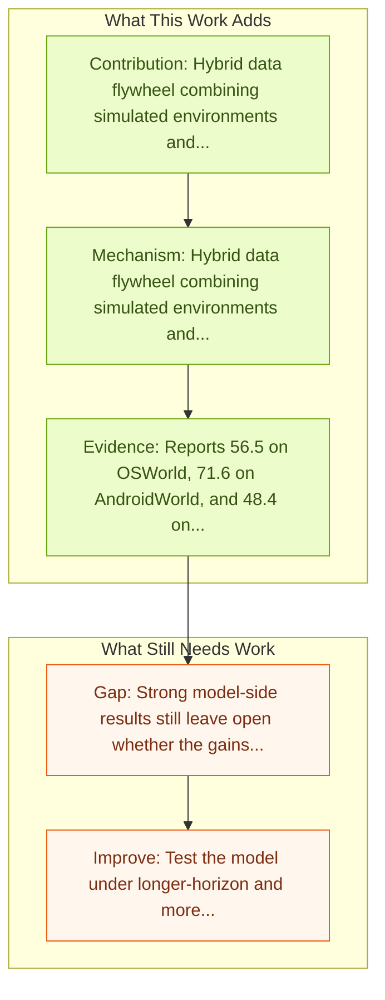

# Mobile-Agent-v3.5: Multi-platform Fundamental GUI Agents

Entry report generated on 2026-03-28 (Asia/Tokyo). This report is based on the repository entry, linked source metadata, and audit-time cross-checks.

## Snapshot

| Field | Detail |
| --- | --- |
| Repo entry | Mobile-Agent-v3.5: Multi-platform Fundamental GUI Agents |
| Actual target | [Mobile-Agent-v3.5: Multi-platform Fundamental GUI Agents](https://arxiv.org/abs/2602.16855) |
| Section | Models and Architectures |
| Source location | `papers/models/README.md:282` |
| Primary link type | `link` |
| Audit status | `ok` |
| Date / venue | February 2026 |
| Authors | Haiyang Xu, Xi Zhang, Haowei Liu, Junyang Wang, Zhaozai Zhu, Shengjie Zhou, Xuhao Hu, Feiyu Gao, Junjie Cao, Zihua Wang, Zhiyuan Chen, Jitong Liao, Qi Zheng, Jiahui Zeng, Ze Xu, Shuai Bai, Junyang Lin, Jingren Zhou, Ming Yan |
| Focus tags | `model` `mobile` `desktop` `cross-platform` |
| Center of gravity | mobile, desktop, cross-platform |
| Code repo | [GitHub](https://github.com/X-PLUG/MobileAgent) |

## Quick Read

| Lens | Read |
| --- | --- |
| Problem pressure | GUI-Owl-1.5 native GUI agent family for desktop, browser, and mobile interaction. |
| Most novel move | The architecture-level novelty is most visible in hybrid data flywheel combining simulated environments and cloud sandboxes. |
| Strongest evidence | Reports 56.5 on OSWorld, 71.6 on AndroidWorld, and 48.4 on WebArena. |
| Main caveat | Strong model-side results still leave open whether the gains survive mobile interfaces, app transitions, and version drift. |

## Visual Frame

```mermaid
flowchart LR
  Problem["Problem: GUI-Owl-1.5 native GUI agent family for desktop, browser..."] --> Novelty["Novelty: The architecture-level novelty is most visible in hybrid..."]
  Novelty --> Framework["Framework: Hybrid data flywheel combining simulated environments and..."]
  Framework --> Evidence["Evidence: Reports 56.5 on OSWorld, 71.6 on AndroidWorld, and 48.4 on..."]
  Evidence --> Gap["Gap: Strong model-side results still leave open whether the gains..."]
  Gap --> Next["Next: Test the model under longer-horizon and more..."]
  classDef insight fill:#dbeafe,stroke:#2563eb,color:#0f172a;
  classDef risk fill:#fee2e2,stroke:#dc2626,color:#7f1d1d;
  classDef next fill:#dcfce7,stroke:#16a34a,color:#14532d;
  class Problem,Novelty,Framework insight;
  class Evidence insight;
  class Gap risk;
  class Next next;
```

## Analysis Map

## Executive Summary

GUI-Owl-1.5 native GUI agent family for desktop, browser, and mobile interaction. The paper introduces GUI-Owl-1.5, the latest native GUI agent model that features instruct/thinking variants in multiple sizes (2B/4B/8B/32B/235B) and supports a range of platforms (desktop, mobile, browser, and more) to enable cloud-edge collaboration and real-time interaction. GUI-Owl-1.5 achieves state-of-the-art results on more than 20+ GUI benchmarks on open-source models: (1) on GUI automation tasks, it obtains 56.5 on OSWorld, 71.6 on AndroidWorld, and 48.4 on WebArena; (2) on grounding tasks, it obtains 80.3 on ScreenSpotPro; (3) on tool-calling tasks, it obtains 47.6 on OSWorld-MCP, and 46.8 on MobileWorld; (4) on memory and knowledge tasks, it obtains 75.5 on GUI-Knowledge Bench. GUI-Owl-1.5 incorporates several key innovations: (1) Hybird Data Flywheel: we construct the data pipeline for UI understanding and trajectory generation based on a...

## Code and Supporting Artifacts

- Code repository: [GitHub](https://github.com/X-PLUG/MobileAgent)

## Novelty

- The architecture-level novelty is most visible in hybrid data flywheel combining simulated environments and cloud sandboxes.
- It also stands out for MRPO reinforcement learning for multi-platform, long-horizon GUI training.
- The paper introduces GUI-Owl-1.5, the latest native GUI agent model that features instruct/thinking variants in multiple sizes (2B/4B/8B/32B/235B) and supports a range of platforms (desktop, mobile, browser, and more) to enable cloud-edge collaboration and real-time interaction.

## Core Contributions

- Hybrid data flywheel combining simulated environments and cloud sandboxes.
- MRPO reinforcement learning for multi-platform, long-horizon GUI training.
- The paper introduces GUI-Owl-1.5, the latest native GUI agent model that features instruct/thinking variants in multiple sizes (2B/4B/8B/32B/235B) and supports a range of platforms (desktop, mobile, browser, and more) to enable cloud-edge collaboration and real-time interaction.
- GUI-Owl-1.5 achieves state-of-the-art results on more than 20+ GUI benchmarks on open-source models: (1) on GUI automation tasks, it obtains 56.5 on OSWorld, 71.6 on AndroidWorld, and 48.4 on WebArena; (2) on grounding tasks, it obtains 80.3 on ScreenSpotPro; (3) on tool-calling tasks, it obtains 47.6 on OSWorld-MCP, and 46.8 on MobileWorld; (4) on memory and knowledge tasks, it obtains 75.5 on GUI-Knowledge Bench.

## Framework and Operating Logic

- Hybrid data flywheel combining simulated environments and cloud sandboxes.
- MRPO reinforcement learning for multi-platform, long-horizon GUI training.
- The paper introduces GUI-Owl-1.5, the latest native GUI agent model that features instruct/thinking variants in multiple sizes (2B/4B/8B/32B/235B) and supports a range of platforms (desktop, mobile, browser, and more) to enable cloud-edge collaboration and real-time interaction.

## Evidence and Claimed Results

- Reports 56.5 on OSWorld, 71.6 on AndroidWorld, and 48.4 on WebArena.
- Reports 80.3 on ScreenSpotPro and 47.6 on OSWorld-MCP.
- The paper introduces GUI-Owl-1.5, the latest native GUI agent model that features instruct/thinking variants in multiple sizes (2B/4B/8B/32B/235B) and supports a range of platforms (desktop, mobile, browser, and more) to enable cloud-edge collaboration and real-time interaction.
- GUI-Owl-1.5 achieves state-of-the-art results on more than 20+ GUI benchmarks on open-source models: (1) on GUI automation tasks, it obtains 56.5 on OSWorld, 71.6 on AndroidWorld, and 48.4 on WebArena; (2) on grounding tasks, it obtains 80.3 on ScreenSpotPro; (3) on tool-calling tasks, it obtains 47.6 on OSWorld-MCP, and 46.8 on MobileWorld; (4) on memory and knowledge tasks, it obtains 75.5 on GUI-Knowledge Bench.
- GUI-Owl-1.5 incorporates several key innovations: (1) Hybird Data Flywheel: we construct the data pipeline for UI understanding and trajectory generation based on a combination of simulated environments and cloud-based sandbox environments, in order to improve the efficiency and quality of data collection.

## Gaps and Limitations

- Strong model-side results still leave open whether the gains survive mobile interfaces, app transitions, and version drift.
- A stronger agent core does not by itself guarantee safer planning, error recovery, or tool-use discipline.

## How To Improve

- Test the model under longer-horizon and more safety-sensitive workloads rather than only narrow benchmark slices.
- Separate perception gains from planning gains with clearer studies over mobile interfaces, app transitions, and version drift.
- Report richer failure modes, especially around recovery after an early grounding or reasoning error.

## Why It Matters

- This entry matters because architecture choices determine whether GUI understanding becomes reliable control rather than passive description.
- It also acts as a capability anchor that other benchmark and method papers in the repo can be read against.

## Connections In This Repo

- [OmegaUse: Building a General-Purpose GUI Agent for Autonomous Task Execution](omegause-building-a-general-purpose-gui-agent-for-autonomous-task-execution.md) - shared focus on mobile GUI control and cross-app interaction constraints.
- [OmniACT](../benchmarks-and-datasets/omniact.md) - shared desktop or OS-level interaction surface.
- [AppAgent: Multimodal Agents as Smartphone Users](appagent-multimodal-agents-as-smartphone-users.md) - shared focus on mobile GUI control and cross-app interaction constraints.
- [Mobile-Agent-v3: Fundamental Agents for GUI Automation](mobile-agent-v3-fundamental-agents-for-gui-automation.md) - shared focus on mobile GUI control and cross-app interaction constraints.

## Source Basis

- Primary basis: Primary arXiv abstract metadata was fetched live from the linked paper page.
- Audit access note: Metadata resolved cleanly during the audit.
