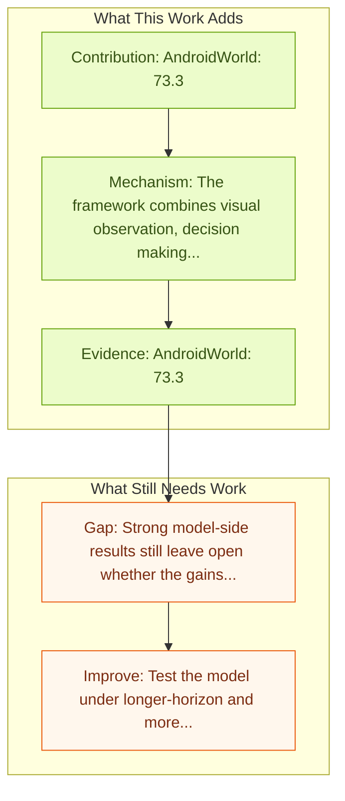

# Mobile-Agent-v3: Fundamental Agents for GUI Automation

Entry report generated on 2026-03-28 (Asia/Tokyo). This report is based on the repository entry, linked source metadata, and audit-time cross-checks.

## Snapshot

| Field | Detail |
| --- | --- |
| Repo entry | Mobile-Agent-v3: Fundamental Agents for GUI Automation |
| Actual target | [Mobile-Agent-v3: Fundamental Agents for GUI Automation](https://arxiv.org/abs/2508.15144) |
| Section | Models and Architectures |
| Source location | `papers/models/README.md:132` |
| Primary link type | `link` |
| Audit status | `ok` |
| Date / venue | August 2025 |
| Authors | Jiabo Ye, Xi Zhang, Haiyang Xu, Haowei Liu, Junyang Wang, Zhaoqing Zhu, Ziwei Zheng, Feiyu Gao, Junjie Cao, Zhengxi Lu, Jitong Liao, Qi Zheng, Fei Huang, Jingren Zhou, Ming Yan |
| Focus tags | `model` `mobile` `multi-agent` `sota` |
| Center of gravity | desktop, mobile, grounding |
| Related assets | [GitHub](https://github.com/X-PLUG/MobileAgent) |

## Quick Read

| Lens | Read |
| --- | --- |
| Problem pressure | GUI-Owl foundational model achieving SOTA among open-source models. |
| Most novel move | The architecture-level novelty is most visible in mobile. |
| Strongest evidence | AndroidWorld: 73.3 |
| Main caveat | Strong model-side results still leave open whether the gains survive mobile interfaces, app transitions, and version drift. |

## Visual Frame

```mermaid
flowchart LR
  Problem["Problem: GUI-Owl foundational model achieving SOTA among open-source..."] --> Novelty["Novelty: The architecture-level novelty is most visible in mobile."]
  Novelty --> Framework["Framework: The framework combines visual observation, decision making..."]
  Framework --> Evidence["Evidence: AndroidWorld: 73.3"]
  Evidence --> Gap["Gap: Strong model-side results still leave open whether the gains..."]
  Gap --> Next["Next: Test the model under longer-horizon and more..."]
  classDef insight fill:#dbeafe,stroke:#2563eb,color:#0f172a;
  classDef risk fill:#fee2e2,stroke:#dc2626,color:#7f1d1d;
  classDef next fill:#dcfce7,stroke:#16a34a,color:#14532d;
  class Problem,Novelty,Framework insight;
  class Evidence insight;
  class Gap risk;
  class Next next;
```

## Analysis Map

## Executive Summary

GUI-Owl foundational model achieving SOTA among open-source models. The paper introduces GUI-Owl, a foundational GUI agent model that achieves state-of-the-art performance among open-source end-to-end models on ten GUI benchmarks across desktop and mobile environments, covering grounding, question answering, planning, decision-making, and procedural knowledge. GUI-Owl-7B achieves 66.4 on AndroidWorld and 29.4 on OSWorld. Building on this, we propose Mobile-Agent-v3, a general-purpose GUI agent framework that further improves performance to 73.3 on AndroidWorld and 37.7 on OSWorld, setting a new state-of-the-art for open-source GUI agent frameworks.

## Novelty

- The architecture-level novelty is most visible in mobile.
- The paper introduces GUI-Owl, a foundational GUI agent model that achieves state-of-the-art performance among open-source end-to-end models on ten GUI benchmarks across desktop and mobile environments, covering grounding, question answering, planning, decision-making, and procedural knowledge.
- GUI-Owl-7B achieves 66.4 on AndroidWorld and 29.4 on OSWorld.

## Core Contributions

- AndroidWorld: 73.3
- OSWorld-Verified: 37.7
- The paper introduces GUI-Owl, a foundational GUI agent model that achieves state-of-the-art performance among open-source end-to-end models on ten GUI benchmarks across desktop and mobile environments, covering grounding, question answering, planning, decision-making, and procedural knowledge.
- GUI-Owl-7B achieves 66.4 on AndroidWorld and 29.4 on OSWorld.

## Framework and Operating Logic

- The framework combines visual observation, decision making, and action execution into a reusable control loop.
- The paper introduces GUI-Owl, a foundational GUI agent model that achieves state-of-the-art performance among open-source end-to-end models on ten GUI benchmarks across desktop and mobile environments, covering grounding, question answering, planning, decision-making, and procedural knowledge.
- GUI-Owl-7B achieves 66.4 on AndroidWorld and 29.4 on OSWorld.

## Evidence and Claimed Results

- AndroidWorld: 73.3
- OSWorld-Verified: 37.7
- GUI-Owl-7B achieves 66.4 on AndroidWorld and 29.4 on OSWorld.
- Building on this, we propose Mobile-Agent-v3, a general-purpose GUI agent framework that further improves performance to 73.3 on AndroidWorld and 37.7 on OSWorld, setting a new state-of-the-art for open-source GUI agent frameworks.
- GUI-Owl incorporates three key innovations: (1) Large-scale Environment Infrastructure: a cloud-based virtual environment spanning Android, Ubuntu, macOS, and Windows, enabling our Self-Evolving GUI Trajectory Production framework.

## Gaps and Limitations

- Strong model-side results still leave open whether the gains survive mobile interfaces, app transitions, and version drift.
- A stronger agent core does not by itself guarantee safer planning, error recovery, or tool-use discipline.

## How To Improve

- Test the model under longer-horizon and more safety-sensitive workloads rather than only narrow benchmark slices.
- Separate perception gains from planning gains with clearer studies over mobile interfaces, app transitions, and version drift.
- Report richer failure modes, especially around recovery after an early grounding or reasoning error.

## Why It Matters

- This entry matters because architecture choices determine whether GUI understanding becomes reliable control rather than passive description.
- It also acts as a capability anchor that other benchmark and method papers in the repo can be read against.

## Connections In This Repo

- [AppAgent: Multimodal Agents as Smartphone Users](appagent-multimodal-agents-as-smartphone-users.md) - shared focus on mobile GUI control and cross-app interaction constraints.
- [AutoGLM: Autonomous Foundation Agents for GUIs](autoglm-autonomous-foundation-agents-for-guis.md) - shared focus on mobile GUI control and cross-app interaction constraints.
- [AgentCPM-GUI: On-device Mobile Agent](agentcpm-gui-on-device-mobile-agent.md) - shared focus on mobile GUI control and cross-app interaction constraints.
- [Ferret-UI: Grounded Mobile UI Understanding](ferret-ui-grounded-mobile-ui-understanding.md) - shared focus on mobile GUI control and cross-app interaction constraints.

## Source Basis

- Primary basis: abstract-level paper metadata plus the repo-local notes in the source Markdown file.
- Audit access note: Metadata resolved cleanly during the audit.
