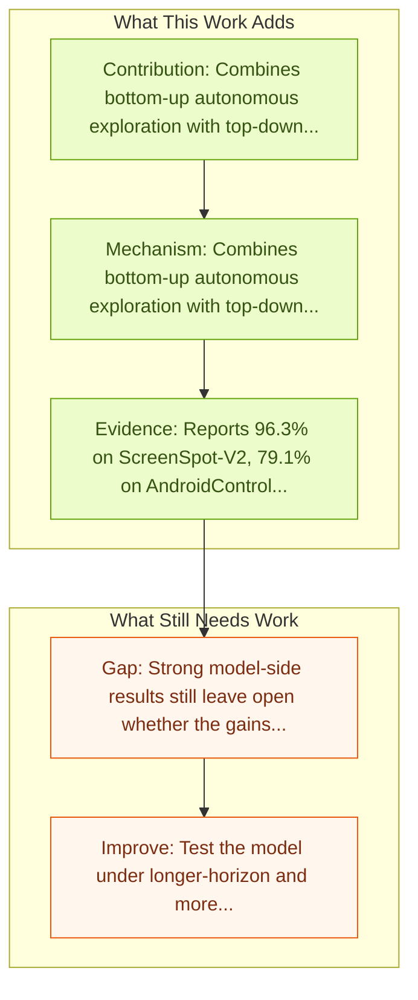

# OmegaUse: Building a General-Purpose GUI Agent for Autonomous Task Execution

Entry report generated on 2026-03-28 (Asia/Tokyo). This report is based on the repository entry, linked source metadata, and audit-time cross-checks.

## Snapshot

| Field | Detail |
| --- | --- |
| Repo entry | OmegaUse: Building a General-Purpose GUI Agent for Autonomous Task Execution |
| Actual target | [OmegaUse: Building a General-Purpose GUI Agent for Autonomous Task Execution](https://arxiv.org/abs/2601.20380) |
| Section | Models and Architectures |
| Source location | `papers/models/README.md:315` |
| Primary link type | `link` |
| Audit status | `ok` |
| Date / venue | January 2026 |
| Authors | Le Zhang, Yixiong Xiao, Xinjiang Lu, Jingjia Cao, Yusai Zhao, Jingbo Zhou, Lang An, Zikan Feng, Wanxiang Sha, Yu Shi, Congxi Xiao, Jian Xiong, Yankai Zhang, Hua Wu, Haifeng Wang |
| Focus tags | `model` `moe` `desktop` `mobile` |
| Center of gravity | moe, desktop, mobile |

## Quick Read

| Lens | Read |
| --- | --- |
| Problem pressure | General-purpose GUI agent for autonomous task execution across mobile and desktop platforms. |
| Most novel move | The architecture-level novelty is most visible in combines bottom-up autonomous exploration with top-down taxonomy-guided synthetic data... |
| Strongest evidence | Reports 96.3% on ScreenSpot-V2, 79.1% on AndroidControl, 74.24% on ChiM-Nav, and 55.9% on Ubu-Nav. |
| Main caveat | Strong model-side results still leave open whether the gains survive mobile interfaces, app transitions, and version drift. |

## Visual Frame

```mermaid
flowchart LR
  Problem["Problem: General-purpose GUI agent for autonomous task execution..."] --> Novelty["Novelty: The architecture-level novelty is most visible in combines..."]
  Novelty --> Framework["Framework: Combines bottom-up autonomous exploration with top-down..."]
  Framework --> Evidence["Evidence: Reports 96.3% on ScreenSpot-V2, 79.1% on AndroidControl..."]
  Evidence --> Gap["Gap: Strong model-side results still leave open whether the gains..."]
  Gap --> Next["Next: Test the model under longer-horizon and more..."]
  classDef insight fill:#dbeafe,stroke:#2563eb,color:#0f172a;
  classDef risk fill:#fee2e2,stroke:#dc2626,color:#7f1d1d;
  classDef next fill:#dcfce7,stroke:#16a34a,color:#14532d;
  class Problem,Novelty,Framework insight;
  class Evidence insight;
  class Gap risk;
  class Next next;
```

## Analysis Map

## Executive Summary

General-purpose GUI agent for autonomous task execution across mobile and desktop platforms. Graphical User Interface (GUI) agents show great potential for enabling foundation models to complete real-world tasks, revolutionizing human-computer interaction and improving human productivity. In this report, we present OmegaUse, a general-purpose GUI agent model for autonomous task execution on both mobile and desktop platforms, supporting computer-use and phone-use scenarios. Building an effective GUI agent model relies on two factors: (1) high-quality data and (2) effective training methods.

## Code and Supporting Artifacts

- Code repository: no dedicated code link is currently tracked in the repo entry.

## Novelty

- The architecture-level novelty is most visible in combines bottom-up autonomous exploration with top-down taxonomy-guided synthetic data generation.
- It also stands out for uses a two-stage SFT plus GRPO training recipe on a Mixture-of-Experts backbone.
- Graphical User Interface (GUI) agents show great potential for enabling foundation models to complete real-world tasks, revolutionizing human-computer interaction and improving human productivity.

## Core Contributions

- Combines bottom-up autonomous exploration with top-down taxonomy-guided synthetic data generation.
- Uses a two-stage SFT plus GRPO training recipe on a Mixture-of-Experts backbone.
- Graphical User Interface (GUI) agents show great potential for enabling foundation models to complete real-world tasks, revolutionizing human-computer interaction and improving human productivity.
- In this report, we present OmegaUse, a general-purpose GUI agent model for autonomous task execution on both mobile and desktop platforms, supporting computer-use and phone-use scenarios.

## Framework and Operating Logic

- Combines bottom-up autonomous exploration with top-down taxonomy-guided synthetic data generation.
- Uses a two-stage SFT plus GRPO training recipe on a Mixture-of-Experts backbone.
- Graphical User Interface (GUI) agents show great potential for enabling foundation models to complete real-world tasks, revolutionizing human-computer interaction and improving human productivity.

## Evidence and Claimed Results

- Reports 96.3% on ScreenSpot-V2, 79.1% on AndroidControl, 74.24% on ChiM-Nav, and 55.9% on Ubu-Nav.
- Building an effective GUI agent model relies on two factors: (1) high-quality data and (2) effective training methods.
- Extensive experiments show that OmegaUse is highly competitive across established GUI benchmarks, achieving a state-of-the-art (SOTA) score of 96.3% on ScreenSpot-V2 and a leading 79.1% step success rate on AndroidControl.
- OmegaUse also performs strongly on OS-Nav, reaching 74.24% step success on ChiM-Nav and 55.9% average success on Ubu-Nav.

## Gaps and Limitations

- Strong model-side results still leave open whether the gains survive mobile interfaces, app transitions, and version drift.
- A stronger agent core does not by itself guarantee safer planning, error recovery, or tool-use discipline.

## How To Improve

- Test the model under longer-horizon and more safety-sensitive workloads rather than only narrow benchmark slices.
- Separate perception gains from planning gains with clearer studies over mobile interfaces, app transitions, and version drift.
- Report richer failure modes, especially around recovery after an early grounding or reasoning error.

## Why It Matters

- This entry matters because architecture choices determine whether GUI understanding becomes reliable control rather than passive description.
- It also acts as a capability anchor that other benchmark and method papers in the repo can be read against.

## Connections In This Repo

- [Mobile-Agent-v3.5: Multi-platform Fundamental GUI Agents](mobile-agent-v3-5-multi-platform-fundamental-gui-agents.md) - shared focus on mobile GUI control and cross-app interaction constraints.
- [AppAgent: Multimodal Agents as Smartphone Users](appagent-multimodal-agents-as-smartphone-users.md) - shared focus on mobile GUI control and cross-app interaction constraints.
- [Mobile-Agent-v3: Fundamental Agents for GUI Automation](mobile-agent-v3-fundamental-agents-for-gui-automation.md) - shared focus on mobile GUI control and cross-app interaction constraints.
- [AutoGLM: Autonomous Foundation Agents for GUIs](autoglm-autonomous-foundation-agents-for-guis.md) - shared focus on mobile GUI control and cross-app interaction constraints.

## Source Basis

- Primary basis: Primary arXiv abstract metadata was fetched live from the linked paper page.
- Audit access note: Metadata resolved cleanly during the audit.
